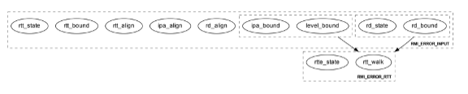
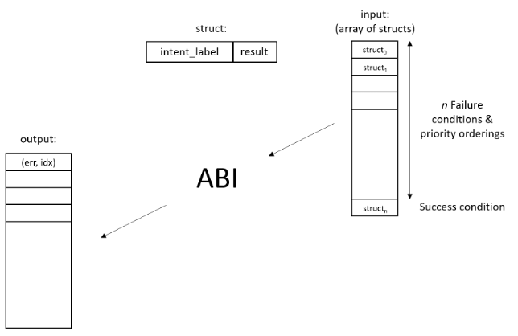

.. Copyright [C] 2023, Arm Limited or its affiliates. All rights reserved.
      SPDX-License-Identifier: BSD-3-Clause

**************************
Command Scenario docuement
**************************
.. raw:: pdf

   PageBreak

.. section-numbering::

.. contents::
      :depth: 4

Introduction
============

In this document the test scenarios for all RMM ABI commands are detailed.
First, an overview of the general test strategy is provided, which forms the
basis of the overall flow and rationale of the various scenarios. Unless otherwise specified,
this scenario doc is compliant to eac2 of `Realm Management Monitor (RMM) Specification`_.

Arm Realm Management Monitor Specification
==========================================
The Realm Management Monitor (RMM) is a software component which forms part of a system which
implements the Arm Confidential Compute Architecture (Arm CCA). `Arm CCA`_ is an architecture which
provides protected execution environments called Realms.

CCA-RMM-ACS Command Suite
=========================

The Command Suite in the CCA-RMM ACS tests the Interface section of
`Realm Management Monitor (RMM) Specification`_. The RMM exposes three interfaces of which one is
facing the Host (RMI), and two are facing the Realm (RSI and PSCI). For each of the commands a set
of input stimuli with which all the failure conditions can be verified, and instructions to observe
the command footprint are provided.
The tests are classified as.

* RMI - Realm Management Interface
* RSI - Realm Services Interface
* PSCI - Power State Coordination Interface

Test strategy
-------------

ABI command testing can be regarded as the 'unit-level like' testing of each ABI command. The goal
here is to verify whether execution of the command produces the expected outcome. For RMM ABI
command testing there are three aspects that require elaboration:

1.      The scope and generation of input stimuli
2.      The observability of the command footprints
3.      The general test flow

Each of the aforementioned aspects will be discussed in a dedicated sections below.

Stimulus
^^^^^^^^

In order to properly exercise the commands, sets of input arguments must be selected such that all
corner cases are covered.
Each command will be tested on failure conditions, failure priority ordering, and finally,
successful execution.

.. list-table::

   * - Failure conditon testing
   * - Typically, each ABI command has a set of failure conditions that can arise from invalid
       input argument values. Such conditions have an associated error code, and the same error
       can often be triggered by multiple values of that input argument. In this part of the test,
       we will explore all the input values with which the failure condition can be triggered. For
       example, we might test whether an address is out of bounds by testing boundary conditions,
       but not all possible regions that would meet the criteria. In each case we then provide a set
       of input arguments that should trigger only a single failure condition at a time:

       Exceptions :

       Although the strategy is to cover all corner cases in failure condition testing, there are
       exceptions:

         * Circular Dependencies: Here we would require ABI commands that are yet to be verified to
           generate the stimulus (note that these are sometimes unavoidable)
         * Multicausal Stimuli: This is unavoidable in certain cases. For example, an out-of-bound
           rd in RMI_DATA_CREATE ABI would also result in Granule(rd).state error. However, we will
           exclude stimuli that trigger multiple failure conditions which have both: I) different
           error codes, and II) no architected priority ordering relative to each other.

.. raw:: pdf

   PageBreak

.. list-table::

   * - Failure priority ordering
   * - It is also important to test that the correct order is maintained between these failure
       conditions. To test this, we trigger multiple failure conditions on one or multiple input
       arguments, and verify that the error code of the higher priority condition is observed.
       In contrast to failure condition testing, each condition will only be triggered in a single
       way to limit the problem size. This methodology of triggering multiple faults at a time will
       be referred to as Pairwise Failure Ordering Testing (PFOT).

       A failure condition ordering A < B can be grouped into two categories:

         * Well-formedness (Not Tested)

           These orderings exist because failure condition B can only be evaluated if failure
           condition A is false. In the figure below [rd_state, rd_bound] < [rtte_state, rtt_walk]
           are well-formedness orderings as we cannot define an RTT walk if the RD granule is not
           an actual Realm Descriptor granule. As the name suggests, these orderings exist to
           ensure the mathematical "well-formedness" of the RMM specification and we will not
           verify these.

            |Priority orderings|

         * Behavioural (Tested)

           These orderings exist to prevent security leaks and to ensure that the returned error
           code is deterministic across RMM implementations and will be verified, An example in the
           figure above is level_bound < rtt_walk, which implies that an out-of-bounds level
           parameter should be reported ahead of an RTT walk failure. Furthermore, while it is
           mathematically acceptable to derive the order between failure conditions based on
           hierarchy (i.e. if A < B and B < C, then A < C), we will also verify these transitive
           priority relationships (i.e. A < C) as these orderings must be honoured by the
           implementer, but are not explicitly mentioned in the specification

.. list-table::

   * - Success conditon testing
   * - At the end of each ABI command test we will execute the command with valid input parameters
       to check that the command executed successfully.

Observability
^^^^^^^^^^^^^

At the end of each ABI command test we will execute the command with valid input parameters to check
that the command executed successfully.

.. table::

  +---------------+------------------------+---------------------------------+
  |Footprint      |Category                |Can it be queried by the host    |
  +===============+========================+=================================+
  |Properties of  | state                  |No                               |
  |a granule      |                        |                                 |
  |               | (UNDELEGATE, DELEGATED,|                                 |
  |               | RD, REC, REC_AUX, DATA,|                                 |
  |               | RTT)                   |                                 |
  |               +------------------------+---------------------------------+
  |               | substate               |In general not, except           |
  |               |                        |RTTE.state/ripas through         |
  |               | (RD - New/Active/ NULL,|RMI_RTT_READ_ENTRY               |
  |               | REC - Ready/Running,   |                                 |
  |               | RTTE.state/ripas)      |                                 |
  |               +------------------------+---------------------------------+
  |               | ownership              |No                               |
  |               |                        |                                 |
  |               | (RD)                   |                                 |
  |               +------------------------+---------------------------------+
  |               | PAS                    |No                               |
  |               |                        |                                 |
  |               | (NS, Root, Realm)      |                                 |
  +---------------+------------------------+---------------------------------+
  |Contents of    | (RD / REC / DATA / RTT |No these are provisioned by the  |
  |a granule      | / NS)                  |host but outside of Realm's TCB  |
  |               |                        |(except for NS granules)         |
  +---------------+------------------------+---------------------------------+

As many of these properties and contents of Granules cannot directly by queried by the Host, we
need to detect these indirectly. For example, we can determine the Granule states and substates by
ascertaining which state transitions are possible, or not possible. Since each state transition is
associated with a successful ABI call, some of which would still be subject to verification, this
gives rise to so called circular dependencies. The general strategy here is to prevent circular
dependencies as much as possible and defer the residual observation of command footprints to other
ACS test scenarios. Hence, we will employ the following strategies where the properties and contents
of Granules cannot be queried by the Host.

Observing Properties of a granule
~~~~~~~~~~~~~~~~~~~~~~~~~~~~~~~~~

.. table::

  +-------------------+----------------------------------------------------------------+
  |Scenario           |Strategy                                                        |
  +===================+================================================================+
  |When the command   |In general, we will not check for changes in properties of      |
  |fails              |a Granule. We will only check the error code in command         |
  |                   |ACS. The expectation that a failing command must not cause      |
  |                   |footprint changes is validated indirectly, to a large           |
  |                   |extent, as part of testing the command for success criteria.    |
  |                   |This is because of the valid arguments being same across        |
  |                   |failure testing (other than the argument that causes a          |
  |                   |particular failure condition) and successful execution of       |
  |                   |the command. Consider also checking rtte_state & rtte_addr      |
  |                   |for applicable commands.                                        |
  |                   +----------------------------------------------------------------+
  |                   |state                                                           |
  |                   |                                                                |
  |                   |We will not test this in CCA-RMM-ACS as the logic to ascertain  |
  |                   |that the state is unchanged (due to command failure) is not     |
  |                   |trivial and typically falls in DV space. Also see above comment |
  |                   +----------------------------------------------------------------+
  |                   |substate                                                        |
  |                   |                                                                |
  |                   |Where they can be queried, we will execute the query ABI (i.e.  |
  |                   |RTT_READ_ENTRY). Where it cannot be queried, we will follow the |
  |                   |same strategy for granule states listed above.                  |
  |                   +----------------------------------------------------------------+
  |                   |ownership                                                       |
  |                   |                                                                |
  |                   |We will follow the same strategy as for granule state.          |
  |                   +----------------------------------------------------------------+
  |                   |PAS                                                             |
  |                   |                                                                |
  |                   |For PAS checks we will do testing in memory management ACS      |
  |                   |scenarios to ensure that the GPI encodings in the GPT has not   |
  |                   |changed.                                                        |
  +-------------------+----------------------------------------------------------------+
  |Summmary           |When command fails, ACS will check for return error code, and   |
  |                   |RTTE for some of the failure conditions.                        |
  +-------------------+----------------------------------------------------------------+
  |When the command   |In general, we will check that the returned error code is equal |
  |succeeds           |to zero.                                                        |
  |                   +----------------------------------------------------------------+
  |                   |state                                                           |
  |                   |                                                                |
  |                   |We will not test this in command ACS as it doesn't fit into a   |
  |                   |typical command ACS test flow. This is covered outside of the   |
  |                   |command ACS, for example, as part of typical realm creation     |
  |                   |flow or winding the state of RMM/Realm as part of rollback logic|
  |                   |by VAL that's needed to run ACS as a single ELF.                |
  |                   +----------------------------------------------------------------+
  |                   |substate                                                        |
  |                   |                                                                |
  |                   |Where they can be queried, we will execute the query ABI. Where |
  |                   |it cannot be queried, we will follow the strategy for observing |
  |                   |granule states listed above.                                    |
  |                   +----------------------------------------------------------------+
  |                   |ownership                                                       |
  |                   |                                                                |
  |                   |Unless otherwise specified we will follow the same strategy as  |
  |                   |specified for granule state.                                    |
  |                   +----------------------------------------------------------------+
  |                   |PAS                                                             |
  |                   |                                                                |
  |                   |There will be testing in memory management ACS scenarios to     |
  |                   |probe the GPI encodings in the GPT.                             |
  +-------------------+----------------------------------------------------------------+
  |Summary            |When command succeeds, ACS will check for return status, and    |
  |                   |RTTE wherever applicable                                        |
  +-------------------+----------------------------------------------------------------+

Observing contents of a granule
~~~~~~~~~~~~~~~~~~~~~~~~~~~~~~~
.. list-table::
  :widths: 25 75

  * - Scenario
    - Strategy
  * - When the command fails
    - We will, in general, not check for forbidden changes in contents of a Granule. There is an
      exception for NS Granules. For example, while testing REC_ENTER, we can check whether the
      exit_ptr remains unchanged and does not contain the fields populated in entry_ptr through
      testing outside of the ACS command scenarios.
  * - When the command succeeds
    - * Host Provisioned

        For contents that are provisioned by the Host through parameters we do know the expected
        value, but still need to verify whether the RMM correctly handled the parameters. These will
        be verified through testing outside of the command ACS.
      * Non-Host Provisioned

        For contents that are not provisioned by the Host, if the expected values are architected,
        we will verify this through testing outside of the ACS command scenarios.

General Test flow
^^^^^^^^^^^^^^^^^
Having defined the overall test strategy and scoping, the general flow of ABI command tests is as
follows:

1.      Enter the test from NS-EL2 or R-EL1
2.      Initialize the input structure (as depicted in the figure below)
3.      Iteratively load the intent labels from the input structure and perform the corresponding
        parameter preparation sequence
4.      Execute the ABI command with the prepared set of parameters and check for the expected
        error code
5.      If all reported error codes are as expected, check the command footprint
6.      Undo any footprint changes caused by the successful ABI execution and observability tests
7.      Return to the test dispatcher

|Intent to sequence structure|

Disclaimer: Only invalid values that cause a failure condition are specified. All other attributes
of an input argument must be set to valid values, if applicable, as defined in argument list table
above.

RMI Commands
------------

RMI_DATA_CREATE
^^^^^^^^^^^^^^^

Argument list
~~~~~~~~~~~~~

.. list-table::
  :widths: 25 75

  * - Input parameters
    - Valid Values
  * - rd
    - | granule(rd).state = RD
      | Realm(rd).state = New
  * - data
    - | granule(data) = 4K_ALIGNED
      | granule(data).state = DELEGATED
  * - ipa
    - | ipa = 4K_ALIGNED
      | ipa = Protected
      | walk(ipa).level = LEAF_LEVEL
      | RTTE(ipa).state = UNASSIGNED
      | RTTE(ipa).ripas = RAM
  * - src
    - | granule(src) = 4K_ALIGNED
      | granule(src).PAS = NS
  * - flags
    - | flags = RMI_MEASURE_CONTENT

Failure conditon testing
~~~~~~~~~~~~~~~~~~~~~~~~

.. list-table::
  :widths: 20 40 40

  * - Input parameters
    - Input Values
    - Remarks
  * - rd
    - granule(rd) = unaligned_addr, mmio_region [A], outside_of_permitted_pa [B],
      not_backed_by_encryption, raz or wi [C]

      granule(rd).state = UNDELEGATED, DELEGATED, REC, RTT, DATA

      Realm(rd).state = Active, Null, System_Off
    - [A] Memory that behaves like mmio (i.e. read or write-sensitive region)

      [B] Pick an address that is outside the permitted PA range (lowest of RmiFeatureRegister0.S2SZ
      and ID_AA64MMFR0_EL1.PARange)

      [C] Memory address that reads as zero and ignores writes
  * - data
    - granule(data) = unaligned_addr, mmio_region [A], outside_of_permitted_pa [B],
      not_backed_by_encryption, raz or wi [C]

      granule(data).state = UNDELEGATED, REC, RD, RTT, DATA

      granule(data).pas = Secure
    -
  * - ipa
    - ipa = unaligned_addr, unprotected_ipa, outside_of_permitted_ipa (info)

      walk(ipa).level != LEAF_LEVEL

      RTTE[ipa].state = ASSIGNED (circular)

      RTTE[ipa].ripas = EMPTY, DESTROYED
    - unprotected_ipa := ipa >= 2**(IPA_WIDTH - 1)

      IPA_WIDTH = RmiFeatureRegister0.S2SZ

      (info) Must cover statement - IFBZPQ The input address to an RTT walk is always less than
      2^w, where w is the IPA width of the target Realm.

      No way to prevent circular dependencies here
  * - src
    - granule(src) = unaligned_addr, mmio_region [A], outside_of_permitted_pa [B],
      not_backed_by_encryption, raz or wi [C]

      granule(src).PAS == Secure, Realm
    -

Failure Priority ordering
~~~~~~~~~~~~~~~~~~~~~~~~~

.. list-table::
  :widths: 20 40 40

  * - Input parameters
    - Input Values
    - Remarks
  * - ipa
    - | unprotected_ipa && walk(ipa).level != LEAF_LEVEL
      | unprotected_ipa && RTTE[ipa].state = ASSIGNED_NS
    -

Observability
~~~~~~~~~~~~~
.. list-table::
  :widths: 25 75

  * - Footprint
    - Verification
  * - Command Failure
    -
  * - | RTTE.state,
      | RTTE.addr
    - Refer Observing Properties of a Granule and Observing Contents of a Granule for details
  * - rim
    - This needs to be tested outside of ACS command scenarios (Security Model / Attestation
      scenarios)
  * - | granule(data).state
      | granule(data).content
    - This is outside the scope of CCA-RMM-ACS. Refer Observing Properties of a Granule and
      Observing Contents of a Granule for details
  * - Command Success
    -
  * - | RTTE.state,
      | RTTE.addr
    - Execute RTT_READ_ENTRY and compare the outcome with expected value (as defined by the
      architecture)

  * - | granule(data).state
      | granule(data).content
    - This is already tested outside of ACS command scenarios, as part of Realm creation
      with payload.
  * - rim
    - This needs to be tested outside of ACS command scenarios (Security Model / Attestation
      scenarios)

RMI_DATA_CREATE_UNKNOWN
^^^^^^^^^^^^^^^^^^^^^^^

Argument list
~~~~~~~~~~~~~

.. list-table::
  :widths: 25 75

  * - Input parameters
    - Valid Values
  * - rd
    - | granule(rd).state = RD
      | Realm(rd).state = New, Active
  * - data
    - | granule(data) = 4K_ALIGNED
      | granule(data).state = DELEGATED
  * - ipa
    - | ipa = 4K_ALIGNED
      | ipa = Protected
      | walk(ipa).level = LEAF_LEVEL
      | RTTE(ipa).state = UNASSIGNED
      | RTTE(ipa).ripas = EMPTY, RAM, DESTROYED

Failure conditon testing
~~~~~~~~~~~~~~~~~~~~~~~~

.. list-table::
  :widths: 20 40 40

  * - Input parameters
    - Input Values
    - Remarks
  * - rd
    - granule(rd) = unaligned_addr, mmio_region [A], outside_of_permitted_pa [B],
      not_backed_by_encryption, raz or wi [C]

      granule(rd).state = UNDELEGATED, DELEGATED, REC, RTT, DATA
    -
  * - data
    - granule(data) = unaligned_addr, mmio_region [A], outside_of_permitted_pa [B],
      not_backed_by_encryption, raz or wi [C]

      granule(data).state = UNDELEGATED, REC, RD, RTT, DATA
    - See RMI_DATA_CREATE for specifics behind these stimuli
  * - ipa
    - ipa = unaligned_addr, unprotected_ipa, outside_of_permitted_ipa (info)

      walk(ipa).level != LEAF_LEVEL

      RTTE[ipa].state = ASSIGNED (circular)

    - unprotected_ipa := ipa >= 2**(IPA_WIDTH - 1)

      IPA_WIDTH = RmiFeatureRegister0.S2SZ

      (info) Must cover statement - IFBZPQ The input address to an RTT walk is always less than
      2^w, where w is the IPA width of the target Realm.

      No way to prevent circular dependencies here

Failure Priority ordering
~~~~~~~~~~~~~~~~~~~~~~~~~

.. list-table::
  :widths: 20 40 40

  * - Input parameters
    - Input Values
    - Remarks
  * - ipa
    - | unprotected_ipa && walk(ipa).level != LEAF_LEVEL
      | unprotected_ipa && RTTE[ipa].state = ASSIGNED_NS
    -

Observability
~~~~~~~~~~~~~
.. list-table::
  :widths: 25 75

  * - Footprint
    - Verification
  * - Command Failure
    -
  * - | RTTE.state,
      | RTTE.addr
    - Refer Observing Properties of a Granule and Observing Contents of a Granule for details
  * - | granule(data).state
      | granule(data).content
    - This is outside the scope of CCA-RMM-ACS. Refer Observing Properties of a Granule and
      Observing Contents of a Granule for details
  * - Command Success
    -
  * - | RTTE.state,
      | RTTE.addr
    - Execute RTT_READ_ENTRY and compare the outcome with expected value (as defined by the
      architecture)

      Do this for Realm(rd).state = {NEW, ACTIVE} and RTTE[ipa].ripas = {EMPTY, RAM, DESTROYED}
  * - | granule(data).state
      | granule(data).content
    - For granule(data).content, it needs to be tested outside of ACS command scennarios as part
      of verifying "granule wiping" security
      property for granule(data).state, it already tested outside of ACS command scenarios, as part
      of RMM/Realm state rollback at the end
      of each test.

RM_DATA_DESTROY
^^^^^^^^^^^^^^^

Argument list
~~~~~~~~~~~~~

.. list-table::
  :widths: 25 75

  * - Input parameters
    - Valid Values
  * - rd
    - | granule(rd).state = RD
      | Realm(rd).state = New, Active
  * - ipa
    - | ipa = 4K_ALIGNED
      | ipa = Protected
      | walk(ipa).level = LEAF_LEVEL
      | RTTE(ipa).state = ASSIGNED
      | RTTE(ipa).ripas = EMPTY, RAM, DESTROYED

Failure conditon testing
~~~~~~~~~~~~~~~~~~~~~~~~

.. list-table::
  :widths: 20 40 40

  * - Input parameters
    - Input Values
    - Remarks
  * - rd
    - granule(rd) = unaligned_addr, mmio_region [A], outside_of_permitted_pa [B],
      not_backed_by_encryption, raz or wi [C]

      granule(rd).state = UNDELEGATED, DELEGATED, REC, RTT, DATA
    -
  * - data
    - granule(data) = unaligned_addr, mmio_region [A], outside_of_permitted_pa [B],
      not_backed_by_encryption, raz or wi [C]

      granule(data).state = UNDELEGATED, REC, RD, RTT, DATA
    - See RMI_DATA_CREATE for specifics behind these stimuli
  * - ipa
    - ipa = unaligned_addr, unprotected_ipa, outside_of_permitted_ipa (info)

      walk(ipa).level != LEAF_LEVEL

      RTTE[ipa].state = UNASSIGNED

    - unprotected_ipa := ipa >= 2**(IPA_WIDTH - 1)

      IPA_WIDTH = RmiFeatureRegister0.S2SZ

      (info) Must cover statement - IFBZPQ The input address to an RTT walk is always less than
      2^w, where w is the IPA width of the target Realm.

Failure Priority ordering
~~~~~~~~~~~~~~~~~~~~~~~~~

.. list-table::
  :widths: 20 40 40

  * - Input parameters
    - Input Values
    - Remarks
  * - ipa
    - | unprotected_ipa && walk(ipa).level != LEAF_LEVEL
      | unprotected_ipa && RTTE[ipa].state = UNASSIGNED_NS
    -

Observability
~~~~~~~~~~~~~
.. list-table::
  :widths: 25 75

  * - Footprint
    - Verification
  * - Command Failure
    -
  * - | RTTE.state,
      | RTTE.addr
    - Refer Observing Properties of a Granule and Observing Contents of a Granule for details
  * - | granule(data).state
      | granule(data).content
    - This is outside the scope of CCA-RMM-ACS. Refer Observing Properties of a Granule and
      Observing Contents of a Granule for details
  * - Command Success
    -
  * - | RTTE.state,
      | RTTE.addr
    - Execute RTT_READ_ENTRY and compare the outcome with expected value (as defined by the
      architecture)

      Do this for Realm(rd).state = {NEW, ACTIVE} and RTTE[ipa].ripas = {EMPTY, RAM, DESTROYED}
  * - | granule(data).state
      | granule(data).content
    - For granule(data).content, it needs to be tested outside of ACS command scennarios (as part
      of security scenarios).

RMI_FEATURES
^^^^^^^^^^^^

Argument list
~~~~~~~~~~~~~

.. list-table::
  :widths: 25 75

  * - Input parameters
    - Valid Values
  * - index
    - index = Any integer (64b)

Failure conditon testing
~~~~~~~~~~~~~~~~~~~~~~~~

This command has no failure conditions.

Failure Priority ordering
~~~~~~~~~~~~~~~~~~~~~~~~~

This command has no failure priority values.

Observability
~~~~~~~~~~~~~
.. list-table::
  :widths: 25 75

  * - Footprint
    - Verification
  * - Command Success
    -
  * - X1 (Command return Value)
    - | when index = 0, Check X1[30:63] MBZ field is zero
      | when index != 0, Check X1 == 0

RMI_GRANULE_DELEGATE
^^^^^^^^^^^^^^^^^^^^

Argument list
~~~~~~~~~~~~~

.. list-table::
  :widths: 25 75

  * - Input parameters
    - Valid Values
  * - addr
    - | granule(addr) = 4K_ALIGNED
      | granule(addr).state = Undelegated
      | granule(addr).PAS = Non secure.

Failure conditon testing
~~~~~~~~~~~~~~~~~~~~~~~~

.. list-table::
  :widths: 20 40 40

  * - Input parameters
    - Input Values
    - Remarks
  * - addr
    - granule(addr) = unaligned_addr, mmio_region [A], outside_of_permitted_pa [B],
      not_backed_by_encryption, raz or wi [C]

      granule(adr).state = DELEGATED,RD, REC, RTT, DATA

      granule(addr).PAS = Secure, Realm
    - See RMI_DATA_CREATE for the specifics behind these stimuli.

      granule(addr).PAS = Root is outside the scope of ACS.

Failure Priority ordering
~~~~~~~~~~~~~~~~~~~~~~~~~

This command has no failure priority orderings.

Observability
~~~~~~~~~~~~~
.. list-table::
  :widths: 25 75

  * - Footprint
    - Verification
  * - Command Failure
    -
  * - granule(addr).PAS
    - | For granule(addr).PAS=Non-secure, an access to addr from the NS world should be successful
      and should be tested in command ACS.
      | For granule(addr).PAS=Secure and Realm (granule(addr).state = DATA), this needs to be tested
      outside of ACS command scenarios
  * - granule(addr).state
    - This is outside the scope of CCA-RMM-ACS. Refer Observing Properties of a Granule and
      Observing Contents of a Granule for details
  * - Command Success
    -
  * - granule(addr).PAS
    - This is tested outside of ACS command scenarios - As part of mm_gpf_exception test:

      Note:

      [1] A NS-world access to addr in this case would result in GPF. The target EL for this GPF
      depends on SCR_EL3.GPF (which is the DUT) If SCR_EL3.GPF =1, the  fault is reported as GPC
      exception and is taken to EL3. EL3 may choose to delegate this exception to NS-EL2. If this
      delegation scheme is supported by the implementation, we can validate changes in PAS in ACS.
      If not, the test needs to be able to exit gracefully, for example, using watchdog interrupt.
      If this is not possible, we won't be able to verify changes in PAS in ACS. If SCR_EL3.GPF=0,
      the GPF is reported as instruction or data abort at EL2 itself, and this can be validated in
      ACS. Need to be wary of the above while writing ACS.

      [2] Using realm creation flow that's already tested outside of ACS command scenarios
      Post RMI_GRANULE_DELEGATE, such a flow would create realm/rec/rtt/data and be able to execute
      from realm successfully. Point 2 proves that the granule can be accessed from the target
      granule(addr).PAS and Point 1 proves that the granule access is forbidden from the current
      state. Conclusion - do option1 outside of command ACS and keep such testing to a limited
      set of tests

  * - granule(addr).state
    - This is already teseted outside of ACS command scenarios (Realm creation with payload).

RMI_GRANULE_UNDELEGATE
^^^^^^^^^^^^^^^^^^^^^^
Argument list
~~~~~~~~~~~~~

.. list-table::
  :widths: 25 75

  * - Input parameters
    - Valid Values
  * - addr
    - | granule(addr) = 4K_ALIGNED
      | granule(addr).state = Undelegated
      | granule(addr).PAS = Realm.

Failure conditon testing
~~~~~~~~~~~~~~~~~~~~~~~~

.. list-table::
  :widths: 20 40 40

  * - Input parameters
    - Input Values
    - Remarks
  * - addr
    - granule(addr) = unaligned_addr, mmio_region [A], outside_of_permitted_pa [B],
      not_backed_by_encryption, raz or wi [C]

      granule(adr).state = UNDELEGATED, RD, REC, RTT, DATA
    - See RMI_DATA_CREATE for the specifics behind these stimuli.

      granule(addr).PAS = Root is outside the scope of ACS.

Failure Priority ordering
~~~~~~~~~~~~~~~~~~~~~~~~~

This command has no failure priority orderings.

Observability
~~~~~~~~~~~~~
.. list-table::
  :widths: 25 75

  * - Footprint
    - Verification
  * - Command Failure
    -
  * - granule(addr).PAS
    - For granule(addr).PAS = Realm && granule(addr).state = REC/DATA/RD/RTT execute the
      respective destroy command and verify that it is successful
  * - granule(addr).content
    - For granule(addr).state = REC/DATA/RTT verify that the content is unchanged. This needs
      to be tested outside of ACS command scenarios.
  * - granule(addr).state
    - For granule(addr).state = Undelegated, access this granule from the NS world, and this access
      should be successful. This is in scope for command ACS
  * - Command Success
    -
  * - | granule(addr).PAS
      | granule(addr).content
    - Can be tested through accesses from the NS world (should succeed and content be wiped)

      Sequence:
      RMI_DATA_CREATE(ipa, src, data) --> RMI_DATA_DESTROY(rd, ipa) -->
      RMI_GRANULE_UNDELEGATE(addr=data)

      Verify:
      src != data
      This will be covered within the command ACS.
  * - granule(addr).state
    - This is already teseted outside of ACS command scenarios (Realm teardown sequence).

RMI_PSCI_COMPLETE
^^^^^^^^^^^^^^^^^
To test this command, unless otherwise specified below, the pre-requsite is that the realm needs to
initiate corresponding PSCI request (PSCI_AFFINITY_INFO or PSCI_CPU_ON) through RSI.

Argument list
~~~~~~~~~~~~~

.. list-table::
  :widths: 25 75

  * - Input parameters
    - Valid Values
  * - calling_rec
    - | granule(calling_rec) = 4K_ALIGNED
      | granule(calling_rec).state = REC
      | Rec(calling_rec).psci_pending = PSCI_REQUEST_PENDING
      | calling rec != target rec
  * - target_rec
    - | granule(target_rec) = 4K_ALIGNED
      | granule(target_rec).state = REC
      | Rec(target_rec).owner = Rec(calling_rec).owner
      | Rec(target_rec).owner = Rec(calling_rec).gprs[1]

Failure conditon testing
~~~~~~~~~~~~~~~~~~~~~~~~

.. list-table::
  :widths: 20 40 40

  * - Input parameters
    - Input Values
    - Remarks
  * - calling_rec
    - granule(calling_rec) = granule(target_rec), unaligned_addr, mmio_region [A],
      outside_of_permitted_pa [B], not_backed_by_encryption, raz or wi [C].

      granule(calling_rec).state = Undelegated, Delegated, RD, RTT

      Rec(calling_rec).psci_pending != PSCI_REQUEST_PENDING [E]
    - [E] - This can be achieved in two ways.

      [1] Execute RMI_PSCI_COMPLETE without a request from realm

      [2] provide incorrect calling_rec arg value (same realm but didn't initiate RSI request,
      REC belonging to different realm) in RMI_PSCI_COMPLETE
  * - target_rec
    - granule(target_rec) = unaligned_addr, mmio_region, outside of permitted pa, not backed by
      encryption, raz or wi, other_realm_owned rec, wrong_target [D]

      granule(target_rec).state = Undelegated, Delegated, RD, RTT
    - [D] wrong_target implies that calling_rec has a different mpidr value stored in gprs[1] than
      target_rec.mpidr

Failure Priority ordering
~~~~~~~~~~~~~~~~~~~~~~~~~
This command has no failure priority ordering.

Observability
~~~~~~~~~~~~~

.. list-table::
  :widths: 25 75

  * - Footprint
    - Verification
  * - Command Failure
    -
  * - | target_rec.content,
      | calling_rec.content
    - Refer Observing Properties of a Granule and Observing Contents of a Granule for details
  * - Command Success
    -
  * - | target_rec.content,
      | calling_rec.content
    - Tested outside of ACS command scenarios.

      Overlap with a scenario in Exception Model module - exception_rec_exit_due_to_psci

RMI_REALM_ACTIVATE
^^^^^^^^^^^^^^^^^^

Argument list
~~~~~~~~~~~~~

.. list-table::
  :widths: 25 75

  * - Input parameters
    - Valid Values
  * - rd
    - | granule(rd) = 4K_ALIGNED
      | granule(rd).state = RD
      | Realm(rd).state = New

Failure conditon testing
~~~~~~~~~~~~~~~~~~~~~~~~

.. list-table::
  :widths: 20 40 40

  * - Input parameters
    - Input Values
    - Remarks
  * - rd
    - granule(rd) = unaligned_addr, mmio_region [A], outside_of_permitted_pa [B],
      not_backed_by_encryption, raz or wi [C]

      granule(rd).state = UNDELEGATED, DELEGATED, REC, RTT, DATA

      Realm(rd).state = Active[D], NULL, System off[D]
    - (A - C) See RMI_DATA_CREATE for the specifics behind these stimuli

      [D] Active requires a valid REALM_ACTIVATE call (circular dependency) -> Do this as part of
      the positive observability check

Failure Priority ordering
~~~~~~~~~~~~~~~~~~~~~~~~~

.. list-table::
  :widths: 20 40 40

  * - Input parameters
    - Input Values
    - Remarks
  * - rd
    - granule(rd).state = NULL & Realm(rd).state = DELEGATED
    - This is already coverd with Realm(rd).state = NULL in the failure condition stimulus above

Observability
~~~~~~~~~~~~~
.. list-table::
  :widths: 25 75

  * - Footprint
    - Verification
  * - Command Failure
    -
  * - Realm(rd).state
    - This is outside the scope of CCA-RMM-ACS. Refer Observing Properties of a Granule and
      Observing Contents of a Granule for details
  * - Command Success
    -
  * - Realm(rd).state
    - This is already tested outside of ACS command scenarios(as part of Realm entry test flows)

RMI_REALM_CREATE
^^^^^^^^^^^^^^^^

Argument list
~~~~~~~~~~~~~

.. list-table::
  :widths: 25 75

  * - Input parameters
    - Valid Values
  * - rd
    - | granule(rd) = 4K_ALIGNED
      | granule(rd).state = Delegated
  * - params_ptr
    - | granule(params_ptr) = 4K_ALIGNED
      | granule(params_ptr).PAS = NS
      | granule(params_ptr).content(rtt_base) = 4K_ALIGNED
      | granule(params_ptr).content(rtt_base).state = Delegated
      | granule(params_ptr).content(flags, s2sz, sve_vl, num_bps, num_wps, pmu_num_ctrs) = supported
      | granule(params_ptr).content(vmid) = valid, not_in_use
      | granule(params_ptr).content(hash_algo) = valid, supported
      | granule(params_ptr).content(rtt_level_start, rtt_num_start) = consistent with features0.S2SZ
      | !(granule(rd) >= granule(params_ptr).content(rtt_base) && granule(rd) <=
        granule(params_ptr).content(rtt_base+rtt size))

Failure conditon testing
~~~~~~~~~~~~~~~~~~~~~~~~

.. list-table::
  :widths: 20 40 40

  * - Input parameters
    - Input Values
    - Remarks
  * - rd
    - granule(rd) = unaligned_addr, mmio_region [A], outside_of_permitted_pa [B],
      not_backed_by_encryption, raz or wi [C],

      params_ptr.content(rtt_base)

      granule(rd).state = Undelegated, RD, RTT, DATA, REC
    -
  * - params_ptr
    - granule(params_ptr) = unaligned_addr, mmio_region[A], outside_of_permitted_pa [B],
      not_backed_by_encryption, raz or wi [C]

      granule(params_ptr).content(hash_algo) = encoding_reserved [D], not_supported [E]

      granule(params_ptr).content(rtt_base) = unaligned_addr,

      granule(params_ptr).content(rtt_num_start, rtt_level_start) = incompatible [F],

      granule(params_ptr).content(rtt_base, rttsize*).state = Undelegated,

      granule(params_ptr).content(vmid) = invalid, in_use

      granule(params_ptr).PAS = Realm, Secure, Root (may be outside the scope of ACS as we may not
      get to know Root memory from platform memory map)

      ***rtt size = rtt base<addr<rtt_num_start*RMM granule size so, cover
      RMIRealmparams.rtt_num_start =1 and >1.

      For the latter, for example, if read of RMIFeatureregister0.S2SZ=16 (that is implementation
      supports 48-bit PA/IPA), program RMIRealmparams.features0.S2SZ= 24 (that is 40- bit IPA),
      RMIRealmparams.rtt_num_start ~2, RMIRealmparams.rtt_level_start ~1, choose rtt_base ~ 8K
      aligned address with first 4KB in delegate state and the next 4KB in undelegate state
    -
      [D] encoding_reserved refers to values thatare reserved for future implementations (i.e.,
      not in the table in spec)

      [E] not_supported refers to a valid encoding that is not supported by current implementation
      - To achieve this error, perform following sequence read RMI Featureregister0.HASH_SHA_256
      and HASH_SHA_512 and figure out which one of these is supported by the underlying platform
      Provide the unsupported value from previous step in granule(params_ptr).hash_algo

      [F] params_ptr.content(rtt_num_start, rtt_level_start) = incompatible with
      RMIFeatureregister0.S2SZ

      Scenario: Host to choose rtt_level_start and ipa_width such that number of starting
      level RTTs is greater than one. Host to populate correct rtt_num_start value in realmParam,
      expect SUCCESS.

      Host to choose rtt_level_start and ipa_width such that number of starting level RTTs is
      greater than one. Host to populate incorrect rtt_num_start value in realmParam and expect ERROR

      Perform following steps in argument preparation phase (intent to sequence block) to achieve
      above conditions (for generating ERROR):

      read RMIFeatureregister0.S2SZ

      if S2SZ ~ [12-15], set RMIRealmparams.rtt_level_start ~ 1/2/3 or set
      RMIRealmparams.rtt_num_start ~ >16

      if S2SZ ~ [16-24], set RMIRealmparams.rtt_level_start ~ 2/3 or set
      RMIRealmparams.rtt_num_start ~ >16

      if S2SZ ~ [25-33], set RMIRealmparams.rtt_level_start ~ 3 or set
      RMIRealmparams.rtt_num_start ~ >16

      if S2SZ ~ [34-42], set RMIRealmparams.rtt_num_start ~ >16

      Note that S2SZ format in RMIFeatureregister0 is different from VTCR_EL2.T0SZ in that the
      former expects the actual IPA width to be programmed (or returned during quering) as against
      specifying the equivalent of T0SZ value.

Failure Priority ordering
~~~~~~~~~~~~~~~~~~~~~~~~~
This command has no failure priority orderings.

Observability
~~~~~~~~~~~~~
.. list-table::
  :widths: 25 75

  * - Footprint
    - Verification
  * - Command Failure
    -
  * - rd.state
    - This is outside the scope of CCA-RMM-ACS. Refer Observing Properties of a Granule and
      Observing Contents of a Granule for details
  * - | rd.substate
      | rd.content
    - Same as above
  * - Command Success
    -
  * - rd.state
    - This is already tested outside of ACS command scenarios(as part of realm creation flow).
  * - | rd.substate
      | rd.content
    - Same as above

RMI_REALM_DESTROY
^^^^^^^^^^^^^^^^^

Argument list
~~~~~~~~~~~~~

.. list-table::
  :widths: 25 75

  * - Input parameters
    - Valid Values
  * - rd
    - | granule(rd) = 4K_ALIGNED
      | granule(rd).state = RD
      | Realm Liveliness = FALSE

Failure conditon testing
~~~~~~~~~~~~~~~~~~~~~~~~

.. list-table::
  :widths: 20 40 40

  * - Input parameters
    - Input Values
    - Remarks
  * - rd
    - granule(rd) = unaligned_addr, mmio_region [A], outside_of_permitted_pa [B],
      not_backed_by_encryption, raz or wi [C], alive [D]

      granule(rd).state = Delegated*, Undelegated, REC, DATA, RTT

      ***-create a realm, destroy a realm. The state of granule is in delegated state. Use this
      granule to destroy an already destroyed realm. The command should fail due to rd_state error.
    -

Failure Priority ordering
~~~~~~~~~~~~~~~~~~~~~~~~~

.. list-table::
  :widths: 20 40 40

  * - Input parameters
    - Input Values
    - Remarks
  * - rd
    - Orderings between granule(rd) or granule(rd).state & Realm liveliness
    - These are outside the scope of CCA-RMM-ACS as thes fall under well formedness orderings.

Observability
~~~~~~~~~~~~~

.. list-table::
  :widths: 25 75

  * - Footprint
    - Verification
  * - Command Failure
    -
  * - Realm(rd).state
    - For Realm(rd).state = Active, System_Off: This is outside the scope of CCA-RMM-ACS, as the
      only sensible thing we can do, is to destroy the Realm, which is the ABI we are currently
      testing. For System_Off, since the scope of system is imp def, we won't be able to test this
      in ACS.

      For Realm(rd).state = New: This is outside of the scope of CCA-RMM-ACS and falls into DV space
  * - granule(rtt).state
    - This is already tested in other command ACS scenarios (RMI_GRANULE_UNDELEGATE or
      RMI_REALM_CREATE)
  * - Command Success
    -
  * - | vmid
      | granule(rd).state
      | Ream(rd).state
    - All of this is already tested outside of ACS command scenarios . For example, VMID being
      freed up is tested as part of running ACS as a single ELF (that is, VAL winds up state of RMM
      test before start of another test).

      For granule(rd).state, Realm(rd).state, verify this is command ACS by performing
      RMI_REALM_CREATE again with identical attributes.

RMI_REC_AUX_COUNT
^^^^^^^^^^^^^^^^^

Argument list
~~~~~~~~~~~~~

.. list-table::
  :widths: 25 75

  * - Input parameters
    - Valid Values
  * - rd
    - | granule(rd) = 4K_ALIGNED
      | granule(rd).state = RD

Failure conditon testing
~~~~~~~~~~~~~~~~~~~~~~~~
.. list-table::
  :widths: 20 40 40

  * - Input parameters
    - Input Values
    - Remarks
  * - rd
    - granule(rd) = unaligned_addr, mmio_region [A], outside_of_permitted_pa [B],
      not_backed_by_encryption, raz or wi [C]

      granule(rd).state = Delegated, Undelegated, DATA, RTT
    - See RMI_DATA_CREATE for the specifics behind these stimuli

Failure Priority ordering
~~~~~~~~~~~~~~~~~~~~~~~~~
This command has no failure priority orderings.

Observability
~~~~~~~~~~~~~
.. list-table::
  :widths: 25 75

  * - Footprint
    - Verification
  * - Command Success
    -
  * - X1 (command return value)
    - This is already tested outside of ACS command scenarios as part of the Realm creation flow
      (when the various feature: SVE, etc. are implemented)

RMI_REC_CREATE
^^^^^^^^^^^^^^

Argument list
~~~~~~~~~~~~~

.. list-table::
  :widths: 25 75

  * - Input parameters
    - Valid Values
  * - rd
    - | granule(rd) = 4K_ALIGNED
      | granule(rd).state = RD
      | Realm(rd).state = New
  * - rec
    - | granule(rec) = 4K_ALIGNED
      | granule(rec).state = Delegated
  * - params_ptr
    - | granule(params_ptr) = 4K_ALIGNED
      | granule(params_ptr).PAS = NS
      | granule(params_ptr).content(mpidr) = in_range (where in_range = 0, 1, 2, ...)
      | granule(params_ptr).content(aux) = 4K_ALIGNED
      | granule(params_ptr).content(num_aux) = RMI_REC_AUX_COUNT(rd)
      | granule(params_ptr).content(aux).state = Delegated
      | granule(params_ptr).content/content(name).MBZ/SBZ = 0, where name can be flags. Try with
        flag = runnable and not runnable.

Failure conditon testing
~~~~~~~~~~~~~~~~~~~~~~~~

.. list-table::
  :widths: 20 40 40

  * - Input parameters
    - Input Values
    - Remarks
  * - rd
    - granule(rd) = unaligned_addr, mmio_region [A], outside_of_permitted_pa [B],
      not_backed_by_encryption, raz or wi [C]

      granule(rd).state = Undelegated, Delegated*, REC, RTT, DATA

      ***-create a realm, destroy the realm and use the granule that's in delegated state as an
      input to this ABI to test above failure condition.

      Realm(rd).state = Active, System off
    -  Prepare granule whose granule(rd).state=Delegated and realm(rd).state=Null
       Realm(rd).state = Null will result in more than one failure condition whose error codes are
       different and priority order ing is not defined
  * - rec
    - granule(rec) = unaligned_addr, mmio_region [A], outside_of_permitted_pa [B],
      not_backed_by_encryption, raz or wi [C]

      granule(rec).state = Undelegated, REC, RTT, RD, DATA
    -
  * - params_ptr
    - granule(params_ptr) = unaligned_addr, mmio_region [A], outside_of_permitted_pa [B],
      not_backed_by_encryption, raz or wi [C]

      granule(params_ptr).content(num_aux) != RMI_REC_AUX_COUNT(rd)

      granule(params_ptr).content(aux...num_aux) = unaligned_addr [F]

      granule(params_ptr).content(aux...num_aux) = granule(rec) [G]

      granule(params_ptr).content(aux) = mmio_region [A], outside_of_permitted_pa [B],
      not_backed_by_encryption, raz or wi [C]

      granule(params_ptr).content(aux...num_aux).state = Undelegated, REC, RTT, DATA, RD

      granule(params_ptr).content(mpidr) = provide mpidr value starting from 2

      granule(params_ptr).pas = Realm, Secure, Root [E]
    - [E] Root (may be outside the scope of ACS as we may not get to know Root memory from platform
      memory map)

      [F] at least one aux_granule must be unaligned

      [G] Provide granule(rec) address to one of aux address

Failure Priority ordering
~~~~~~~~~~~~~~~~~~~~~~~~~

.. list-table::
  :widths: 20 40

  * - Input parameters
    - Remarks
  * - rd
    - The priority ordering as defined in the spec is already covered with granule(rd) = mmio in
      the failure condition stimulus above.

Observability
~~~~~~~~~~~~~
.. list-table::
  :widths: 25 75

  * - Footprint
    - Verification
  * - Command Failure
    -
  * - Realm(rd).rec_index
    - Refer Observing Properties of a Granule and Observing Contents of a Granule for details.
  * - granule(rec).content
    - This is outside the scope of CCA-RMM-ACS
  * - rim
    - This needs to be tested outside of command ACS(Attestation Scenarios)
  * - granule(rec).content
    - Refer Observing Properties of a Granule and Observing Contents of a Granule for details.
  * - granule(rec).attest
    - Refer Observing Properties of a Granule and Observing Contents of a Granule for details.
  * - granule(rec_aux).state
    - Refer Observing Properties of a Granule and Observing Contents of a Granule for details.
  * - Command Success
    -
  * - Realm(rd).rec_index
    - This is already tested outside of command ACS (a Realm with multiple RECs)
  * - granule(rec).conted
    - This is already tested outside of command ACS (a Realm entry)
  * - | granule(rec).ripas_addr
      | granule(rec).ripas_top
      | granule(rec).host_call
    - This is already tested outside of command ACS in one of the Exception Model scenario
  * - rim
    - This needs to be tested outside of command ACS (Attestation Scenarios)
  * - granule(rec).attest
    - This is outside the scope of CCA-RMM-ACS

RMI_REC_DESTROY
^^^^^^^^^^^^^^^

Argument list
~~~~~~~~~~~~~

.. list-table::
  :widths: 25 75

  * - Input parameters
    - Valid Values
  * - rec
    - | granule(rec) = 4K_ALIGNED
      | granule(rec).state = REC
      | Rec(rec).state = READY

Failure conditon testing
~~~~~~~~~~~~~~~~~~~~~~~~

.. list-table::
  :widths: 20 40 40

  * - Input parameters
    - Input Values
    - Remarks
  * - rec
    - granule(rec) = unaligned_addr, mmio_region [A], outside_of_permitted_pa [B],
      not_backed_by_encryption, raz or wi [C]

      granule(rec).state = Undelegated, Delegated, RTT, DATA, RD, REC_AUX

      Rec(rec).state = Running [D]
    - [D] This can be verified only in an MP envrionment and need to be tested outside of
      command ACS.

Failure Priority ordering
~~~~~~~~~~~~~~~~~~~~~~~~~

.. list-table::
  :widths: 20 40

  * - Input parameters
    - Remarks
  * - rec
    - The priority ordering as defined in the spec is already covered with granule(rec) = mmio and
      granule(rec).state  in the failure condition stimulus above

Observability
~~~~~~~~~~~~~
.. list-table::
  :widths: 25 75

  * - Footprint
    - Verification
  * - Command Failure
    -
  * - | granule(rec).state
      | granule(rec_aux).state
    - Refer Observing Properties of a Granule and Observing Contents of a Granule for details.
  * - granule(rec).content
    - This needs to be tested outside of ACS command scenarios
  * - Command Success
    -
  * - | granule(rec).state
      | granule(rec_aux).state
    - This is already tested outside of ACS command scenarios, as part of RMM/Realm state rollback
      that's needed to run ACS as a single ELF.
  * - granule(rec).content
    - This needs to be tested outside of ACS command scenarios (in memory management scenarios)

RMI_REC_ENTER
^^^^^^^^^^^^

Argument list
~~~~~~~~~~~~~

.. list-table::
  :widths: 25 75

  * - Input parameters
    - Valid Values
  * - rec
    - | granule(rec) = 4K_ALIGNED
      | granule(rec).state = REC
      | Rec(rec).state = READY
      | Rec(rec).content(flags.runnable) = RUNNABLE
      | Rec(rec).content(psci_pending) = NO_PSCI_REQUEST_PENDING
      | Realm(Rec(rec).owner).state = Active
  * - run_ptr
    - | granule(run_ptr) = 4K_ALIGNED
      | granule(run_ptr).PAS = NS
      | granule(run_ptr).content(entry.flags.emul_mmio) = NOT_RMI_EMULATED_MMIO
      | granule(run_ptr).content(entry.gicv3_hcr) = valid (RES0)
      | granule(run_ptr).content(entry.gicv3_lrs) = valid (HW = 0)

Failure conditon testing
~~~~~~~~~~~~~~~~~~~~~~~~

.. list-table::
  :widths: 20 40 40

  * - Input parameters
    - Input Values
    - Remarks
  * - rec
    - granule(rec) = unaligned_addr, mmio_region , outside_of_permitted_pa [B],
      not_backed_by_encryption, raz or wi [C]

      granule(rec).content(flags.runnable) = NOT_RUNNABLE

      granule(rec).content(psci_pending) = PSCI_REQUEST_PENDING [F]

      granule(rec).state = Undelegated, Delegated, RTT, RD, DATA, REC_AUX

      Rec(rec).state = Running [E]

      Realm(Rec(rec).owner).state = New, System_Off
    - [E] This is an MP scenario as one thread (REC) will be running inside the Realm,
      while another will attempt to enter into realm using the same REC. This needs to be tested
      outside of command ACS.

      [F] This needs to be tested outside of command ACS as it requires entering into realm and
      execute a PSCI command.
  * - run_ptr
    - granule(run_ptr) = unaligned_addr, mmio_region [A], outside_of_permitted_pa [B],
      not_backed_by_encryption, raz or wi [C]

      granule(run_ptr).pas = Realm, Secure, Root [H]

      granule(run_ptr).content(is_emulated_mmio) = RMI_EMULATED_MMIO [F]

      granule(run_ptr).content(gicv3_hcr/gcv3_lrs) = invalid_encoding [G]
    - [F] assumes rec.content(emulatable_abort) = NOT_EMULATABLE_ABORT (this is the case before
      even entering into realm for the first time)

      [G] Exhaustive testing to follow in GIC Scenarios

      [H] Root (may be outside the scope of ACS as we may not get to know Root memory from platform
      memory map)

Failure Priority ordering
~~~~~~~~~~~~~~~~~~~~~~~~~
This is tested as part of single failure condition testing.

Observability
~~~~~~~~~~~~~
.. list-table::
  :widths: 25 75

  * - Footprint
    - Verification
  * - Command Failure
    -
  * - Rec(rec).content
    - | This needs to be tested outside of ACS command scenarios.
      | Overlap with scenarios in Exception Model section.
      | REC Exit Security & Data Abort scenarios.
  * - Command Success
    -
  * - Rec(rec).content
    - | This needs to be tested outside of ACS command scenarios.
      | Overlap with scenarios in Exception Model section.
      | REC Exit Security & Data Abort scenarios.

RMI_RTT_CREATE
^^^^^^^^^^^^^^

Argument list
~~~~~~~~~~~~~

.. list-table::
  :widths: 25 75

  * - Input parameters
    - Valid Values
  * - rd
    - | granule(rtt) = 4K_ALIGNED
      | granule(rtt).state = Delegated
  * - rtt
    - | granule(rd) = 4K_ALIGNED
      | granule(rd).state = RD
      | Realm(rd).state = New, Active, System_Off
  * - ipa
    - | ipa = (level-1)_aligned
      | ipa = within_permissible_ipa (< 2^features0.S2SZ)
      | walk(ipa).level = level - 1
      | RTTE[ipa].state = UNASSIGNED
  * - level
    - level = {1, 2, 3} if start level is level 0.

Failure conditon testing
~~~~~~~~~~~~~~~~~~~~~~~~

.. list-table::
  :widths: 20 40 40

  * - Input parameters
    - Input Values
    - Remarks
  * - rd
    - granule(rd) = unaligned_addr, mmio_region [A], outside_of_permitted_pa [B],
      not_backed_by_encryption, raz or wi [C]

      granule(rd).state = Undelegated, Delegated, REC, RTT, DATA
    -
  * - rtt
    - granule(rtt) = unaligned_addr (<4KB aligned), mmio_region [A], outside_of_permitted_pa [B],
      not_backed_by_encryption, raz or wi [C]

      granule(rtt).state = Undelegated, REC, RD, RTT, DATA
    -
  * - ipa
    - ipa = unaligned_addr (for example, a 4KB aligned IPA to create level2 RTT),
      outside_permissible_ipa (*)

      walk(ipa).level < level - 1

      RTTE[ipa].state = Table (circular -> same as positive Observability check)
    - (*)Must cover statement - IFBZPQ The input address to an RTT walk is always less than
      2^w, where w is the IPA width of the target Realm as defined by RMIFeatureregister0.S2SZ
  * - levle
    - level = start_level (for example 0 if S2SZ supports an IPA width compatible to level0), 4
    -

Failure Priority ordering
~~~~~~~~~~~~~~~~~~~~~~~~~
All failure priority ordering conditions specified in spec are tested as part of failure condition
testing (multi-causal stimuli)

Observability
~~~~~~~~~~~~~
.. list-table::
  :widths: 25 75

  * - Footprint
    - Verification
  * - Command Failure
    -
  * - | rtt.state
      | RTTE.state
      | RTTE.addr
      | RTT[ipa].content
    - Refer Observing Properties of a Granule and Observing Contents of a Granule for details.
  * - Command Success
    -
  * - | rtt.state
      | RTTE.state
      | RTTE.addr
      | RTT[ipa].content
    - | Execute Valid RTT_CREATE --> success
      | Execute RTT_READ_ENTRY and verify the outcome is as expected by the architecture.

RMI_RTT_DESTROY
^^^^^^^^^^^^^^^

Argument list
~~~~~~~~~~~~~

.. list-table::
  :widths: 25 75

  * - Input parameters
    - Valid Values
  * - rd
    - | granule(rd) = 4K_ALIGNED
      | granule(rd).state = RD
      | Realm(rd).state = New, Active, System_Off
  * - ipa
    - | ipa = (level-1)_aligned
      | ipa = within_permissible_ipa (< 2^ (features0.S2SZ))
      | walk(ipa).level = level - 1
      | RTTE[ipa].state = Table
      | Rtt(walk(ipa, level-1).addr) = Non live
  * - level
    - level = {1, 2, 3} if start level is level 0.

Failure conditon testing
~~~~~~~~~~~~~~~~~~~~~~~~

.. list-table::
  :widths: 20 40 40

  * - Input parameters
    - Input Values
    - Remarks
  * - rd
    - granule(rd) = unaligned_addr, mmio_region [A], outside_of_permitted_pa [B],
      not_backed_by_encryption, raz or wi [C]

      Granule(rd).state = Undelegated, Delegated, DATA, REC, RTT
    -
  * - ipa
    - ipa = unaligned_addr(for example, a 4KB aligned IPA to destroy level2 RTT),
      outside_permissible_ipa,

      walk(ipa).level < level - 1

      RTTE[ipa].state = ASSIGNED, UNASSIGNED

      Rtt(walk(ipa, level-1).addr) = Live [D]
    - [D] Destroy a RTT with at least one live entry (ex RTTE[walk(ipa, level)] = ASSIGNED or TABLE)
  * - level
    - level = start_level (for example 0 if S2SZ supports an IPA width compatible to level0), 4
    -

Failure Priority ordering
~~~~~~~~~~~~~~~~~~~~~~~~~
All failure priority ordering conditions specified in spec are tested as part of failure condition
testing (multi-causal stimuli) and some fall under well-formed ordering

Observability
~~~~~~~~~~~~~
.. list-table::
  :widths: 25 75

  * - Footprint
    - Verification
  * - Command Failure
    -
  * - | rtt.state
      | RTTE.state
    - Refer Observing Properties of a Granule and Observing Contents of a Granule for details.
  * - Command Success
    -
  * - | rtt.state
      | RTTE.state
    - | Execute Valid RTT_DESTROY --> success
      | Execute RTT_READ_ENTRY and verify the outcome is as expected by the architecture.

RMI_RTT_FOLD
^^^^^^^^^^^^

Argument list
~~~~~~~~~~~~~

.. list-table::
  :widths: 25 75

  * - Input parameters
    - Valid Values
  * - rd
    - | granule(rd) = 4K_ALIGNED
      | granule(rd).state = RD
      | Realm(rd).state = New, Active, System_Off
  * - ipa
    - | ipa = (level-1)_aligned
      | ipa = within_permissible_ipa (< 2^Features0.S2SZ)
      | walk(ipa).level = level-1
      | RTTE[ipa].state = Table
      | RTT[walk(ipa, level-1).addr) = Homogeneous
  * - level
    - level = {1 when RMIFeatureregister0.LPA2 is True, 2, 3}

Failure conditon testing
~~~~~~~~~~~~~~~~~~~~~~~~

.. list-table::
  :widths: 20 40 40

  * - Input parameters
    - Input Values
    - Remarks
  * - rd
    - granule(rd) = unaligned_addr, mmio_region [A], outside_of_permitted_ipa [B],
      not_backed_by_encryption, raz or wi [C]

      granule(rd).state = Undelegated, Delegated, REC, DATA, RTT
    -
  * - ipa
    - ipa = unaligned_addr (for example, a 4KB aligned IPA to fold level3 RTT),
      outside_permissible_ipa.

      walk(ipa).level < level - 1

      RTTE[ipa].state = ASSIGNED, UNASSIGNED

      RTT[walk(ipa, level-1).addr) = not_homogeneous
    - [D] not_homogeneous refers to an RTT that has RTTEs in different states. For example, an RTTE
      is in assigned state and another RTTE in destroyed state.
  * - level
    - level = SL (-1 when RMIFeatureregister0.LPA2 is supported),4,1(when RMIFeatureregister0.LPA2
      is not supported)
    -

Failure Priority ordering
~~~~~~~~~~~~~~~~~~~~~~~~~
All failure priority ordering conditions specified in spec are tested as part of failure condition
testing (multi-causal stimuli) and some fall under well-formed ordering

Observability
~~~~~~~~~~~~~
.. list-table::
  :widths: 25 75

  * - Footprint
    - Verification
  * - Command Failure
    -
  * - | rtt.state
      | RTTE.state
    - Refer Observing Properties of a Granule and Observing Contents of a Granule for details.
  * - Command Success
    -
  * - | rtt.state
      | RTTE.state
    - | Execute Valid RTT_FOLD --> success
      | Execute RTT_READ_ENTRY and verify the outcome is as expected by the architecture.

RMI_RTT_INIT_RIPAS
^^^^^^^^^^^^^^^^^^

Argument list
~~~~~~~~~~~~~

.. list-table::
  :widths: 25 75

  * - Input parameters
    - Valid Values
  * - rd
    - | granule(rd) = 4K_ALIGNED
      | granule(rd).state = RD
      | Realm(rd).state = New
  * - base
    - | base = walk.level aligned
      | RTTE[base].state = UNASSINGED
  * - top
    - | top = protected_ipa
      | top > base
      | top > next walk.level aligned address after base

Failure conditon testing
~~~~~~~~~~~~~~~~~~~~~~~~

.. list-table::
  :widths: 20 40 40

  * - Input parameters
    - Input Values
    - Remarks
  * - rd
    - granule(rd) = unaligned_addr, mmio_region [A], outside_of_permitted_ipa [B],
      not_backed_by_encryption, raz or wi [C]

      granule(rd).state = Undelegated, Delegated, DATA, RTT, REC

      Realm(rd).state = Active, Null, System_off
    -
  * - base
    - base = unaligned_addr (ensuring walk.level = 2, provide an IPA that's 4KB aligned)

      RTTE[base].state = ASSIGNED
    - Must cover statement - IFBZPQ The input address to an RTT walk is always less than
      2^w, where w is the IPA width of the target Realm.
  * - top
    - top =  unprotected_ipa

      top <= base

      top < next level alligned IPA address after base.
    -

Failure Priority ordering
~~~~~~~~~~~~~~~~~~~~~~~~~
All failure priority ordering conditions specified in spec are tested as part of failure condition
testing (multi-causal stimuli)

Observability
~~~~~~~~~~~~~
.. list-table::
  :widths: 25 75

  * - Footprint
    - Verification
  * - Command Failure
    -
  * - RTTE.ripas
    - Refer Observing Properties of a Granule and Observing Contents of a Granule for details.
  * - rim
    - This needs to be tested outside of ACS command scenarios.
  * - Command Success
    -
  * - RTTE.ripas
    - | Execute Valid RMI_RTT_INIT_RIPAS --> success
      | Execute RTT_READ_ENTRY and verify the outcome is as expected by the architecture.
  * - rim
    - This needs to be tested outside of ACS command scenarios.

RMI_RTT_MAP_UNPROTECTED
^^^^^^^^^^^^^^^^^^^^^^^

Argument list
~~~~~~~~~~~~~

.. list-table::
  :widths: 25 75

  * - Input parameters
    - Valid Values
  * - rd
    - | granule(rd) = 4K_ALIGNED
      | granule(rd).state = RD
  * - ipa
    - | ipa = (level) aligned
      | ipa = unprotected_ipa and within_permissible_ipa (< 2^Features0.S2SZ)
      | walk(ipa).level = level
      | RTTE[ipa].state = UNASSIGNED
  * - level
    - level = LEAF_LEVEL
  * - desc
    - desc = attr_valid, output_addr_aligned to level

Failure conditon testing
~~~~~~~~~~~~~~~~~~~~~~~~

.. list-table::
  :widths: 20 40 40

  * - Input parameters
    - Input Values
    - Remarks
  * - rd
    - granule(rd) = unaligned_addr, mmio_region [A], outside_of_permitted_ipa [B],
      not_backed_by_encryption, raz or wi [C]

      granule(rd).state = Undelegated, Delegated, REC, DATA, RTT
    -
  * - ipa
    - ipa = unaligned_addr(wrt "level" argument value supplied to the command. For example,
      if level = 3, provide an IPA that's < 4KB aligned),protected_ipa, outside_permissible_ipa

      walk(ipa).level != level

      RTTE[ipa].state = ASSIGNED_NS
    -
  * - level
    - level = 0 (when RMIFeatureregister0.LPA2 is not supported), 1 (assuming this is pointing to a
      Table entry, that is there is no prior RTT_FOLD operation), 4
    -
  * - desc
    - desc = rtte_addr_unaligned to level, attr_invalid (a value 1 in RES0 field, for example
      MemAttr[3] = 1)
    -

Failure Priority ordering
~~~~~~~~~~~~~~~~~~~~~~~~~
All failure priority ordering conditions specified in spec are tested as part of failure condition
testing (multi-causal stimuli)

Observability
~~~~~~~~~~~~~
.. list-table::
  :widths: 25 75

  * - Footprint
    - Verification
  * - Command Failure
    -
  * - | RTTE.state
      | RTTE.content
    - Refer Observing Properties of a Granule and Observing Contents of a Granule for details.
  * - Command Success
    -
  * - | RTTE.state
      | RTTE.content
    - Execute Valid RTT_MAP_UNPROTECTED -> success

      Execute RTT_READ_ENTRY
      -> RTTE.state =ASSIGNED
      -> RTTE.MemAttr = desc.MemAttr
      -> RTTE.s2ap = desc.s2ap
      -> RTTE.sh = desc.sh
      -> RTTE.addr = desc.addr

RMI_RTT_READ_ENTRTY
^^^^^^^^^^^^^^^^^^^

Argument list
~~~~~~~~~~~~~

.. list-table::
  :widths: 25 75

  * - Input parameters
    - Valid Values
  * - rd
    - | granule(rd) = 4K_ALIGNED
      | granule(rd).state = RD
  * - ipa
    - | ipa = level_aligned
      | ipa = within_permissible_ipa (< 2^Features0.S2SZ)
  * - level
    - level = SL/SL+1 (depending on the value read from RMIFeatureregister0.S2SZ),2, 3

Failure conditon testing
~~~~~~~~~~~~~~~~~~~~~~~~

.. list-table::
  :widths: 20 40 40

  * - Input parameters
    - Input Values
    - Remarks
  * - rd
    - granule(rd) = unaligned_addr, mmio_region [A], outside_of_permitted_ipa [B],
      not_backed_by_encryption, raz or wi [C]

      granule(rd).state = Undelegated, Delegated, REC, RTT, DATA
    -
  * - ipa
    - ipa = unaligned_addrr(wrt "level" argument value supplied to the command. For example,
      if level = 3, provide an IPA that's < 4KB aligned), outside_permissible_ipa
    -
  * - level
    - level = 4
    -

Failure Priority ordering
~~~~~~~~~~~~~~~~~~~~~~~~~
This command has no failure priority orderings.

Observability
~~~~~~~~~~~~~
.. list-table::
  :widths: 25 75

  * - Footprint
    - Verification
  * - Command Failure
    -
  * - X1 - X4
    - Check for X1-X4 = zeros()
  * - Command Success
    -
  * -
    - | Follow below steps for output values,
      | Execute Valid RTT_READ_ENTRY --> success
      | Execute RTT_READ_ENTRY and verify the outcome is as expected by the architecture.
  * - X1(walk_level)
    - Create a maximum RTT depth (say, till level3 mapping) and use the same IPA aligned to
      corresponding level to cover various walk levels.
  * - X2(state)
    - Although some of this is tested in other commands as part of their successful execution,
      we will do this for completeness' sake in this command. see last row in this table.
  * - X3(desc)
    - Although some of this is tested in other commands as part of their successful execution,
      we will do this for completeness' sake in this command. see last row in this table.
  * - X4(ripas)
    - Although some of this is tested in other commands as part of their successful execution,
      we will do this for completeness' sake in this command. see last row in this table.
  * - | rtte.state
      | rtte.ripas
    - | Provide IPA whose state is UNASSIGNED/DESTROYED and validate X3(desc) as per spec
      | Provide protected IPA whose state is ASSIGNED or IPA whose state is TABLE and validate
        X3(desc).MemAtt, X3(desc). S2AP, X3(desc).SH, and X3(desc).addr as per spec.
      | Provide Unprotected IPA whose state is ASSIGNED and validate that X3(desc).MemAttr,
        X3(desc).S2AP, X3(desc).SH, and X3(desc).addr as per spec.
      | Provide unprotected IPA/ provide IPA whose state is in DESTROYED/TABLE and validate
        X4 as per spec.

RMI_RTT_SET_RIPAS
^^^^^^^^^^^^^^^^^

Argument list
~~~~~~~~~~~~~

.. list-table::
  :widths: 25 75

  * - Input parameters
    - Valid Values
  * - rd
    - | granule(rd) = 4K_ALIGNED
      | granule(rd).state = RD
  * - rec
    - | granule(rec) = 4K_ALIGNED
      | granule(rec).state = REC
      | Rec(rec).state = READY
      | Rec(rec).owner = rd
  * - base
    - | base = walk.level aligned
      | base = Rec(rec).ripas_addr
  * - top
    - | top <= Rec(rec).ripas_top
      | top > base
      | top > next level aligned IPA to base.

Failure conditon testing
~~~~~~~~~~~~~~~~~~~~~~~~

.. list-table::
  :widths: 20 40 40

  * - Input parameters
    - Input Values
    - Remarks
  * - rd
    - granule(rd) = unaligned_addr, mmio_region [A], outside_of_permitted_ipa [B],
      not_backed_by_encryption, raz or wi [C]

      granule(rd).state = Undelegated, Delegated, REC, RTT, DATA
    -
  * - rec
    - granule(rec) = unaligned_addr, mmio_region [A], outside_of_permitted_ipa [B],
      not_backed_by_encryption, raz or wi [C]

      granule(rec).state = Undelegated, Delegated, RD, DATA, RTT

      Rec(rec).state = Running [D]

      Rec(rec).owner = not_rd [E]
    - [D] This is an MP scenario as one thread (REC) will be running inside the Realm,
      while another will attempt to enter into realm using the same REC. This needs to be tested
      outside of command ACS.

      [E] Other RD than the one used to create rec.
  * - base
    - base = unaligned_addr (ensuring walk.level = 2, provide an IPA that's 4KB aligned),

      base != rec.ripas_addr
    -
  * - top
    - top > rec.ripas_top

      top <= base

      top < next level alligned IPA address after base.
    -

Failure Priority ordering
~~~~~~~~~~~~~~~~~~~~~~~~~

.. list-table::
  :widths: 20 40 40

  * - Input parameters
    - Input Values
    - Remarks
  * - base
    - base != Rec.ripas_addr, base_unaligned
    - Both base_align and base_bound can be triggered with same stimuli, The test should expect RMI_ERROR_INPUT

Observability
~~~~~~~~~~~~~
.. list-table::
  :widths: 25 75

  * - Footprint
    - Verification
  * - Command Failure
    -
  * - RTTE.ripas
    - Refer Observing Properties of a Granule and Observing Contents of a Granule for details.
  * - Command Success
    -
  * - RTTE.ripas
    - | Execute Valid RMI_SET_RIPAS --> success
      | Execute RTT_READ_ENTRY and verify the outcome is as expected by the architecture.
  * - ripas_addr
    -

RMI_RTT_UNMAP_UNPROTECTED
^^^^^^^^^^^^^^^^^^^^^^^^^

Argument list
~~~~~~~~~~~~~

.. list-table::
  :widths: 25 75

  * - Input parameters
    - Valid Values
  * - rd
    - | granule(rd) = 4K_ALIGNED
      | granule(rd).state = RD
  * - ipa
    - | ipa = level_aligned, unprotected_ipa and within_permissible_ipa (< 2^Features0.S2SZ)
      | walk(ipa).level = level
      | RTTE[ipa].state = ASSIGNED_NS
  * - level
    - level = LEAF_LEVEL

Failure conditon testing
~~~~~~~~~~~~~~~~~~~~~~~~

.. list-table::
  :widths: 20 40 40

  * - Input parameters
    - Input Values
    - Remarks
  * - rd
    - rd = unaligned_addr, mmio_region [A], outside_of_permitted_ipa [B], not_backed_by_encryption,
      raz or wi [C]

      rd.state = Undelegated, Delegated, REC, DATA, RTT
    -
  * - ipa
    - ipa = unaligned_addr(wrt "level" argument value supplied to the command. For example,
      if level = 3, provide an IPA that's < 4KB aligned), protected_ipa, outside_permissible_ipa

      walk(ipa).level != level

      RTTE[ipa].state = UNASSIGNED_NS
    -
  * - level
    - level = 0 (when RMIFeatureregister0.LPA2 is not supported), 4
    -

Failure Priority ordering
~~~~~~~~~~~~~~~~~~~~~~~~~
All failure priority ordering conditions specified in spec are tested as part of failure condition
testing.

Observability
~~~~~~~~~~~~~
.. list-table::
  :widths: 25 75

  * - Footprint
    - Verification
  * - Command Failure
    -
  * - RTTE.state
    - Refer Observing Properties of a Granule and Observing Contents of a Granule for details.
  * - Command Success
    -
  * - RTTE.state
    - | Execute Valid RMI_UNMAP_UNPROTECTED --> success
      | Execute RTT_READ_ENTRY and verify the outcome is as expected by the architecture.

RMI_VERSION
^^^^^^^^^^^^

Argument list
~~~~~~~~~~~~~
none

Failure conditon testing
~~~~~~~~~~~~~~~~~~~~~~~~
This command has no failure conditions.

Failure Priority ordering
~~~~~~~~~~~~~~~~~~~~~~~~~

This command has no failure priority orderings.

Observability
~~~~~~~~~~~~~
This command has no footprint.

RSI Commands
------------

RSI_ATTESTATION_TOKEN_CONTINUE
^^^^^^^^^^^^^^^^^^^^^^^^^^^^^^

Argument list
~~~~~~~~~~~~~

.. list-table::
  :widths: 25 75

  * - Input parameters
    - Valid Values
  * - addr
    - addr = rec.attest_adr

Failure conditon testing
~~~~~~~~~~~~~~~~~~~~~~~~

.. list-table::
  :widths: 20 40 40

  * - Input parameters
    - Input Values
    - Remarks
  * - addr
    - | addr = not_rec_attest_gran
      | Current.rec(attest_state) = NO_ATTEST_IN_PROGRESS
    -

Failure Priority ordering
~~~~~~~~~~~~~~~~~~~~~~~~~
This command has no failure priority orderings.

Observability
~~~~~~~~~~~~~
.. list-table::
  :widths: 25 75

  * - Footprint
    - Verification
  * - Command Failure
    -
  * - addr.owner.rec(attest_state)
    - This is tested outside of command suite (Attestation scenarios)
  * - Command Success
    -
  * - addr.owner.rec(attest_state)
    - Execute Valid RSI_ATTESTATION_TOKEN_CONTINUE until output = RSI_SUCCESS

RSI_ATTESTATION_TOKEN_INIT
^^^^^^^^^^^^^^^^^^^^^^^^^^

Argument list
~~~~~~~~~~~~~

.. list-table::
  :widths: 25 75

  * - Input parameters
    - Valid VaGlues
  * - addr
    - | addr= 4K_ALIGNED
      | addr = within_permissible_ipa (< 2^(IPA_WIDTH - 1))
  * - challenge_[0:7]
    - Doubleword n of the challenge value (0 <= n <= 7)

Failure conditon testing
~~~~~~~~~~~~~~~~~~~~~~~~

.. list-table::
  :widths: 20 40 40

  * - Input parameters
    - Input Values
    - Remarks
  * - addr
    - addr = unaligned_addr, >= 2**(IPA_WIDTH - 1)
    -

Failure Priority ordering
~~~~~~~~~~~~~~~~~~~~~~~~~
This command has no failure priority orderings

Observability
~~~~~~~~~~~~~
.. list-table::
  :widths: 25 75

  * - Footprint
    - Verification
  * - Command Failure
    -
  * - addr.owner.rec(attest_state)
    - Execute RSI_ATTESTATION_TOKEN_CONTINUE --> Expect RSI_ERROR_INPUT
      (To check attest_state = NO_ATTEST_IN_PROGRESS)
  * - Command Success
    -
  * - addr.owner.rec(attest_state)
    - Execute Valid RSI_ATTESTATION_TOKEN_INIT --> SUCCESS

      Excecute RSI_ATTESTATION_TOKEN_CONTINUE --> SUCCESS
      (To check attest_state = ATTEST_IN_PROGRESS)

RSI_HOST_CALL
^^^^^^^^^^^^^

Argument list
~~~~~~~~~~~~~

.. list-table::
  :widths: 25 75

  * - Input parameters
    - Valid Values
  * - addr
    - | addr= 4K_ALIGNED
      | addr = within_permissible_ipa (< 2^(IPA_WIDTH - 1))

Failure conditon testing
~~~~~~~~~~~~~~~~~~~~~~~~

.. list-table::
  :widths: 20 40 40

  * - Input parameters
    - Input Values
    - Remarks
  * - addr
    - addr = unaligned_addr, >= 2**(IPA_WIDTH - 1)
    -

Failure Priority ordering
~~~~~~~~~~~~~~~~~~~~~~~~~
This command has no failure priority orderings.

Observability
~~~~~~~~~~~~~
.. list-table::
  :widths: 25 75

  * - Footprint
    - Verification
  * - Command Failure
    -
  * - host_call
    - This is ouside scope of ACS.
  * - Command Success
    -
  * - host_call
    - Execute RSI_HOST_CALL --> At host REC_ENTER with rec_entry.gprs[1] = val

      After succesful REC_ENTER chec host_call_struct.gprs[1] == val

RSI_IPA_STATE_GET
^^^^^^^^^^^^^^^^^

Argument list
~~~~~~~~~~~~~

.. list-table::
  :widths: 25 75

  * - Input parameters
    - Valid Values
  * - addr
    - | addr = 4K_ALIGNED
      | addr = Protected

Failure conditon testing
~~~~~~~~~~~~~~~~~~~~~~~~

.. list-table::
  :widths: 20 40 40

  * - Input parameters
    - Input Values
    - Remarks
  * - addr
    - | addr = unaligned_addr,
      | addr >= 2**(IPA_WIDTH - 1)
    -

Failure Priority ordering
~~~~~~~~~~~~~~~~~~~~~~~~~
This command has no failure priority orderings.

Observability
~~~~~~~~~~~~~
This command has no footprint.

RSI_IPA_STATE_SET
^^^^^^^^^^^^^^^^^

Argument list
~~~~~~~~~~~~~

.. list-table::
  :widths: 25 75

  * - Input parameters
    - Valid Values
  * - addr
    - | addr= 4K_ALIGNED
      | addr = Protected
  * - size
    - size = 4K_ALIGNED
  * - ripas
    - 0 (EMPTY) or 1 (RAM)

Failure conditon testing
~~~~~~~~~~~~~~~~~~~~~~~~

.. list-table::
  :widths: 20 40 40

  * - Input parameters
    - Input Values
    - Remarks
  * - addr
    - addr = unaligned_addr
    -
  * - size
    - size = unaligned_size , size >
    -
  * - ripas
    - Invalid encoding (ex: 0x2)
    -

Failure Priority ordering
~~~~~~~~~~~~~~~~~~~~~~~~~
This command has no failure priority orderings.

Observability
~~~~~~~~~~~~~
This command has no footprint.

RSI_MEASUREMENT_EXTEND
^^^^^^^^^^^^^^^^^^^^^^

Argument list
~~~~~~~~~~~~~

.. list-table::
  :widths: 25 75

  * - Input parameters
    - Valid Values
  * - index
    - 1 < index <4
  * - size
    - size < 64 bytes
  * - value_0:7
    - Doubleword n of the measurement value (0 <= n <=7)

Failure conditon testing
~~~~~~~~~~~~~~~~~~~~~~~~

.. list-table::
  :widths: 20 40 40

  * - Input parameters
    - Input Values
    - Remarks
  * - index
    - index = 0, 7
    -
  * - size
    - size = 65
    -

Failure Priority ordering
~~~~~~~~~~~~~~~~~~~~~~~~~
This command has no failure priority orderings

Observability
~~~~~~~~~~~~~
.. list-table::
  :widths: 25 75

  * - Footprint
    - Verification
  * - Command Failure
    -
  * - realm.measurements[index]
    - Tested outside of ACS command scenarios.
  * - Command Success
    -
  * - realm.measurements[index]
    - Tested outside of ACS command scenarios.

RSI_MEASUREMENT_READ
^^^^^^^^^^^^^^^^^^^^

Argument list
~~~~~~~~~~~~~

.. list-table::
  :widths: 25 75

  * - Input parameters
    - Valid Values
  * - index
    - index = valid

Failure conditon testing
~~~~~~~~~~~~~~~~~~~~~~~~

.. list-table::
  :widths: 20 40 40

  * - Input parameters
    - Input Values
    - Remarks
  * - index
    - index = 7
    -

Failure Priority ordering
~~~~~~~~~~~~~~~~~~~~~~~~~
This command has no failure priority orderings

Observability
~~~~~~~~~~~~~
This command has no footprint.

RSI_REALM_CONFIG
^^^^^^^^^^^^^^^^

Argument list
~~~~~~~~~~~~~

.. list-table::
  :widths: 25 75

  * - Input parameters
    - Valid Values
  * - addr
    - | addr = 4K_ALIGNED
      | addr = Protected

Failure conditon testing
~~~~~~~~~~~~~~~~~~~~~~~~

.. list-table::
  :widths: 20 40 40

  * - Input parameters
    - Input Values
    - Remarks
  * - addr
    - | addr = unaligned_addr
      | addr >= 2**(IPA_WIDTH - 1)
    -

Failure Priority ordering
~~~~~~~~~~~~~~~~~~~~~~~~~
This command has no failure priority orderings

Observability
~~~~~~~~~~~~~
This command has no footprint.

RSI_VERSION
^^^^^^^^^^^^

Argument list
~~~~~~~~~~~~~
none

Failure conditon testing
~~~~~~~~~~~~~~~~~~~~~~~~
This command has no failure conditions.

Failure Priority ordering
~~~~~~~~~~~~~~~~~~~~~~~~~

This command has no failure priority orderings.

Observability
~~~~~~~~~~~~~
This command has no footprint.

PSCI Commands
-------------

PSCI_AFFINITY_INFO
^^^^^^^^^^^^^^^^^^

Argument list
~~~~~~~~~~~~~

.. list-table::
  :widths: 25 75

  * - Input parameters
    - Valid Values
  * - target_affinity
    - Assigned MPIDR
  * - lowest_affiniyt_value
    - 0

Failure conditon testing
~~~~~~~~~~~~~~~~~~~~~~~~

.. list-table::
  :widths: 20 40 40

  * - Input parameters
    - Input Values
    - Remarks
  * - target_affinity
    - target_affinity = unassigned MPIDR
    -
  * - lowest_affinity_level
    - lowest_affinity_level = 1
    -

Failure Priority ordering
~~~~~~~~~~~~~~~~~~~~~~~~~

This command has no failure priority orderings.

Observability
~~~~~~~~~~~~~
* Execute PSCI_AFFINITY_INFO for REC with rec.flags = RUNNABLE --> PSCI_SUCCESS
* Execute PSCI_AFFINITY_INFO for REC with rec.flags = NOT_RUNAABLE --> PSCI_OFF
* Upon REC exit due to PSCI check rec_exit.gprs[0] = PSCI_AFFINITY_INFO

PSCI_CPU_OFF
^^^^^^^^^^^^

Argument list
~~~~~~~~~~~~~
none

Failure conditon testing
~~~~~~~~~~~~~~~~~~~~~~~~
This command has no failure conditions.

Failure Priority ordering
~~~~~~~~~~~~~~~~~~~~~~~~~

This command has no failure priority orderings.

Observability
~~~~~~~~~~~~~

* Enter Realm, Excecute PSCI_CPU_OFF
* At host side check REC exit reason = RMI_EXIT_PSCI & rec_exit.gprs[0] = PSCI_CPU_OFF

PSCI_CPU_ON
^^^^^^^^^^^

Argument list
~~~~~~~~~~~~~

.. list-table::
  :widths: 25 75

  * - Input parameters
    - Valid Values
  * - target_cpu
    - target_cpu = Assigned MPIDR
  * - entry_point_address
    - entry_point_address = Protected
  * - context_id
    - This parameter is only meaningful to the caller

Failure conditon testing
~~~~~~~~~~~~~~~~~~~~~~~~

.. list-table::
  :widths: 20 40 40

  * - Input parameters
    - Input Values
    - Remarks
  * - target_cpu
    - | target_cpu = unassigned_mpidr
      | target_cpu.flags.runnable = Runnable
    -
  * - entry_point_address
    - entry_point_address = Unprotected
    -

Failure Priority ordering
~~~~~~~~~~~~~~~~~~~~~~~~~
This command has no failure priority orderings.

Observability
~~~~~~~~~~~~~

.. list-table::
  :widths: 25 75

  * - Footprint
    - Verification
  * - Command Failure
    -
  * - runnable
    - Execute PSCI_CPU_ON --> PSCI_SUCCESS
  * - Command Success
    -
  * - runnable
    - Execute PSCI_CPU_ON again to same REC --> PSCI_ALREADY_ON

PSCI_CPU_SUSPEND
^^^^^^^^^^^^^^^^

Argument list
~~~~~~~~~~~~~

.. list-table::
  :widths: 25 75

  * - Input parameters
    - Valid Values
  * - power_state
    - Identifier for a specific local state
  * - entry_point_address
    - Address at which the core must resume execution
  * - context_id
    - This parameter is only meaningful to the caller

Failure conditon testing
~~~~~~~~~~~~~~~~~~~~~~~~
This command has no failure conditions.

Failure Priority ordering
~~~~~~~~~~~~~~~~~~~~~~~~~

This command has no failure priority orderings.

Observability
~~~~~~~~~~~~~
* Enter Realm, Excecute PSCI_CPU_SUSPEND
* At host side check REC exit reason = RMI_EXIT_PSCI & rec_exit.gprs[0] = PSCI_CPU_SUSPEND

PSCI_FEATURES
^^^^^^^^^^^^^

Argument list
~~~~~~~~~~~~~

.. list-table::
  :widths: 25 75

  * - Input parameters
    - Valid Values
  * - psci_func_id
    - Function ID for a supported PSCI Function

Failure conditon testing
~~~~~~~~~~~~~~~~~~~~~~~~
This command has no failure conditions.

Failure Priority ordering
~~~~~~~~~~~~~~~~~~~~~~~~~

This command has no failure priority orderings.

Observability
~~~~~~~~~~~~~
* Execute PSCI_FEATURES with unsupported PSCI function --> PSCI_NOT_SUPPORTED.

PSCI_SYSTEM_OFF
^^^^^^^^^^^^^^^

Argument list
~~~~~~~~~~~~~
none

Failure conditon testing
~~~~~~~~~~~~~~~~~~~~~~~~
This command has no failure conditions.

Failure Priority ordering
~~~~~~~~~~~~~~~~~~~~~~~~~

This command has no failure priority orderings.

Observability
~~~~~~~~~~~~~
* In Realm, Execute PSCI_SYSTEM_OFF
* At host side check REC exit reason = RMI_EXIT_PSCI & rec_exit.gprs[0] = PSCI_SYSTEM_OFF
* Execute RMI_REC_ENTER again --> Should fail with RMI_ERROR_REALM

PSCI_SYSTEM_RESET
^^^^^^^^^^^^^^^^^

Argument list
~~~~~~~~~~~~~
none

Failure conditon testing
~~~~~~~~~~~~~~~~~~~~~~~~
This command has no failure conditions.

Failure Priority ordering
~~~~~~~~~~~~~~~~~~~~~~~~~
This command has no failure priority orderings.

Observability
~~~~~~~~~~~~~
* In Realm, Execute PSCI_SYSTEM_RESET
* At host side check REC exit reason = RMI_EXIT_PSCI & rec_exit.gprs[0] = PSCI_SYSTEM_RESET
* Execute RMI_REC_ENTER again --> Should fail with RMI_ERROR_REALM

PSCI_VERSION
^^^^^^^^^^^^

Argument list
~~~~~~~~~~~~~
none

Failure conditon testing
~~~~~~~~~~~~~~~~~~~~~~~~
This command has no failure conditions.

Failure Priority ordering
~~~~~~~~~~~~~~~~~~~~~~~~~
This command has no failure priority orderings.

Observability
~~~~~~~~~~~~~
Check for PSCI_Version.major == 1, PSCI_Version.minor = 1

.. _Realm Management Monitor (RMM) Specification: https://developer.arm.com/documentation/den0137/1-0eac2/?lang=en
.. _Arm CCA: https://www.arm.com/architecture/security-features/arm-confidential-compute-architecture

