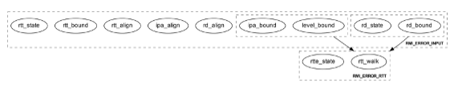
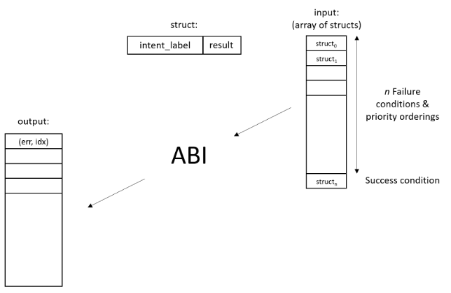

.. Copyright [C] 2023-2026, Arm Limited or its affiliates. All rights reserved.
      SPDX-License-Identifier: BSD-3-Clause

*************************
Command Scenario document
*************************
.. raw:: pdf

   PageBreak

.. section-numbering::

.. contents::
      :depth: 3

Introduction
============

In this document the test scenarios for all RMM ABI commands are detailed.
First, an overview of the general test strategy is provided, which forms the
basis of the overall flow and rationale of the various scenarios. Unless otherwise specified,
this scenario doc is compliant to alp8 of `Realm Management Monitor (RMM) Specification`_ v1.1.

Arm Realm Management Monitor Specification
==========================================
The Realm Management Monitor (RMM) is a software component which forms part of a system which
implements the Arm Confidential Compute Architecture (Arm CCA). `Arm CCA`_ is an architecture which
provides protected execution environments called Realms.

CCA-RMM-ACS Command Suite
=========================

The Command Suite in the CCA-RMM ACS tests the Interface section of
`Realm Management Monitor (RMM) Specification`_. The RMM exposes three interfaces of which one is
facing the Host (RMI), and two are facing the Realm (RSI and PSCI). For each of the commands a set
of input stimuli with which all the failure conditions can be verified, and instructions to observe
the command footprint are provided.
The tests are classified as.

* RMI - Realm Management Interface
* RSI - Realm Services Interface
* PSCI - Power State Coordination Interface

Test strategy
-------------

ABI command testing can be regarded as the 'unit-level like' testing of each ABI command. The goal
here is to verify whether execution of the command produces the expected outcome. For RMM ABI
command testing there are three aspects that require elaboration:

1.      The scope and generation of input stimuli
2.      The observability of the command footprints
3.      The general test flow

Each of the aforementioned aspects will be discussed in a dedicated sections below.

Stimulus
^^^^^^^^

In order to properly exercise the commands, sets of input arguments must be selected such that all
corner cases are covered.
Each command will be tested on failure conditions, failure priority ordering, and finally,
successful execution.

.. list-table::

   * - Failure conditon testing
   * - Typically, each ABI command has a set of failure conditions that can arise from invalid
       input argument values. Such conditions have an associated error code, and the same error
       can often be triggered by multiple values of that input argument. In this part of the test,
       we will explore all the input values with which the failure condition can be triggered. For
       example, we might test whether an address is out of bounds by testing boundary conditions,
       but not all possible regions that would meet the criteria. In each case we then provide a set
       of input arguments that should trigger only a single failure condition at a time:

       Exceptions :

       Although the strategy is to cover all corner cases in failure condition testing, there are
       exceptions:

         * Circular Dependencies: Here we would require ABI commands that are yet to be verified to
           generate the stimulus (note that these are sometimes unavoidable)
         * Multi-causal Stimuli: This is unavoidable in certain cases. For example, an out-of-bound
           rd in RMI_DATA_CREATE ABI would also result in granule(rd).state error. However, we will
           exclude stimuli that trigger multiple failure conditions which have both: I) different
           error codes, and II) no architected priority ordering relative to each other.

.. raw:: pdf

   PageBreak

.. list-table::

   * - Failure priority ordering
   * - It is also important to test that the correct order is maintained between these failure
       conditions. To test this, we trigger multiple failure conditions on one or multiple input
       arguments, and verify that the error code of the higher priority condition is observed.
       In contrast to failure condition testing, each condition will only be triggered in a single
       way to limit the problem size. This methodology of triggering multiple faults at a time will
       be referred to as Pairwise Failure Ordering Testing (PFOT).

       A failure condition ordering A < B can be grouped into two categories:

         * Well-formedness (Not Tested)

           These orderings exist because failure condition B can only be evaluated if failure
           condition A is false. In the figure below [rd_state, rd_bound] < [rtte_state, rtt_walk]
           are well-formedness orderings as we cannot define an RTT walk if the RD granule is not
           an actual Realm Descriptor granule. As the name suggests, these orderings exist to
           ensure the mathematical "well-formedness" of the RMM specification and we will not
           verify these.

            |Priority orderings|

         * Behavioural (Tested)

           These orderings exist to prevent security leaks and to ensure that the returned error
           code is deterministic across RMM implementations and will be verified, An example in the
           figure above is level_bound < rtt_walk, which implies that an out-of-bounds level
           parameter should be reported ahead of an RTT walk failure. Furthermore, while it is
           mathematically acceptable to derive the order between failure conditions based on
           hierarchy (i.e. if A < B and B < C, then A < C), we will also verify these transitive
           priority relationships (i.e. A < C) as these orderings must be honoured by the
           implementer, but are not explicitly mentioned in the specification

.. list-table::

   * - Success conditon testing
   * - At the end of each ABI command test we will execute the command with valid input parameters
       to check that the command executed successfully.

Observability
^^^^^^^^^^^^^

At the end of each ABI command test we will execute the command with valid input parameters to check
that the command executed successfully.

.. table::

  +---------------+------------------------+---------------------------------+
  |Footprint      |Category                |Can it be queried by the host    |
  +===============+========================+=================================+
  |Properties of  | state                  |No                               |
  |a granule      |                        |                                 |
  |               | (UNDELEGATE, DELEGATED,|                                 |
  |               | RD, REC, REC_AUX, DATA,|                                 |
  |               | RTT)                   |                                 |
  |               +------------------------+---------------------------------+
  |               | substate               |In general not, except           |
  |               |                        |RTTE.state/ripas through         |
  |               | (RD - New/Active/ NULL,|RMI_RTT_READ_ENTRY               |
  |               | REC - Ready/Running,   |                                 |
  |               | RTTE.state/ripas)      |                                 |
  |               +------------------------+---------------------------------+
  |               | ownership              |No                               |
  |               |                        |                                 |
  |               | (RD)                   |                                 |
  |               +------------------------+---------------------------------+
  |               | GPT entry              |No                               |
  |               |                        |                                 |
  |               | (GPT_NS, GPT_ROOT,     |                                 |
  |               | GPT_REALM, GPT_SECURE) |                                 |
  +---------------+------------------------+---------------------------------+
  |Contents of    | (RD / REC / DATA / RTT |No these are provisioned by the  |
  |a granule      | / NS)                  |host but outside of Realm's TCB  |
  |               |                        |(except for NS granules)         |
  +---------------+------------------------+---------------------------------+

As many of these properties and contents of Granules cannot directly by queried by the Host, we
need to detect these indirectly. For example, we can determine the Granule states and substates by
ascertaining which state transitions are possible, or not possible. Since each state transition is
associated with a successful ABI call, some of which would still be subject to verification, this
gives rise to so called circular dependencies. The general strategy here is to prevent circular
dependencies as much as possible and defer the residual observation of command footprints to other
ACS test scenarios. Hence, we will employ the following strategies where the properties and contents
of Granules cannot be queried by the Host.

Observing Properties of a granule
~~~~~~~~~~~~~~~~~~~~~~~~~~~~~~~~~

.. table::

  +-------------------+----------------------------------------------------------------+
  |Scenario           |Strategy                                                        |
  +===================+================================================================+
  |When the command   |In general, we will not check for changes in properties of      |
  |fails              |a Granule. We will only check the error code in command         |
  |                   |ACS. The expectation that a failing command must not cause      |
  |                   |footprint changes is validated indirectly, to a large           |
  |                   |extent, as part of testing the command for success criteria.    |
  |                   |This is because of the valid arguments being same across        |
  |                   |failure testing (other than the argument that causes a          |
  |                   |particular failure condition) and successful execution of       |
  |                   |the command. Consider also checking rtte_state & rtte_addr      |
  |                   |for applicable commands.                                        |
  |                   +----------------------------------------------------------------+
  |                   |state                                                           |
  |                   |                                                                |
  |                   |We will not test this in CCA-RMM-ACS as the logic to ascertain  |
  |                   |that the state is unchanged (due to command failure) is not     |
  |                   |trivial and typically falls in DV space. Also see above comment |
  |                   +----------------------------------------------------------------+
  |                   |substate                                                        |
  |                   |                                                                |
  |                   |Where they can be queried, we will execute the query ABI (i.e.  |
  |                   |RTT_READ_ENTRY). Where it cannot be queried, we will follow the |
  |                   |same strategy for granule states listed above.                  |
  |                   +----------------------------------------------------------------+
  |                   |ownership                                                       |
  |                   |                                                                |
  |                   |We will follow the same strategy as for granule state.          |
  |                   +----------------------------------------------------------------+
  |                   |GPT entry                                                       |
  |                   |                                                                |
  |                   |For GPT entry checks we will do testing in memory management ACS|
  |                   |scenarios to ensure that the GPI encodings in the GPT has not   |
  |                   |changed.                                                        |
  +-------------------+----------------------------------------------------------------+
  |Summary            |When command fails, ACS will check for return error code, and   |
  |                   |RTTE for some of the failure conditions.                        |
  +-------------------+----------------------------------------------------------------+
  |When the command   |In general, we will check that the returned error code is equal |
  |succeeds           |to zero.                                                        |
  |                   +----------------------------------------------------------------+
  |                   |state                                                           |
  |                   |                                                                |
  |                   |We will not test this in command ACS as it doesn't fit into a   |
  |                   |typical command ACS test flow. This is covered outside of the   |
  |                   |command ACS, for example, as part of typical realm creation     |
  |                   |flow or winding the state of RMM/Realm as part of rollback logic|
  |                   |by VAL that's needed to run ACS as a single ELF.                |
  |                   +----------------------------------------------------------------+
  |                   |substate                                                        |
  |                   |                                                                |
  |                   |Where they can be queried, we will execute the query ABI. Where |
  |                   |it cannot be queried, we will follow the strategy for observing |
  |                   |granule states listed above.                                    |
  |                   +----------------------------------------------------------------+
  |                   |ownership                                                       |
  |                   |                                                                |
  |                   |Unless otherwise specified we will follow the same strategy as  |
  |                   |specified for granule state.                                    |
  |                   +----------------------------------------------------------------+
  |                   |GPT entry                                                       |
  |                   |                                                                |
  |                   |There will be testing in memory management ACS scenarios to     |
  |                   |probe the GPI encodings in the GPT.                             |
  +-------------------+----------------------------------------------------------------+
  |Summary            |When command succeeds, ACS will check for return status, and    |
  |                   |RTTE wherever applicable                                        |
  +-------------------+----------------------------------------------------------------+

Observing contents of a granule
~~~~~~~~~~~~~~~~~~~~~~~~~~~~~~~
.. list-table::
  :widths: 25 75

  * - Scenario
    - Strategy
  * - When the command fails
    - We will, in general, not check for forbidden changes in contents of a Granule. There is an
      exception for NS Granules. For example, while testing REC_ENTER, we can check whether the
      exit_ptr remains unchanged and does not contain the fields populated in entry_ptr through
      testing outside of the ACS command scenarios.
  * - When the command succeeds
    - * Host Provisioned

        For contents that are provisioned by the Host through parameters we do know the expected
        value, but still need to verify whether the RMM correctly handled the parameters. These will
        be verified through testing outside of the command ACS.
      * Non-Host Provisioned

        For contents that are not provisioned by the Host, if the expected values are architected,
        we will verify this through testing outside of the ACS command scenarios.

General Test flow
^^^^^^^^^^^^^^^^^
Having defined the overall test strategy and scoping, the general flow of ABI command tests is as
follows:

1.      Enter the test from NS-EL2 or R-EL1
2.      Initialize the input structure (as depicted in the figure below)
3.      Iteratively load the intent labels from the input structure and perform the corresponding
        parameter preparation sequence
4.      Execute the ABI command with the prepared set of parameters and check for the expected
        error code
5.      If all reported error codes are as expected, check the command footprint
6.      Undo any footprint changes caused by the successful ABI execution and observability tests
7.      Return to the test dispatcher

|Intent to sequence structure|

Disclaimer: Only invalid values that cause a failure condition are specified. All other attributes
of an input argument must be set to valid values, if applicable, as defined in argument list table
above.

RMI Commands
------------

RMI_DATA_CREATE
^^^^^^^^^^^^^^^

Argument list
~~~~~~~~~~~~~

.. list-table::
  :widths: 25 75

  * - Input parameters
    - Valid Values
  * - rd
    - | granule(rd).state = RD
      | Realm(rd).state = New
  * - data
    - | granule(data) = 4K_ALIGNED
      | granule(data).state = DELEGATED
      | data < 2^48 if Realm(rd).feat_lpa2 == FALSE
  * - ipa
    - | ipa = 4K_ALIGNED
      | ipa = Protected
      | walk(ipa).level = LEAF_LEVEL
      | RTTE(ipa).state = UNASSIGNED
      | RTTE(ipa).ripas = RAM
  * - src
    - | granule(src) = 4K_ALIGNED
      | granule(src).gpt = GPT_NS
  * - flags
    - | flags = RMI_MEASURE_CONTENT

Failure condition testing
~~~~~~~~~~~~~~~~~~~~~~~~~

.. list-table::
  :widths: 20 40 40

  * - Input parameters
    - Input Values
    - Remarks
  * - rd
    - granule(rd) = unaligned_addr, mmio_region [A], outside_of_permitted_pa [B],
      not_backed_by_encryption, raz or wi [C]

      (rd).state = UNDELEGATED, DELEGATED, REC, RTT, DATA

      Realm(rd).state = Active, Null, System_Off
    - [A] Memory that behaves like mmio (i.e. read or write-sensitive region)

      [B] Pick an address that is outside the permitted PA range (lowest of RmiFeatureRegister0.S2SZ
      and ID_AA64MMFR0_EL1.PARange)

      [C] Memory address that reads as zero and ignores writes

  * - data
    - granule(data) = unaligned_addr, mmio_region [A], outside_of_permitted_pa [B],
      not_backed_by_encryption, raz or wi [C]

      granule(data).state = UNDELEGATED, DELEGATED, RD, REC, RTT

      granule(data).gpt = GPT_SECURE

      data >= 2^48 when Realm(rd).feat_lpa2 == FALSE
    -
  * - ipa
    - ipa = unaligned_addr, unprotected_ipa, outside_of_permitted_ipa (info)

      walk(ipa).level != LEAF_LEVEL

      RTTE[ipa].state = ASSIGNED (circular)

    - unprotected_ipa := ipa >= 2**(IPA_WIDTH - 1)

      IPA_WIDTH = RmiFeatureRegister0.S2SZ

      (info) Must cover statement - IFBZPQ The input address to an RTT walk is always less than
      2^w, where w is the IPA width of the target Realm.

      No way to prevent circular dependencies here
  * - src
    - granule(src) = unaligned_addr, mmio_region [A], outside_of_permitted_pa [B],
      not_backed_by_encryption, raz or wi [C]

      granule(src).gpt == GPT_SECURE, GPT_REALM
    -

Failure Priority ordering
~~~~~~~~~~~~~~~~~~~~~~~~~

.. list-table::
  :widths: 20 40 40

  * - Input parameters
    - Input Values
    - Remarks
  * - ipa
    - | unprotected_ipa && walk(ipa).level != LEAF_LEVEL
      | unprotected_ipa && RTTE[ipa].state = ASSIGNED_NS
    -

Observability
~~~~~~~~~~~~~
.. list-table::
  :widths: 25 75

  * - Footprint
    - Verification
  * - Command Failure
    -
  * - | RTTE.state,
      | RTTE.addr
    - Refer Observing Properties of a Granule and Observing Contents of a Granule for details
  * - rim
    - This is outside the scope of CCA-RMM-ACS.
  * - | granule(data).state
      | granule(data).content
    - This is outside the scope of CCA-RMM-ACS. Refer Observing Properties of a Granule and
      Observing Contents of a Granule for details
  * - Command Success
    -
  * - | RTTE.state,
      | RTTE.addr
      | RTTE.ripas
    - Execute RTT_READ_ENTRY and compare the outcome with expected value (as defined by the
      architecture)

  * - | granule(data).state
      | granule(data).content
    - This is already tested outside of ACS command scenarios, as part of Realm creation
      with payload.
  * - rim
    - This is already tested outside of ACS command scenarios (Attestation and Measurement
      scenarios)

RMI_DATA_CREATE_UNKNOWN
^^^^^^^^^^^^^^^^^^^^^^^

Argument list
~~~~~~~~~~~~~

.. list-table::
  :widths: 25 75

  * - Input parameters
    - Valid Values
  * - rd
    - | granule(rd).state = RD
      | Realm(rd).state = New, Active
  * - data
    - | granule(data) = 4K_ALIGNED
      | granule(data).state = DELEGATED
      | data < 2^48 if Realm(rd).feat_lpa2 == FALSE
  * - ipa
    - | ipa = 4K_ALIGNED
      | ipa = Protected
      | walk(ipa).level = LEAF_LEVEL
      | RTTE(ipa).state = UNASSIGNED
      | RTTE(ipa).ripas = EMPTY, RAM, DESTROYED

Failure condition testing
~~~~~~~~~~~~~~~~~~~~~~~~~

.. list-table::
  :widths: 20 40 40

  * - Input parameters
    - Input Values
    - Remarks
  * - rd
    - granule(rd) = unaligned_addr, mmio_region [A], outside_of_permitted_pa [B],
      not_backed_by_encryption, raz or wi [C]

      granule(rd).state = UNDELEGATED, DELEGATED, REC, RTT, DATA
    -
  * - data
    - granule(data) = unaligned_addr, mmio_region [A], outside_of_permitted_pa [B],
      not_backed_by_encryption, raz or wi [C]

      granule(data).state = UNDELEGATED, DELEGATED, RD, REC, RTT

      data >= 2^48 when Realm(rd).feat_lpa2 == FALSE

    - See RMI_DATA_CREATE for specifics behind these stimuli
  * - ipa
    - ipa = unaligned_addr, unprotected_ipa, outside_of_permitted_ipa (info)

      walk(ipa).level != LEAF_LEVEL

      RTTE[ipa].state = ASSIGNED (circular)

    - unprotected_ipa := ipa >= 2**(IPA_WIDTH - 1)

      IPA_WIDTH = RmiFeatureRegister0.S2SZ

      (info) Must cover statement - IFBZPQ The input address to an RTT walk is always less than
      2^w, where w is the IPA width of the target Realm.

      No way to prevent circular dependencies here

Failure Priority ordering
~~~~~~~~~~~~~~~~~~~~~~~~~

.. list-table::
  :widths: 20 40 40

  * - Input parameters
    - Input Values
    - Remarks
  * - ipa
    - | unprotected_ipa && walk(ipa).level != LEAF_LEVEL
      | unprotected_ipa && RTTE[ipa].state = ASSIGNED_NS
    -

Observability
~~~~~~~~~~~~~
.. list-table::
  :widths: 25 75

  * - Footprint
    - Verification
  * - Command Failure
    -
  * - | RTTE.state,
      | RTTE.addr
    - Refer Observing Properties of a Granule and Observing Contents of a Granule for details
  * - | granule(data).state
      | granule(data).content
    - This is outside the scope of CCA-RMM-ACS. Refer Observing Properties of a Granule and
      Observing Contents of a Granule for details
  * - Command Success
    -
  * - | RTTE.state,
      | RTTE.addr
    - Execute RTT_READ_ENTRY and compare the outcome with expected value (as defined by the
      architecture)

      Do this for Realm(rd).state = {NEW, ACTIVE} and RTTE[ipa].ripas = {EMPTY, RAM, DESTROYED}
  * - | granule(data).state
      | granule(data).content
    - For granule(data).content, it needs to be tested outside of ACS command scenarios as part
      of verifying "granule wiping" security
      property for granule(data).state, it already tested outside of ACS command scenarios, as part
      of RMM/Realm state rollback at the end
      of each test.

RMI_DATA_DESTROY
^^^^^^^^^^^^^^^^

Argument list
~~~~~~~~~~~~~

.. list-table::
  :widths: 25 75

  * - Input parameters
    - Valid Values
  * - rd
    - | granule(rd).state = RD
      | Realm(rd).state = New, Active
  * - ipa
    - | ipa = 4K_ALIGNED
      | ipa = Protected
      | walk(ipa).level = LEAF_LEVEL
      | RTTE(ipa).state = ASSIGNED
      | RTTE(ipa).ripas = EMPTY, RAM, DESTROYED
      | RTTE_AUX(ipa).state = UNASSIGNED provided Realm(rd).rtt_tree_pp is TRUE

Failure condition testing
~~~~~~~~~~~~~~~~~~~~~~~~~

.. list-table::
  :widths: 20 40 40

  * - Input parameters
    - Input Values
    - Remarks
  * - rd
    - granule(rd) = unaligned_addr, mmio_region [A], outside_of_permitted_pa [B],
      not_backed_by_encryption, raz or wi [C]

      granule(rd).state = UNDELEGATED, DELEGATED, REC, RTT, DATA
    -
  * - data
    - granule(data) = unaligned_addr, mmio_region [A], outside_of_permitted_pa [B],
      not_backed_by_encryption, raz or wi [C]

      granule(data).state = UNDELEGATED, DELEGATED, RD, REC, RTT

    - See RMI_DATA_CREATE for specifics behind these stimuli
  * - ipa
    - ipa = unaligned_addr, unprotected_ipa, outside_of_permitted_ipa (info)

      walk(ipa).level != LEAF_LEVEL

      RTTE[ipa].state = UNASSIGNED

      RTTE_AUX[ipa].state = UNASSIGNED if Realm(rd).rtt_tree_pp == TRUE

    - unprotected_ipa := ipa >= 2**(IPA_WIDTH - 1)

      IPA_WIDTH = RmiFeatureRegister0.S2SZ

      (info) Must cover statement - IFBZPQ The input address to an RTT walk is always less than
      2^w, where w is the IPA width of the target Realm.

Failure Priority ordering
~~~~~~~~~~~~~~~~~~~~~~~~~

.. list-table::
  :widths: 20 40 40

  * - Input parameters
    - Input Values
    - Remarks
  * - ipa
    - | unprotected_ipa && walk(ipa).level != LEAF_LEVEL
      | unprotected_ipa && RTTE[ipa].state = UNASSIGNED_NS
      | unprotected_ipa && RTTE_AUX[ipa].state = ASSIGNED_NS
    -

Observability
~~~~~~~~~~~~~
.. list-table::
  :widths: 25 75

  * - Footprint
    - Verification
  * - Command Failure
    -
  * - | RTTE.state,
      | RTTE.addr
    - Refer Observing Properties of a Granule and Observing Contents of a Granule for details
  * - | granule(data).state
      | granule(data).content
    - This is outside the scope of CCA-RMM-ACS. Refer Observing Properties of a Granule and
      Observing Contents of a Granule for details
  * - Command Success
    -
  * - | RTTE.state,
      | RTTE.addr
    - Execute RTT_READ_ENTRY and compare the outcome with expected value (as defined by the
      architecture)

      Do this for Realm(rd).state = {NEW, ACTIVE} and RTTE[ipa].ripas = {EMPTY, RAM, DESTROYED}
  * - | granule(data).state
      | granule(data).content
    - For granule(data).content, it needs to be tested outside of ACS command scennarios (as part
      of security scenarios).

RMI_FEATURES
^^^^^^^^^^^^

Argument list
~~~~~~~~~~~~~

.. list-table::
  :widths: 25 75

  * - Input parameters
    - Valid Values
  * - index
    - index = Any integer (64b)

Failure condition testing
~~~~~~~~~~~~~~~~~~~~~~~~~

This command has no failure conditions.

Failure Priority ordering
~~~~~~~~~~~~~~~~~~~~~~~~~

This command has no failure priority values.

Observability
~~~~~~~~~~~~~
.. list-table::
  :widths: 25 75

  * - Footprint
    - Verification
  * - Command Success
    -
  * - X1 (Command return Value)
    - | when index = 0, and spec version is v1.0 Check X1[42:63] MBZ field is zero
      | when index = 0, and spec version is v1.1 Check X1[49:63] MBZ field is zero
      | when index != 0, Check X1 == 0

RMI_GRANULE_DELEGATE
^^^^^^^^^^^^^^^^^^^^

Argument list
~~~~~~~~~~~~~

.. list-table::
  :widths: 25 75

  * - Input parameters
    - Valid Values
  * - addr
    - | granule(addr) = 4K_ALIGNED
      | granule(addr).state = UNDELEGATED
      | granule(addr).gpt = GPT_NS.

Failure condition testing
~~~~~~~~~~~~~~~~~~~~~~~~~

.. list-table::
  :widths: 20 40 40

  * - Input parameters
    - Input Values
    - Remarks
  * - addr
    - granule(addr) = unaligned_addr, mmio_region [A], outside_of_permitted_pa [B],
      not_backed_by_encryption, raz or wi [C]

      granule(addr).state = DELEGATED, RD, REC, RTT, DATA

      granule(addr).gpt = GPT_SECURE, GPT_REALM
    - See RMI_DATA_CREATE for the specifics behind these stimuli.

      granule(addr).gpt = GPT_ROOT is outside the scope of ACS.

Failure Priority ordering
~~~~~~~~~~~~~~~~~~~~~~~~~

This command has no failure priority orderings.

Observability
~~~~~~~~~~~~~
.. list-table::
  :widths: 25 75

  * - Footprint
    - Verification
  * - Command Failure
    -
  * - granule(addr).gpt
    - | For granule(addr).gpt = GPT_NS, an access to addr from the NS world should be successful
        and should be tested in command ACS.
      | For granule(addr).gpt = GPT_SECURE and GPT_REALM (granule(addr).state = DATA), this needs
        to be tested outside of ACS command scenarios
  * - granule(addr).state
    - This is outside the scope of CCA-RMM-ACS. Refer Observing Properties of a Granule and
      Observing Contents of a Granule for details
  * - Command Success
    -
  * - granule(addr).gpt
    - This is tested outside of ACS command scenarios - As part of mm_gpf_exception test:

      Note:

      [1] A NS-world access to addr in this case would result in GPF. The target EL for this GPF
      depends on SCR_EL3.GPF (which is the DUT) If SCR_EL3.GPF =1, the  fault is reported as GPC
      exception and is taken to EL3. EL3 may choose to delegate this exception to NS-EL2. If this
      delegation scheme is supported by the implementation, we can validate changes in PAS in ACS.
      If not, the test needs to be able to exit gracefully, for example, using watchdog interrupt.
      If this is not possible, we won't be able to verify changes in PAS in ACS. If SCR_EL3.GPF=0,
      the GPF is reported as instruction or data abort at EL2 itself, and this can be validated in
      ACS. Need to be wary of the above while writing ACS.

      [2] Using realm creation flow that's already tested outside of ACS command scenarios
      Post RMI_GRANULE_DELEGATE, such a flow would create realm/rec/rtt/data and be able to execute
      from realm successfully. Point 2 proves that the granule can be accessed from the target
      granule(addr).PAS and Point 1 proves that the granule access is forbidden from the current
      state. Conclusion - do option1 outside of command ACS and keep such testing to a limited
      set of tests

  * - granule(addr).state
    - This is already tested outside of ACS command scenarios (Realm creation with payload).

RMI_GRANULE_UNDELEGATE
^^^^^^^^^^^^^^^^^^^^^^
Argument list
~~~~~~~~~~~~~

.. list-table::
  :widths: 25 75

  * - Input parameters
    - Valid Values
  * - addr
    - | granule(addr) = 4K_ALIGNED
      | granule(addr).state = DELEGATED
      | granule(addr).gpt = GPT_REALM

Failure condition testing
~~~~~~~~~~~~~~~~~~~~~~~~~

.. list-table::
  :widths: 20 40 40

  * - Input parameters
    - Input Values
    - Remarks
  * - addr
    - granule(addr) = unaligned_addr, mmio_region [A], outside_of_permitted_pa [B],
      not_backed_by_encryption, raz or wi [C]

      granule(addr).state = DELEGATED, RD, REC, RTT, DATA

    - See RMI_DATA_CREATE for the specifics behind these stimuli.

      granule(addr).gpt = GPT_ROOT is outside the scope of ACS.

Failure Priority ordering
~~~~~~~~~~~~~~~~~~~~~~~~~

This command has no failure priority orderings.

Observability
~~~~~~~~~~~~~
.. list-table::
  :widths: 25 75

  * - Footprint
    - Verification
  * - Command Failure
    -
  * - | granule(addr).gpt
      | grnaule(addr).state
    - For granule(addr).gpt = GPT_RELAM && granule(addr).state = REC/DATA/RD/RTT
      execute the respective destroy command and verify that it is successful
  * - granule(addr).content
    - This is outside the scope of CCA-RMM-ACS. Refer Observing Properties of a Granule and
      Observing Contents of a Granule for details
  * - Command Success
    -
  * - | granule(addr).gpt
      | granule(addr).content
    - Can be tested through accesses from the NS world (should succeed and content be wiped)

      Sequence:
      RMI_DATA_CREATE(ipa, src, data) --> RMI_DATA_DESTROY(rd, ipa) -->
      RMI_GRANULE_UNDELEGATE(addr=data)

      Verify:
      src != data
      This will be covered within the command ACS.
  * - granule(addr).state
    - This is already tested outside of ACS command scenarios (Realm teardown sequence).

RMI_PSCI_COMPLETE
^^^^^^^^^^^^^^^^^
To test this command, unless otherwise specified below, the pre-requisite is that the realm needs to
initiate corresponding PSCI request (PSCI_AFFINITY_INFO or PSCI_CPU_ON) through RSI.

Argument list
~~~~~~~~~~~~~

.. list-table::
  :widths: 25 75

  * - Input parameters
    - Valid Values
  * - calling_rec_ptr
    - | granule(calling_rec_ptr) = 4K_ALIGNED
      | granule(calling_rec_ptr).state = REC
      | Rec(calling_rec_ptr).psci_pending = PSCI_REQUEST_PENDING
      | calling_rec_ptr != target_rec_ptr
  * - target_rec_ptr
    - | granule(target_rec_ptr) = 4K_ALIGNED
      | granule(target_rec_ptr).state = REC
      | Rec(target_rec_ptr).owner = Rec(calling_rec_ptr).owner
      | Rec(target_rec_ptr).mpidr = Rec(calling_rec_ptr).gprs[1]
  * - status
    - Valid PSCI status code which is permitted.

Failure condition testing
~~~~~~~~~~~~~~~~~~~~~~~~~

.. list-table::
  :widths: 20 40 40

  * - Input parameters
    - Input Values
    - Remarks
  * - calling_rec_ptr
    - granule(calling_rec_ptr) = granule(target_rec_ptr), unaligned_addr, mmio_region [A],
      outside_of_permitted_pa [B], not_backed_by_encryption, raz or wi [C].

      granule(calling_rec_ptr).state = UNDELEGATED, DELEGATED, RD, REC_AUX, RTT, DATA [D]

      Rec(calling_rec_ptr).psci_pending != PSCI_REQUEST_PENDING [E]
    - [E] - This can be achieved in two ways.

      [1] Execute RMI_PSCI_COMPLETE without a request from realm

      [2] provide incorrect calling_rec arg value (same realm but didn't initiate RSI request,
      REC belonging to different realm) in RMI_PSCI_COMPLETE
  * - target_rec_ptr
    - granule(target_rec_ptr) = unaligned_addr, mmio_region, outside of permitted pa, not backed by
      encryption, raz or wi, other_realm_owned rec, wrong_target [F]

      granule(target_rec_ptr).state = UNDELEGATED, DELEGATED, RD, REC_AUX, RTT, DATA [D]

    - [F] wrong_target implies that calling_rec has a different mpidr value stored in gprs[1] than
      target_rec.mpidr
  * - status
    - Return a PSCI status code which is not permitted to return.
    -

Failure Priority ordering
~~~~~~~~~~~~~~~~~~~~~~~~~
This command has no failure priority ordering.

Observability
~~~~~~~~~~~~~

.. list-table::
  :widths: 25 75

  * - Footprint
    - Verification
  * - Command Failure
    -
  * - | target_rec_ptr.content,
      | calling_rec_ptr.content
    - Refer Observing Properties of a Granule and Observing Contents of a Granule for details
  * - Command Success
    -
  * - | target_rec_ptr.content,
      | calling_rec_ptr.content
    - Tested outside of ACS command scenarios.

      Overlap with a scenario in Exception Model module - exception_rec_exit_due_to_psci

RMI_REALM_ACTIVATE
^^^^^^^^^^^^^^^^^^

Argument list
~~~~~~~~~~~~~

.. list-table::
  :widths: 25 75

  * - Input parameters
    - Valid Values
  * - rd
    - | granule(rd) = 4K_ALIGNED
      | granule(rd).state = RD
      | Realm(rd).state = New

Failure condition testing
~~~~~~~~~~~~~~~~~~~~~~~~~

.. list-table::
  :widths: 20 40 40

  * - Input parameters
    - Input Values
    - Remarks
  * - rd
    - granule(rd) = unaligned_addr, mmio_region [A], outside_of_permitted_pa [B],
      not_backed_by_encryption, raz or wi [C]

      granule(rd).state = UNDELEGATED, DELEGATED, REC, RTT, DATA

      Realm(rd).state = Active[E], NULL, System off[E]
    - (A - D) See RMI_DATA_CREATE for the specifics behind these stimuli

      [E] Active requires a valid REALM_ACTIVATE call (circular dependency) -> Do this as part of
      the positive observability check

Failure Priority ordering
~~~~~~~~~~~~~~~~~~~~~~~~~

.. list-table::
  :widths: 20 40 40

  * - Input parameters
    - Input Values
    - Remarks
  * - rd
    - granule(rd).state DELEGATED & Realm(rd).state = NULL
    - This is already covered with Realm(rd).state = NULL in the failure condition stimulus above

Observability
~~~~~~~~~~~~~
.. list-table::
  :widths: 25 75

  * - Footprint
    - Verification
  * - Command Failure
    -
  * - Realm(rd).state
    - This is outside the scope of CCA-RMM-ACS. Refer Observing Properties of a Granule and
      Observing Contents of a Granule for details
  * - Command Success
    -
  * - Realm(rd).state
    - This is already tested outside of ACS command scenarios(as part of Realm entry test flows)

RMI_REALM_CREATE
^^^^^^^^^^^^^^^^

Argument list
~~~~~~~~~~~~~

.. list-table::
  :widths: 25 75

  * - Input parameters
    - Valid Values
  * - rd
    - | granule(rd) = 4K_ALIGNED
      | granule(rd).state = DELEGATED
  * - params_ptr
    - | granule(params_ptr) = 4K_ALIGNED
      | granule(params_ptr).gpt = GPT_NS
      | granule(params_ptr).content(rtt_base) = 4K_ALIGNED
      | granule(params_ptr).content(rtt_base).state = DELEGATED
      | granule(params_ptr).content(flags, s2sz, sve_vl, num_bps, num_wps, pmu_num_ctrs) = supported
      | granule(params_ptr).content(vmid) = valid, not_in_use
      | granule(params_ptr).content(hash_algo) = valid, supported
      | granule(params_ptr).content(rtt_level_start, rtt_num_start) = consistent with features0.S2SZ
      | !(granule(rd) >= granule(params_ptr).content(rtt_base) && granule(rd) <=
        granule(params_ptr).content(rtt_base+rtt size))

Failure condition testing
~~~~~~~~~~~~~~~~~~~~~~~~~

.. list-table::
  :widths: 20 40 40

  * - Input parameters
    - Input Values
    - Remarks
  * - rd
    - granule(rd) = unaligned_addr, mmio_region [A], outside_of_permitted_pa [B],
      not_backed_by_encryption, raz or wi [C],

      params_ptr.content(rtt_base)

      granule(rd).state = UNDELEGATED, DELEGATED, REC, RTT, DATA
    -
  * - params_ptr
    - granule(params_ptr) = unaligned_addr, mmio_region[A], outside_of_permitted_pa [B],
      not_backed_by_encryption, raz or wi [C]

      granule(params_ptr).content(hash_algo) = encoding_reserved [E], not_supported [F]

      granule(params_ptr).content(rtt_base) = unaligned_addr,

      granule(params_ptr).content(rtt_num_start, rtt_level_start) = incompatible [G],

      granule(params_ptr).content(rtt_base, rttsize(*)).state = UNDELEGATED,

      granule(params_ptr).content(vmid) = invalid, in_use

      granule(params_ptr).gpt = GPT_REALM, GPT_SECURE, GPT_ROOT (may be outside the scope of ACS
      as we may not get to know Root memory from platform memory map)

      (*)rtt size = rtt base<addr<rtt_num_start*RMM granule size so, cover
      RMIRealmparams.rtt_num_start =1 and >1.

      For the latter, for example, if read of RMIFeatureregister0.S2SZ=16 (that is implementation
      supports 48-bit PA/IPA), program RMIRealmparams.features0.S2SZ= 24 (that is 40- bit IPA),
      RMIRealmparams.rtt_num_start ~2, RMIRealmparams.rtt_level_start ~1, choose rtt_base ~ 8K
      aligned address with first 4KB in delegate state and the next 4KB in undelegate state
    -
      [E] encoding_reserved refers to values that are reserved for future implementations (i.e.,
      not in the table in spec)

      [F] not_supported refers to a valid encoding that is not supported by current implementation
      - To achieve this error, perform following sequence read RMI Featureregister0.HASH_SHA_256
      and HASH_SHA_512 and figure out which one of these is supported by the underlying platform
      Provide the unsupported value from previous step in granule(params_ptr).hash_algo

      [G] params_ptr.content(rtt_num_start, rtt_level_start) = incompatible with
      RMIFeatureregister0.S2SZ

      Scenario: Host to choose rtt_level_start and ipa_width such that number of starting
      level RTTs is greater than one. Host to populate correct rtt_num_start value in realmParam,
      expect SUCCESS.

      Host to choose rtt_level_start and ipa_width such that number of starting level RTTs is
      greater than one. Host to populate incorrect rtt_num_start value in realmParam and expect ERROR

      Perform following steps in argument preparation phase (intent to sequence block) to achieve
      above conditions (for generating ERROR):

      read RMIFeatureregister0.S2SZ

      if S2SZ ~ [12-15], set RMIRealmparams.rtt_level_start ~ 1/2/3 or set
      RMIRealmparams.rtt_num_start ~ >16

      if S2SZ ~ [16-24], set RMIRealmparams.rtt_level_start ~ 2/3 or set
      RMIRealmparams.rtt_num_start ~ >16

      if S2SZ ~ [25-33], set RMIRealmparams.rtt_level_start ~ 3 or set
      RMIRealmparams.rtt_num_start ~ >16

      if S2SZ ~ [34-42], set RMIRealmparams.rtt_num_start ~ >16

      Note that S2SZ format in RMIFeatureregister0 is different from VTCR_EL2.T0SZ in that the
      former expects the actual IPA width to be programmed (or returned during querying) as against
      specifying the equivalent of T0SZ value.

Failure Priority ordering
~~~~~~~~~~~~~~~~~~~~~~~~~
This command has no failure priority orderings.

Observability
~~~~~~~~~~~~~
.. list-table::
  :widths: 25 75

  * - Footprint
    - Verification
  * - Command Failure
    -
  * - | rd.state
      | rd.substate
      | rd.content
    - This is outside the scope of CCA-RMM-ACS. Refer Observing Properties of a Granule and
      Observing Contents of a Granule for details
  * - Command Success
    -
  * - | rd.state
      | rd.substate
      | rd.content
    - This is already tested outside of ACS command scenarios(as part of realm creation flow).

RMI_REALM_DESTROY
^^^^^^^^^^^^^^^^^

Argument list
~~~~~~~~~~~~~

.. list-table::
  :widths: 25 75

  * - Input parameters
    - Valid Values
  * - rd
    - | granule(rd) = 4K_ALIGNED
      | granule(rd).state = RD
      | Realm Liveliness = FALSE

Failure condition testing
~~~~~~~~~~~~~~~~~~~~~~~~~

.. list-table::
  :widths: 20 40 40

  * - Input parameters
    - Input Values
    - Remarks
  * - rd
    - granule(rd) = unaligned_addr, mmio_region [A], outside_of_permitted_pa [B],
      not_backed_by_encryption, raz or wi [C], alive

      granule(rd).state = UNDELEGATED, DELEGATED[E], REC, RTT, DATA

      [E] create a realm, destroy a realm. The state of granule is in delegated state. Use this
      granule to destroy an already destroyed realm. The command should fail due to rd_state error.
    -

Failure Priority ordering
~~~~~~~~~~~~~~~~~~~~~~~~~

.. list-table::
  :widths: 20 40 40

  * - Input parameters
    - Input Values
    - Remarks
  * - rd
    - Orderings between granule(rd) or granule(rd).state & Realm liveliness
    - These are outside the scope of CCA-RMM-ACS as these fall under well formedness orderings.

Observability
~~~~~~~~~~~~~

.. list-table::
  :widths: 25 75

  * - Footprint
    - Verification
  * - Command Failure
    -
  * - | granule(rd).state
      | granule(rtt).state
    - Refer Observing Properties of a Granule and Observing Contents of a Granule for details.
  * - Command Success
    -
  * - | vmid
      | granule(rd).state
      | Ream(rd).state
    - All of this is already tested outside of ACS command scenarios . For example, VMID being
      freed up is tested as part of running ACS as a single ELF (that is, VAL winds up state of RMM
      test before start of another test).

      For granule(rd).state, Realm(rd).state, verify this is command ACS by performing
      RMI_REALM_CREATE again with identical attributes.

RMI_REC_AUX_COUNT
^^^^^^^^^^^^^^^^^

Argument list
~~~~~~~~~~~~~

.. list-table::
  :widths: 25 75

  * - Input parameters
    - Valid Values
  * - rd
    - | granule(rd) = 4K_ALIGNED
      | granule(rd).state = RD

Failure condition testing
~~~~~~~~~~~~~~~~~~~~~~~~~
.. list-table::
  :widths: 20 40 40

  * - Input parameters
    - Input Values
    - Remarks
  * - rd
    - granule(rd) = unaligned_addr, mmio_region [A], outside_of_permitted_pa [B],
      not_backed_by_encryption, raz or wi [C]

      granule(rd).state = UNDELEGATED, DELEGATED, REC, RTT, DATA

    - See RMI_DATA_CREATE for the specifics behind these stimuli

Failure Priority ordering
~~~~~~~~~~~~~~~~~~~~~~~~~
This command has no failure priority orderings.

Observability
~~~~~~~~~~~~~
.. list-table::
  :widths: 25 75

  * - Footprint
    - Verification
  * - Command Success
    -
  * - X1 (command return value)
    - This is already tested outside of ACS command scenarios as part of the Realm creation flow.

RMI_REC_CREATE
^^^^^^^^^^^^^^

Argument list
~~~~~~~~~~~~~

.. list-table::
  :widths: 25 75

  * - Input parameters
    - Valid Values
  * - rd
    - | granule(rd) = 4K_ALIGNED
      | granule(rd).state = RD
      | Realm(rd).state = New
  * - rec
    - | granule(rec) = 4K_ALIGNED
      | granule(rec).state = DELEGATED
  * - params_ptr
    - | granule(params_ptr) = 4K_ALIGNED
      | granule(params_ptr).gpt = GPT_NS
      | granule(params_ptr).content(mpidr) = in_range (where in_range = 0, 1, 2, ...)
      | granule(params_ptr).content(aux) = 4K_ALIGNED
      | granule(params_ptr).content(num_aux) = RMI_REC_AUX_COUNT(rd)
      | granule(params_ptr).content(aux).state = DELEGATED
      | granule(params_ptr).content/content(name).MBZ/SBZ = 0, where name can be flags. Try with
        flag = runnable and not runnable.

Failure condition testing
~~~~~~~~~~~~~~~~~~~~~~~~~

.. list-table::
  :widths: 20 40 40

  * - Input parameters
    - Input Values
    - Remarks
  * - rd
    - granule(rd) = unaligned_addr, mmio_region [A], outside_of_permitted_pa [B],
      not_backed_by_encryption, raz or wi [C]

      granule(rd).state = UNDELEGATED, DELEGATED[E], REC, RTT, DATA

      Realm(rd).state = Active, System off

    - [E] create a realm, destroy the realm and use the granule that's in delegated state as an
      input to this ABI to test above failure condition.

      Prepare granule whose granule(rd).state=DELEGATED and realm(rd).state=Null
      Realm(rd).state = Null will result in more than one failure condition whose error codes are
      different and priority ordering is not defined
  * - rec
    - granule(rec) = unaligned_addr, mmio_region [A], outside_of_permitted_pa [B],
      not_backed_by_encryption, raz or wi [C]

      granule(rec).state = UNDELEGATED, DELEGATED, RD, REC_AUX, RTT, DATA [D]
    -
  * - params_ptr
    - granule(params_ptr) = unaligned_addr, mmio_region [A], outside_of_permitted_pa [B],
      not_backed_by_encryption, raz or wi [C]

      granule(params_ptr).content(num_aux) != RMI_REC_AUX_COUNT(rd)

      granule(params_ptr).content(aux...num_aux) = unaligned_addr [G]

      granule(params_ptr).content(aux...num_aux) = granule(rec) [H]

      granule(params_ptr).content(aux) = mmio_region [A], outside_of_permitted_pa [B],
      not_backed_by_encryption, raz or wi [C]

      granule(params_ptr).content(aux...num_aux).state = UNDELEGATED, REC, RTT, DATA [D]

      granule(params_ptr).content(mpidr) = provide mpidr value starting from 2

      granule(params_ptr).gpt = GPT_REALM, GPT_SECURE, GPT_ROOT [F]
    - [F] GPT_ROOT (may be outside the scope of ACS as we may not get to know Root memory from
      platform memory map)

      [G] at least one aux_granule must be unaligned

      [H] Provide granule(rec) address to one of aux address

Failure Priority ordering
~~~~~~~~~~~~~~~~~~~~~~~~~

.. list-table::
  :widths: 20 40

  * - Input parameters
    - Remarks
  * - rd
    - The priority ordering as defined in the spec is already covered with granule(rd) = mmio in
      the failure condition stimulus above.

Observability
~~~~~~~~~~~~~
.. list-table::
  :widths: 25 75

  * - Footprint
    - Verification
  * - Command Failure
    -
  * - | Realm(rd).rec_index
      | granule(rec).content
      | granule(rec).attest
      | granule(rec_aux).state
    - Refer Observing Properties of a Granule and Observing Contents of a Granule for details.
  * - | rim
    - This is outside the scope of CCA-RMM-ACS
  * - Command Success
    -
  * - Realm(rd).rec_index
    - This is already tested outside of command ACS (a Realm with multiple RECs)
  * - granule(rec).content
    - This is already tested outside of command ACS (a Realm entry)
  * - | granule(rec).ripas_addr
      | granule(rec).ripas_top
      | granule(rec).host_call
    - This is already tested outside of command ACS in one of the Exception Model scenarios.
  * - rim
    - This is already tested outside of command ACS (Attestation and Measurement Scenarios)
  * - granule(rec).attest
    - This is outside the scope of CCA-RMM-ACS

RMI_REC_DESTROY
^^^^^^^^^^^^^^^

Argument list
~~~~~~~~~~~~~

.. list-table::
  :widths: 25 75

  * - Input parameters
    - Valid Values
  * - rec_ptr
    - | granule(rec_ptr) = 4K_ALIGNED
      | granule(rec_ptr).state = REC
      | Rec(rec_ptr).state = READY

Failure condition testing
~~~~~~~~~~~~~~~~~~~~~~~~~

.. list-table::
  :widths: 20 40 40

  * - Input parameters
    - Input Values
    - Remarks
  * - rec_ptr
    - granule(rec_ptr) = unaligned_addr, mmio_region [A], outside_of_permitted_pa [B],
      not_backed_by_encryption, raz or wi [C]

      granule(rec_ptr).state = UNDELEGATED, DELEGATED, RD, REC_AUX, RTT, DATA [D]

      Rec(rec_ptr).state = Running [E]
    - [E] This can be verified only in an MP environment and need to be tested outside of
      command ACS.

Failure Priority ordering
~~~~~~~~~~~~~~~~~~~~~~~~~

.. list-table::
  :widths: 20 40

  * - Input parameters
    - Remarks
  * - rec_ptr
    - The priority ordering as defined in the spec is already covered with granule(rec_ptr) = mmio and
      granule(rec_ptr).state  in the failure condition stimulus above

Observability
~~~~~~~~~~~~~
.. list-table::
  :widths: 25 75

  * - Footprint
    - Verification
  * - Command Failure
    -
  * - | granule(rec_ptr).state
      | granule(rec_aux).state
    - Refer Observing Properties of a Granule and Observing Contents of a Granule for details.
  * - Command Success
    -
  * - | granule(rec).state
      | granule(rec_aux).state
    - This is already tested outside of ACS command scenarios, as part of RMM/Realm state rollback
      that's needed to run ACS as a single ELF.

RMI_REC_ENTER
^^^^^^^^^^^^^

Argument list
~~~~~~~~~~~~~

.. list-table::
  :widths: 25 75

  * - Input parameters
    - Valid Values
  * - rec
    - | granule(rec) = 4K_ALIGNED
      | granule(rec).state = REC
      | Rec(rec).state = READY
      | Rec(rec).content(flags.runnable) = RUNNABLE
      | Rec(rec).content(psci_pending) = NO_PSCI_REQUEST_PENDING
      | Realm(Rec(rec).owner).state = Active
  * - run_ptr
    - | granule(run_ptr) = 4K_ALIGNED
      | granule(run_ptr).gpt = GPT_NS
      | granule(run_ptr).content(entry.flags.emul_mmio) = NOT_RMI_EMULATED_MMIO
      | granule(run_ptr).content(entry.gicv3_hcr) = valid (RES0)
      | granule(run_ptr).content(entry.gicv3_lrs) = valid (HW = 0)

Failure condition testing
~~~~~~~~~~~~~~~~~~~~~~~~~

.. list-table::
  :widths: 20 40 40

  * - Input parameters
    - Input Values
    - Remarks
  * - rec
    - granule(rec) = unaligned_addr, mmio_region , outside_of_permitted_pa [B],
      not_backed_by_encryption, raz or wi [C]

      granule(rec).content(flags.runnable) = NOT_RUNNABLE

      granule(rec).content(psci_pending) = PSCI_REQUEST_PENDING

      granule(rec).state = UNDELEGATED, DELEGATED, RD, REC_AUX, RTT, DATA [D]

      Rec(rec).state = Running [E]

      Realm(Rec(rec).owner).state = New, System_Off
    - [E] This is an MP scenario as one thread (REC) will be running inside the Realm,
      while another will attempt to enter into realm using the same REC. This needs to be tested
      outside of command ACS.

  * - run_ptr
    - granule(run_ptr) = unaligned_addr, mmio_region [A], outside_of_permitted_pa [B],
      not_backed_by_encryption, raz or wi [C]

      granule(run_ptr).gpt = GPT_REALM, GPT_SECURE, GPT_ROOT [H]

      granule(run_ptr).content(is_emulated_mmio) = RMI_EMULATED_MMIO [F]

      granule(run_ptr).content(gicv3_hcr/gcv3_lrs) = invalid_encoding [G]
    - [F] assumes rec.content(emulatable_abort) = NOT_EMULATABLE_ABORT (this is the case before
      even entering into realm for the first time)

      [G] Exhaustive testing to follow in GIC Scenarios

      [H] GPT_ROOT (may be outside the scope of ACS as we may not get to know Root memory
      from platform memory map)

Failure Priority ordering
~~~~~~~~~~~~~~~~~~~~~~~~~
This is tested as part of single failure condition testing.

Observability
~~~~~~~~~~~~~
.. list-table::
  :widths: 25 75

  * - Footprint
    - Verification
  * - Command Failure
    -
  * - Rec(rec).content
    - Refer Observing Properties of a Granule and Observing Contents of a Granule for details.
  * - Command Success
    -
  * - Rec(rec).content
    - This is already tested outside of ACS command scenarios. (Exception scenarios)

RMI_RTT_AUX_CREATE
^^^^^^^^^^^^^^^^^^

Argument list
~~~~~~~~~~~~~

.. list-table::
  :widths: 25 75

  * - Input parameters
    - Valid Values
  * - rd
    - | granule(rd) = 4K_ALIGNED
      | granule(rd).state = RD
      | Realm(rd).state = New, Active, System_Off
  * - rtt
    - | granule(rtt) = 4K_ALIGNED
      | granule(rtt).state = DELEGATED
      | rtt < 2^48 if Realm(rd).feat_lpa2 == FALSE
  * - ipa
    - | ipa = (level-1)_aligned
      | ipa = within_permissible_ipa (< 2^features0.S2SZ)
      | walk(ipa).level = level - 1
      | RTTE[ipa].state = UNASSIGNED
  * - level
    - level = {1, 2, 3} if start level is level 0.
  * - index
    - 0 < index < realm.num_aux_planes, provided Realm(rd).rtt_tree_pp is TRUE.

Failure condition testing
~~~~~~~~~~~~~~~~~~~~~~~~~

.. list-table::
  :widths: 20 40 40

  * - Input parameters
    - Input Values
    - Remarks
  * - rd
    - granule(rd) = unaligned_addr, mmio_region [A], outside_of_permitted_pa [B],
      not_backed_by_encryption, raz or wi [C]

      granule(rd).state = UNDELEGATED, DELEGATED, REC, RTT, DATA
    -
  * - rtt
    - granule(rtt) = unaligned_addr (<4KB aligned), mmio_region [A], outside_of_permitted_pa [B],
      not_backed_by_encryption, raz or wi [C]

      granule(rtt).state = UNDELEGATED, DELEGATED, RD, REC, DATA

      rtt >= 2^48 when Realm(rd).feat_lpa2 == FALSE
    -
  * - ipa
    - ipa = unaligned_addr (for example, a 4KB aligned IPA to create level2 RTT),
      outside_permissible_ipa (*)

      walk(ipa).level < level - 1

      RTTE[ipa].state = TABLE (circular -> same as positive Observability check)
    - (*)Must cover statement - IFBZPQ The input address to an RTT walk is always less than
      2^w, where w is the IPA width of the target Realm as defined by RMIFeatureregister0.S2SZ
  * - level
    - level = start_level (for example 0 if S2SZ supports an IPA width compatible to level0), 4
    -
  * - index
    - index = 0, Realm(rd).num_aux_planes + 1

      index = X, Realm(rd).rtt_tree_pp = FALSE
    -

Failure Priority ordering
~~~~~~~~~~~~~~~~~~~~~~~~~
All failure priority ordering conditions specified in spec are tested as part of failure condition
testing (multi-causal stimuli)

Observability
~~~~~~~~~~~~~
.. list-table::
  :widths: 25 75

  * - Footprint
    - Verification
  * - Command Failure
    -
  * - | rtt.state
      | RTTE.state
      | RTTE.addr
      | RTT[ipa].content
    - Refer Observing Properties of a Granule and Observing Contents of a Granule for details.
  * - Command Success
    -
  * - | rtt.state
      | RTTE.state
      | RTTE.addr
      | RTT[ipa].content
    - Execute Valid RTT_AUX__CREATE --> success

RMI_RTT_AUX_DESTROY
^^^^^^^^^^^^^^^^^^^

Argument list
~~~~~~~~~~~~~

.. list-table::
  :widths: 25 75

  * - Input parameters
    - Valid Values
  * - rd
    - | granule(rd) = 4K_ALIGNED
      | granule(rd).state = RD
      | Realm(rd).state = New, Active, System_Off
  * - ipa
    - | ipa = (level-1)_aligned
      | ipa = within_permissible_ipa (< 2^ (features0.S2SZ))
      | walk(ipa).level = level - 1
      | RTTE[ipa].state = Table
      | Rtt(walk(ipa, level-1).addr) = Non live
  * - level
    - level = {1, 2, 3} if start level is level 0.
  * - index
    - 0 < index < realm.num_aux_planes, provided Realm(rd).rtt_tree_pp is TRUE.

Failure condition testing
~~~~~~~~~~~~~~~~~~~~~~~~~

.. list-table::
  :widths: 20 40 40

  * - Input parameters
    - Input Values
    - Remarks
  * - rd
    - granule(rd) = unaligned_addr, mmio_region [A], outside_of_permitted_pa [B],
      not_backed_by_encryption, raz or wi [C]

      granule(rd).state = UNDELEGATED, DELEGATED, REC, RTT, DATA
    -
  * - ipa
    - ipa = unaligned_addr(for example, a 4KB aligned IPA to destroy level2 RTT),
      outside_permissible_ipa,

      walk(ipa).level < level - 1

      RTTE[ipa].state = ASSIGNED, UNASSIGNED

      Rtt(walk(ipa, level-1).addr) = Live [E]
    - [E] Destroy a RTT with at least one live entry (ex RTTE[walk(ipa, level)] = ASSIGNED or TABLE)
  * - level
    - level = start_level (for example 0 if S2SZ supports an IPA width compatible to level0), 4
    -
  * - index
    - index = 0, Realm(rd).num_aux_planes + 1

      index = X, Realm(rd).rtt_tree_pp = FALSE
    -

Failure Priority ordering
~~~~~~~~~~~~~~~~~~~~~~~~~
All failure priority ordering conditions specified in spec are tested as part of failure condition
testing (multi-causal stimuli) and some fall under well-formed ordering

Observability
~~~~~~~~~~~~~
.. list-table::
  :widths: 25 75

  * - Footprint
    - Verification
  * - Command Failure
    -
  * - rtt.state, rtte
    - Refer Observing Properties of a Granule and Observing Contents of a Granule for details.
  * - Command Success
    -
  * - rtt.state, rtte
    - Execute Valid RTT_AUX_DESTROY --> success

RMI_RTT_AUX_FOLD
^^^^^^^^^^^^^^^^

Argument list
~~~~~~~~~~~~~

.. list-table::
  :widths: 25 75

  * - Input parameters
    - Valid Values
  * - rd
    - | granule(rd) = 4K_ALIGNED
      | granule(rd).state = RD
      | Realm(rd).state = New, Active, System_Off
  * - ipa
    - | ipa = (level-1)_aligned
      | ipa = within_permissible_ipa (< 2^Features0.S2SZ)
      | walk(ipa).level = level-1
      | RTTE[ipa].state = Table
      | RTT[walk(ipa, level-1).addr) = Homogeneous
  * - level
    - level = {1 when RMIFeatureregister0.LPA2 is True, 2, 3}
  * - index
    - 0 < index < realm.num_aux_planes, provided Realm(rd).rtt_tree_pp is TRUE.

Failure condition testing
~~~~~~~~~~~~~~~~~~~~~~~~~

.. list-table::
  :widths: 20 40 40

  * - Input parameters
    - Input Values
    - Remarks
  * - rd
    - granule(rd) = unaligned_addr, mmio_region [A], outside_of_permitted_ipa [B],
      not_backed_by_encryption, raz or wi [C]

      granule(rd).state = UNDELEGATED, DELEGATED, REC, RTT, DATA
    -
  * - ipa
    - ipa = unaligned_addr (for example, a 4KB aligned IPA to fold level3 RTT),
      outside_permissible_ipa.

      walk(ipa).level < level - 1

      RTTE[ipa].state = ASSIGNED, UNASSIGNED

      RTT[walk(ipa, level-1).addr) = not_homogeneous [E]
    - [E] not_homogeneous refers to an RTT that has RTTEs in different states. For example, an RTTE
      is in assigned state and another RTTE in destroyed state.
  * - level
    - level = SL (-1 when RMIFeatureregister0.LPA2 is supported, otherwise 0),4,1(when
      RMIFeatureregister0.LPA2 is not supported)
    -
  * - index
    - index = 0, Realm(rd).num_aux_planes + 1

      index = X, Realm(rd).rtt_tree_pp = FALSE
    -

Failure Priority ordering
~~~~~~~~~~~~~~~~~~~~~~~~~
All failure priority ordering conditions specified in spec are tested as part of failure condition
testing (multi-causal stimuli) and some fall under well-formed ordering

Observability
~~~~~~~~~~~~~
.. list-table::
  :widths: 25 75

  * - Footprint
    - Verification
  * - Command Failure
    -
  * - | rtt.state
      | RTTE.state
    - Refer Observing Properties of a Granule and Observing Contents of a Granule for details.
  * - Command Success
    -
  * - | rtt.state
      | RTTE.state
    - Execute Valid RTT_AUX_FOLD --> success

RMI_RTT_AUX_MAP_PROTECTED
^^^^^^^^^^^^^^^^^^^^^^^^^

Argument list
~~~~~~~~~~~~~

.. list-table::
  :widths: 25 75

  * - Input parameters
    - Valid Values
  * - rd
    - | granule(rd).state = RD
      | Realm(rd).state = New
  * - ipa
    - | ipa = 4K_ALIGNED
      | ipa = Protected
      | walk_aux(index, ipa).level = walk_pri(ipa).level
      | RTTE_PRI(ipa).state = ASSIGNED
      | RTTE_PRI(ipa).ripas = RAM
      | RTTE_AUX(index, ipa).state = UNASSIGNED
  * - index
    - 0 < index < realm.num_aux_planes, provided Realm(rd).rtt_tree_pp is TRUE.

Failure condition testing
~~~~~~~~~~~~~~~~~~~~~~~~~

.. list-table::
  :widths: 20 40 40

  * - Input parameters
    - Input Values
    - Remarks
  * - rd
    - granule(rd) = unaligned_addr, mmio_region [A], outside_of_permitted_pa [B],
      not_backed_by_encryption, raz or wi [C]

      granule(rd).state = UNDELEGATED, DELEGATED, REC, RTT, DATA

      Realm(rd).state = Active, Null, System_Off
    -
  * - ipa
    - ipa = unaligned_addr, unprotected_ipa, outside_of_permitted_ipa (info)

      walk_aux(index, ipa).level < walk_pri(ipa).level

      RTTE_PRI[ipa].state = UNASSIGNED, TABLE
      RTTE_PRI[ipa].ripas = EMPTY, DESTROYED

      RTTE_AUX[index][ipa].state = UNASSIGNED, AUX_DESTROYED

    - unprotected_ipa := ipa >= 2**(IPA_WIDTH - 1)

      IPA_WIDTH = RmiFeatureRegister0.S2SZ

      (info) Must cover statement - IFBZPQ The input address to an RTT walk is always less than
      2^w, where w is the IPA width of the target Realm.

      No way to prevent circular dependencies here
  * - index
    - index = 0, Realm(rd).num_aux_planes + 1

      index = X, Realm(rd).rtt_tree_pp = FALSE
    -

Failure Priority ordering
~~~~~~~~~~~~~~~~~~~~~~~~~

.. list-table::
  :widths: 20 40 40

  * - Input parameters
    - Input Values
    - Remarks
  * - index, ipa
    - | index = 0 && walk_pri(ipa).state = UNASSIGNED
      | unprotected_ipa && walk_aux(index, ipa).level != walk_pri(ipa).level
      | unprotected_ipa && RTTE[ipa].state = ASSIGNED_NS

    - All other priority orderings are tested as part of failure condition testing

Observability
~~~~~~~~~~~~~
.. list-table::
  :widths: 25 75

  * - Footprint
    - Verification
  * - Command Failure
    -
  * - | RTTE.state,
      | RTTE.addr
    - Refer Observing Properties of a Granule and Observing Contents of a Granule for details
  * - Command Success
    -
  * - | RTTE.state,
      | RTTE.addr
      | RTTE.ripas
    - Execute RTT_READ_ENTRY and compare the outcome with expected value (as defined by the
      architecture)

RMI_RTT_AUX_MAP_UNPROTECTED
^^^^^^^^^^^^^^^^^^^^^^^^^^^

Argument list
~~~~~~~~~~~~~

.. list-table::
  :widths: 25 75

  * - Input parameters
    - Valid Values
  * - rd
    - | granule(rd) = 4K_ALIGNED
      | granule(rd).state = RD
  * - ipa
    - | ipa = (level) aligned
      | ipa = unprotected_ipa and within_permissible_ipa (< 2^Features0.S2SZ)
      | walk_aux(index, ipa).level = walk_pri(ipa).level
      | RTTE_PRI[ipa].state = ASSIGNED
      | RTTE_AUX[ipa].state = UNASSIGNED_NS
  * - index
    - 0 < index < realm.num_aux_planes, provided Realm(rd).rtt_tree_pp is TRUE.

Failure condition testing
~~~~~~~~~~~~~~~~~~~~~~~~~

.. list-table::
  :widths: 20 40 40

  * - Input parameters
    - Input Values
    - Remarks
  * - rd
    - granule(rd) = unaligned_addr, mmio_region [A], outside_of_permitted_ipa [B],
      not_backed_by_encryption, raz or wi [C]

      granule(rd).state = UNDELEGATED, DELEGATED, REC, RTT, DATA
    -
  * - ipa
    - ipa = unaligned_addr(wrt "level" argument value supplied to the command. For example,
      if level = 3, provide an IPA that's < 4KB aligned),protected_ipa, outside_permissible_ipa

      walk(ipa).level != level

      RTTE[ipa].state = ASSIGNED_NS
    -
  * - index
    - index = 0, Realm(rd).num_aux_planes + 1

      index = X, Realm(rd).rtt_tree_pp = FALSE
    -

Failure Priority ordering
~~~~~~~~~~~~~~~~~~~~~~~~~

.. list-table::
  :widths: 20 40 40

  * - Input parameters
    - Input Values
    - Remarks
  * - index, ipa
    - | index = 0 && walk_pri(ipa).state = UNASSIGNED_NS
      | protected_ipa && walk_aux(index, ipa).level != walk_pri(ipa).level
      | protected_ipa && RTTE[ipa].state = ASSIGNED
    - All other priority orderings are tested as part of failure condition testing

Observability
~~~~~~~~~~~~~
.. list-table::
  :widths: 25 75

  * - Footprint
    - Verification
  * - Command Failure
    -
  * - | RTTE_AUX.state
      | RTTE_AUX.content
    - Refer Observing Properties of a Granule and Observing Contents of a Granule for details.
  * - Command Success
    -
  * - | RTTE_AUX.state
      | RTTE_AUX.content
    - Execute Valid RTT_AUX_MAP_UNPROTECTED -> success

RMI_RTT_AUX_UNMAP_PROTECTED
^^^^^^^^^^^^^^^^^^^^^^^^^^^

Argument list
~~~~~~~~~~~~~

.. list-table::
  :widths: 25 75

  * - Input parameters
    - Valid Values
  * - rd
    - | granule(rd).state = RD
      | Realm(rd).state = New, Active
  * - ipa
    - | ipa = 4K_ALIGNED
      | ipa = Protected
      | walk(index, ipa).level = LEAF_LEVEL
      | RTTE(index, ipa).state = ASSIGNED
      | RTTE(index, ipa).ripas = EMPTY, RAM, DESTROYED
  * - index
    - 0 < index < realm.num_aux_planes, provided Realm(rd).rtt_tree_pp is TRUE.

Failure condition testing
~~~~~~~~~~~~~~~~~~~~~~~~~

.. list-table::
  :widths: 20 40 40

  * - Input parameters
    - Input Values
    - Remarks
  * - rd
    - granule(rd) = unaligned_addr, mmio_region [A], outside_of_permitted_pa [B],
      not_backed_by_encryption, raz or wi [C]

      granule(rd).state = UNDELEGATED, DELEGATED, REC, RTT, DATA
    -
  * - ipa
    - ipa = unaligned_addr, unprotected_ipa, outside_of_permitted_ipa (info)

      walk(ipa).level != LEAF_LEVEL

      RTTE[index, ipa].state = UNASSIGNED

    - unprotected_ipa := ipa >= 2**(IPA_WIDTH - 1)

      IPA_WIDTH = RmiFeatureRegister0.S2SZ

      (info) Must cover statement - IFBZPQ The input address to an RTT walk is always less than
      2^w, where w is the IPA width of the target Realm.
  * - index
    - index = 0, Realm(rd).num_aux_planes + 1

      index = X, Realm(rd).rtt_tree_pp = FALSE
    -

Failure Priority ordering
~~~~~~~~~~~~~~~~~~~~~~~~~

.. list-table::
  :widths: 20 40 40

  * - Input parameters
    - Input Values
    - Remarks
  * - ipa, index
    - | index = 0 && RTTE[index, ipa].state = UNASSIGNED_NS
      | unprotected_ipa && walk(index, ipa).level != LEAF_LEVEL
      | unprotected_ipa && RTTE[index, ipa].state = UNASSIGNED_NS
    - All other priority orderings are tested as part of failure condition testing.

Observability
~~~~~~~~~~~~~
.. list-table::
  :widths: 25 75

  * - Footprint
    - Verification
  * - Command Failure
    -
  * - | RTTE.state,
      | RTTE.addr
    - Refer Observing Properties of a Granule and Observing Contents of a Granule for details
  * - Command Success
    -
  * - | RTTE.state,
      | RTTE.addr
    - Executing RTT_AUX_MAP_PROTECTED on the same IPA should succeed.

RMI_RTT_AUX_UNMAP_UNPROTECTED
^^^^^^^^^^^^^^^^^^^^^^^^^^^^^

Argument list
~~~~~~~~~~~~~

.. list-table::
  :widths: 25 75

  * - Input parameters
    - Valid Values
  * - rd
    - | granule(rd) = 4K_ALIGNED
      | granule(rd).state = RD
  * - ipa
    - | ipa = level_aligned, unprotected_ipa and within_permissible_ipa (< 2^Features0.S2SZ)
      | RTTE[index, ipa].state = ASSIGNED_NS
  * - index
    - 0 < index < realm.num_aux_planes, provided Realm(rd).rtt_tree_pp is TRUE.

Failure condition testing
~~~~~~~~~~~~~~~~~~~~~~~~~

.. list-table::
  :widths: 20 40 40

  * - Input parameters
    - Input Values
    - Remarks
  * - rd
    - rd = unaligned_addr, mmio_region [A], outside_of_permitted_ipa [B], not_backed_by_encryption,
      raz or wi [C]

      granule(rd).state = UNDELEGATED, DELEGATED, REC, RTT, DATA
    -
  * - ipa
    - ipa = unaligned_addr(wrt "level" argument value supplied to the command. For example,
      if level = 3, provide an IPA that's < 4KB aligned), protected_ipa, outside_permissible_ipa

      RTTE[ipa].state = UNASSIGNED_NS
    -
  * - index
    - index = 0, Realm(rd).num_aux_planes + 1

      index = X, Realm(rd).rtt_tree_pp = FALSE
    -

Failure Priority ordering
~~~~~~~~~~~~~~~~~~~~~~~~~

.. list-table::
  :widths: 20 40 40

  * - Input parameters
    - Input Values
    - Remarks
  * - ipa, index
    - index = 0 && RTTE[index, ipa].state = UNASSIGNED_NS
    - All other priority orderings are tested as part of failure condition testing.

Observability
~~~~~~~~~~~~~
.. list-table::
  :widths: 25 75

  * - Footprint
    - Verification
  * - Command Failure
    -
  * - RTTE.state
    - Refer Observing Properties of a Granule and Observing Contents of a Granule for details.
  * - Command Success
    -
  * - RTTE.state
    - Execute Valid RTT_AUX_UNMAP_UNPROTECTED --> success

RMI_RTT_CREATE
^^^^^^^^^^^^^^

Argument list
~~~~~~~~~~~~~

.. list-table::
  :widths: 25 75

  * - Input parameters
    - Valid Values
  * - rd
    - | granule(rd) = 4K_ALIGNED
      | granule(rd).state = RD
      | Realm(rd).state = New, Active, System_Off
  * - rtt
    - | granule(rtt) = 4K_ALIGNED
      | granule(rtt).state = DELEGATED
      | rtt < 2^48 if Realm(rd).feat_lpa2 == FALSE
  * - ipa
    - | ipa = (level-1)_aligned
      | ipa = within_permissible_ipa (< 2^features0.S2SZ)
      | walk(ipa).level = level - 1
      | RTTE[ipa].state = UNASSIGNED
  * - level
    - level = {1, 2, 3} if start level is level 0.

Failure condition testing
~~~~~~~~~~~~~~~~~~~~~~~~~

.. list-table::
  :widths: 20 40 40

  * - Input parameters
    - Input Values
    - Remarks
  * - rd
    - granule(rd) = unaligned_addr, mmio_region [A], outside_of_permitted_pa [B],
      not_backed_by_encryption, raz or wi [C]

      granule(rd).state = UNDELEGATED, DELEGATED, REC, RTT, DATA
    -
  * - rtt
    - granule(rtt) = unaligned_addr (<4KB aligned), mmio_region [A], outside_of_permitted_pa [B],
      not_backed_by_encryption, raz or wi [C]

      granule(rtt).state = UNDELEGATED, DELEGATED, RD, REC, DATA

      rtt >= 2^48 when Realm(rd).feat_lpa2 == FALSE
    -
  * - ipa
    - ipa = unaligned_addr (for example, a 4KB aligned IPA to create level2 RTT),
      outside_permissible_ipa (*)

      walk(ipa).level < level - 1

      RTTE[ipa].state = Table (circular -> same as positive Observability check)
    - (*)Must cover statement - IFBZPQ The input address to an RTT walk is always less than
      2^w, where w is the IPA width of the target Realm as defined by RMIFeatureregister0.S2SZ
  * - level
    - level = start_level (for example 0 if S2SZ supports an IPA width compatible to level0), 4
    -

Failure Priority ordering
~~~~~~~~~~~~~~~~~~~~~~~~~
All failure priority ordering conditions specified in spec are tested as part of failure condition
testing (multi-causal stimuli)

Observability
~~~~~~~~~~~~~
.. list-table::
  :widths: 25 75

  * - Footprint
    - Verification
  * - Command Failure
    -
  * - | rtt.state
      | RTTE.state
      | RTTE.addr
      | RTT[ipa].content
    - Refer Observing Properties of a Granule and Observing Contents of a Granule for details.
  * - Command Success
    -
  * - | rtt.state
      | RTTE.state
      | RTTE.addr
      | RTT[ipa].content
    - | Execute Valid RTT_CREATE --> success
      | Execute RTT_READ_ENTRY and verify the outcome is as expected by the architecture.

RMI_RTT_DESTROY
^^^^^^^^^^^^^^^

Argument list
~~~~~~~~~~~~~

.. list-table::
  :widths: 25 75

  * - Input parameters
    - Valid Values
  * - rd
    - | granule(rd) = 4K_ALIGNED
      | granule(rd).state = RD
      | Realm(rd).state = New, Active, System_Off
  * - ipa
    - | ipa = (level-1)_aligned
      | ipa = within_permissible_ipa (< 2^ (features0.S2SZ))
      | walk(ipa).level = level - 1
      | RTTE[ipa].state = Table
      | Rtt(walk(ipa, level-1).addr) = Non live
  * - level
    - level = {1, 2, 3} if start level is level 0.

Failure condition testing
~~~~~~~~~~~~~~~~~~~~~~~~~

.. list-table::
  :widths: 20 40 40

  * - Input parameters
    - Input Values
    - Remarks
  * - rd
    - granule(rd) = unaligned_addr, mmio_region [A], outside_of_permitted_pa [B],
      not_backed_by_encryption, raz or wi [C]

      granule(rd).state = UNDELEGATED, DELEGATED, REC, RTT, DATA
    -
  * - ipa
    - ipa = unaligned_addr(for example, a 4KB aligned IPA to destroy level2 RTT),
      outside_permissible_ipa,

      walk(ipa).level < level - 1

      RTTE[ipa].state = ASSIGNED, UNASSIGNED

      Rtt(walk(ipa, level-1).addr) = Live [E]
    - [E] Destroy a RTT with at least one live entry (ex RTTE[walk(ipa, level)] = ASSIGNED or TABLE)
  * - level
    - level = start_level (for example 0 if S2SZ supports an IPA width compatible to level0), 4
    -

Failure Priority ordering
~~~~~~~~~~~~~~~~~~~~~~~~~
All failure priority ordering conditions specified in spec are tested as part of failure condition
testing (multi-causal stimuli) and some fall under well-formed ordering

Observability
~~~~~~~~~~~~~
.. list-table::
  :widths: 25 75

  * - Footprint
    - Verification
  * - Command Failure
    -
  * - | rtt.state
      | RTTE.state
    - Refer Observing Properties of a Granule and Observing Contents of a Granule for details.
  * - Command Success
    -
  * - | rtt.state
      | RTTE.state
    - | Execute Valid RTT_DESTROY --> success
      | Execute RTT_READ_ENTRY and verify the outcome is as expected by the architecture.

RMI_RTT_FOLD
^^^^^^^^^^^^

Argument list
~~~~~~~~~~~~~

.. list-table::
  :widths: 25 75

  * - Input parameters
    - Valid Values
  * - rd
    - | granule(rd) = 4K_ALIGNED
      | granule(rd).state = RD
      | Realm(rd).state = New, Active, System_Off
  * - ipa
    - | ipa = (level-1)_aligned
      | ipa = within_permissible_ipa (< 2^Features0.S2SZ)
      | walk(ipa).level = level-1
      | RTTE[ipa].state = Table
      | RTT[walk(ipa, level-1).addr) = Homogeneous
  * - level
    - level = {1 when RMIFeatureregister0.LPA2 is True, 2, 3}

Failure condition testing
~~~~~~~~~~~~~~~~~~~~~~~~~

.. list-table::
  :widths: 20 40 40

  * - Input parameters
    - Input Values
    - Remarks
  * - rd
    - granule(rd) = unaligned_addr, mmio_region [A], outside_of_permitted_ipa [B],
      not_backed_by_encryption, raz or wi [C]

      granule(rd).state = UNDELEGATED, DELEGATED, REC, RTT, DATA
    -
  * - ipa
    - ipa = unaligned_addr (for example, a 4KB aligned IPA to fold level3 RTT),
      outside_permissible_ipa.

      walk(ipa).level < level - 1

      RTTE[ipa].state = ASSIGNED, UNASSIGNED

      RTT[walk(ipa, level-1).addr) = not_homogeneous [E]
    - [E] not_homogeneous refers to an RTT that has RTTEs in different states. For example, an RTTE
      is in assigned state and another RTTE in destroyed state.
  * - level
    - level = SL (-1 when RMIFeatureregister0.LPA2 is supported, otherwise 0),4,1(when
      RMIFeatureregister0.LPA2 is not supported)
    -

Failure Priority ordering
~~~~~~~~~~~~~~~~~~~~~~~~~
All failure priority ordering conditions specified in spec are tested as part of failure condition
testing (multi-causal stimuli) and some fall under well-formed ordering

Observability
~~~~~~~~~~~~~
.. list-table::
  :widths: 25 75

  * - Footprint
    - Verification
  * - Command Failure
    -
  * - | rtt.state
      | RTTE.state
    - Refer Observing Properties of a Granule and Observing Contents of a Granule for details.
  * - Command Success
    -
  * - | rtt.state
      | RTTE.state
    - | Execute Valid RTT_FOLD --> success
      | Execute RTT_READ_ENTRY and verify the outcome is as expected by the architecture.

RMI_RTT_INIT_RIPAS
^^^^^^^^^^^^^^^^^^

Argument list
~~~~~~~~~~~~~

.. list-table::
  :widths: 25 75

  * - Input parameters
    - Valid Values
  * - rd
    - | granule(rd) = 4K_ALIGNED
      | granule(rd).state = RD
      | Realm(rd).state = New
  * - base
    - | base = walk.level aligned
      | RTTE[base].state = UNASSINGED
  * - top
    - | top = protected_ipa
      | top > base

Failure condition testing
~~~~~~~~~~~~~~~~~~~~~~~~~

.. list-table::
  :widths: 20 40 40

  * - Input parameters
    - Input Values
    - Remarks
  * - rd
    - granule(rd) = unaligned_addr, mmio_region [A], outside_of_permitted_ipa [B],
      not_backed_by_encryption, raz or wi [C]

      granule(rd).state = UNDELEGATED, DELEGATED, REC, RTT, DATA

      Realm(rd).state = Active, Null, System_off
    -
  * - base
    - base = unaligned_addr (ensuring walk.level = 2, provide an IPA that's 4KB aligned)

      RTTE[base].state = ASSIGNED
    - Must cover statement - IFBZPQ The input address to an RTT walk is always less than
      2^w, where w is the IPA width of the target Realm.
  * - top
    - top =  unprotected_ipa

      top <= base

      top = unaligned_addr (provide addr which is less than 4KB aligned)

    -

Failure Priority ordering
~~~~~~~~~~~~~~~~~~~~~~~~~

.. list-table::
  :widths: 20 40 40

  * - Input parameters
    - Input Values
    - Remarks
  * - top
    - top != GRANULE aligned & top != Rtt(walk.ipa) aligned.
    -

Observability
~~~~~~~~~~~~~
.. list-table::
  :widths: 25 75

  * - Footprint
    - Verification
  * - Command Failure
    -
  * - RTTE.ripas
    - Refer Observing Properties of a Granule and Observing Contents of a Granule for details.
  * - rim
    - This is outside the scope of CCA-RMM-ACS
  * - Command Success
    -
  * - RTTE.ripas
    - | Execute Valid RMI_RTT_INIT_RIPAS --> success
      | Execute RTT_READ_ENTRY and verify the outcome is as expected by the architecture.
  * - rim
    - This is already tested outside of ACS command scenarios (Attestation and Measurement
      Scenarios).

RMI_RTT_MAP_UNPROTECTED
^^^^^^^^^^^^^^^^^^^^^^^

Argument list
~~~~~~~~~~~~~

.. list-table::
  :widths: 25 75

  * - Input parameters
    - Valid Values
  * - rd
    - | granule(rd) = 4K_ALIGNED
      | granule(rd).state = RD
  * - ipa
    - | ipa = (level) aligned
      | ipa = unprotected_ipa and within_permissible_ipa (< 2^Features0.S2SZ)
      | walk(ipa).level = level
      | RTTE[ipa].state = UNASSIGNED
  * - level
    - level = 3, 2, 1
  * - desc
    - desc = attr_valid, output_addr_aligned to level

Failure condition testing
~~~~~~~~~~~~~~~~~~~~~~~~~

.. list-table::
  :widths: 20 40 40

  * - Input parameters
    - Input Values
    - Remarks
  * - rd
    - granule(rd) = unaligned_addr, mmio_region [A], outside_of_permitted_ipa [B],
      not_backed_by_encryption, raz or wi [C]

      granule(rd).state = UNDELEGATED, DELEGATED, REC, RTT, DATA
    -
  * - ipa
    - ipa = unaligned_addr(wrt "level" argument value supplied to the command. For example,
      if level = 3, provide an IPA that's < 4KB aligned),protected_ipa, outside_permissible_ipa

      walk(ipa).level != level

      RTTE[ipa].state = ASSIGNED_NS
    -
  * - level
    - level = 0 (when RMIFeatureregister0.LPA2 is not supported), 4
    -
  * - desc
    - desc = rtte_addr_unaligned to level, attr_invalid (a value 1 in RES0 field, for example
      MemAttr[3] = 1)
    -

Failure Priority ordering
~~~~~~~~~~~~~~~~~~~~~~~~~
All failure priority ordering conditions specified in spec are tested as part of failure condition
testing (multi-causal stimuli)

Observability
~~~~~~~~~~~~~
.. list-table::
  :widths: 25 75

  * - Footprint
    - Verification
  * - Command Failure
    -
  * - | RTTE.state
      | RTTE.content
    - Refer Observing Properties of a Granule and Observing Contents of a Granule for details.
  * - Command Success
    -
  * - | RTTE.state
      | RTTE.content
    - Execute Valid RTT_MAP_UNPROTECTED -> success

      Execute RTT_READ_ENTRY
      -> RTTE.state =ASSIGNED
      -> RTTE.MemAttr = desc.MemAttr
      -> RTTE.s2ap = desc.s2ap
      -> RTTE.addr = desc.addr

RMI_RTT_READ_ENTRY
^^^^^^^^^^^^^^^^^^

Argument list
~~~~~~~~~~~~~

.. list-table::
  :widths: 25 75

  * - Input parameters
    - Valid Values
  * - rd
    - | granule(rd) = 4K_ALIGNED
      | granule(rd).state = RD
  * - ipa
    - | ipa = level_aligned
      | ipa = within_permissible_ipa (< 2^Features0.S2SZ)
  * - level
    - level = SL/SL+1 (depending on the value read from RMIFeatureregister0.S2SZ),2, 3

Failure condition testing
~~~~~~~~~~~~~~~~~~~~~~~~~

.. list-table::
  :widths: 20 40 40

  * - Input parameters
    - Input Values
    - Remarks
  * - rd
    - granule(rd) = unaligned_addr, mmio_region [A], outside_of_permitted_ipa [B],
      not_backed_by_encryption, raz or wi [C]

      granule(rd).state = UNDELEGATED, DELEGATED, REC, RTT, DATA
    -
  * - ipa
    - ipa = unaligned_addrr(wrt "level" argument value supplied to the command. For example,
      if level = 3, provide an IPA that's < 4KB aligned), outside_permissible_ipa
    -
  * - level
    - level = 4
    -

Failure Priority ordering
~~~~~~~~~~~~~~~~~~~~~~~~~
This command has no failure priority orderings.

Observability
~~~~~~~~~~~~~
.. list-table::
  :widths: 25 75

  * - Footprint
    - Verification
  * - Command Failure
    -
  * - X1 - X4
    - Check for X1-X4 = zeros()
  * - Command Success
    -
  * -
    - | Follow below steps for output values,
      | Execute Valid RTT_READ_ENTRY --> success
      | Execute RTT_READ_ENTRY and verify the outcome is as expected by the architecture.
  * - X1(walk_level)
    - Create a maximum RTT depth (say, till level3 mapping) and use the same IPA aligned to
      corresponding level to cover various walk levels.
  * - X2(state)
    - Although some of this is tested in other commands as part of their successful execution,
      we will do this for completeness' sake in this command. see last row in this table.
  * - X3(desc)
    - Although some of this is tested in other commands as part of their successful execution,
      we will do this for completeness' sake in this command. see last row in this table.
  * - X4(ripas)
    - Although some of this is tested in other commands as part of their successful execution,
      we will do this for completeness' sake in this command. see last row in this table.
  * - | rtte.state
      | rtte.ripas
    - | Provide IPA whose state is UNASSIGNED/DESTROYED and validate X3(desc) as per spec
      | Provide protected IPA whose state is ASSIGNED or IPA whose state is TABLE and validate
        X3(desc).MemAtt, X3(desc). S2AP, and X3(desc).addr as per spec.
      | Provide Unprotected IPA whose state is ASSIGNED and validate that X3(desc).MemAttr,
        X3(desc).SPP , and X3(desc).addr as per spec.
      | Provide unprotected IPA/ provide IPA whose state is in DESTROYED/TABLE and validate
        X4 as per spec.

RMI_RTT_SET_RIPAS
^^^^^^^^^^^^^^^^^

Argument list
~~~~~~~~~~~~~

.. list-table::
  :widths: 25 75

  * - Input parameters
    - Valid Values
  * - rd
    - | granule(rd) = 4K_ALIGNED
      | granule(rd).state = RD
  * - rec_ptr
    - | granule(rec_ptr) = 4K_ALIGNED
      | granule(rec_ptr).state = REC
      | Rec(rec_ptr).state = READY
      | Rec(rec_ptr).owner = rd
  * - base
    - | base = walk.level aligned
      | base = Rec(rec_ptr).ripas_addr
  * - top
    - | top <= Rec(rec_ptr).ripas_top
      | top > base
      | RTTE_AUX[base, top].state = UNASSIGNED

Failure condition testing
~~~~~~~~~~~~~~~~~~~~~~~~~

.. list-table::
  :widths: 20 40 40

  * - Input parameters
    - Input Values
    - Remarks
  * - rd
    - granule(rd) = unaligned_addr, mmio_region [A], outside_of_permitted_ipa [B],
      not_backed_by_encryption, raz or wi [C]

      granule(rd).state = UNDELEGATED, DELEGATED, REC, RTT, DATA
    -
  * - rec_ptr
    - granule(rec_ptr) = unaligned_addr, mmio_region [A], outside_of_permitted_ipa [B],
      not_backed_by_encryption, raz or wi [C]

      granule(rec_ptr).state = UNDELEGATED, DELEGATED, RD, REC_AUX, RTT, DATA [D]

      Rec(rec_ptr).state = Running [E]

      Rec(rec_ptr).owner = not_rd [F]
    - [E] This is an MP scenario as one thread (REC) will be running inside the Realm,
      while another will attempt to enter into realm using the same REC. This needs to be tested
      outside of command ACS.

      [F] Other RD than the one used to create rec.
  * - base
    - base = unaligned_addr (ensuring walk.level = 2, provide an IPA that's 4KB aligned),

      base != rec_ptr.ripas_addr
    -
  * - top
    - top > rec_ptr.ripas_top

      top <= base

      top = unaligned_addr (provide addr which is less than 4KB aligned)

      RTT_AUX(base, top) = Live
    -

Failure Priority ordering
~~~~~~~~~~~~~~~~~~~~~~~~~

.. list-table::
  :widths: 20 40 40

  * - Input parameters
    - Input Values
    - Remarks
  * - base
    - base != Rec.ripas_addr, base_unaligned
    - Both base_align and base_bound can be triggered with same stimuli, The test should expect
      RMI_ERROR_INPUT
  * - top
    - top != GRANULE aligned & top != Rtt(walk.ipa) aligned.
    -

Observability
~~~~~~~~~~~~~
.. list-table::
  :widths: 25 75

  * - Footprint
    - Verification
  * - Command Failure
    -
  * - RTTE.ripas
    - Refer Observing Properties of a Granule and Observing Contents of a Granule for details.
  * - Command Success
    -
  * - RTTE.ripas
    - | Execute Valid RMI_SET_RIPAS --> success
      | Execute RTT_READ_ENTRY and verify the outcome is as expected by the architecture.
  * - ripas_addr
    -

RMI_RTT_SET_S2AP
^^^^^^^^^^^^^^^^

Argument list
~~~~~~~~~~~~~

.. list-table::
  :widths: 25 75

  * - Input parameters
    - Valid Values
  * - rd
    - | granule(rd) = 4K_ALIGNED
      | granule(rd).state = RD
  * - rec_ptr
    - | granule(rec_ptr) = 4K_ALIGNED
      | granule(rec_ptr).state = REC
      | Rec(rec_ptr).state = READY
      | Rec(rec_ptr).owner = rd
  * - base
    - | base = walk_pri.level aligned
      | base = walk_aux.level aligned in all auxilliary RTTs
      | base = Rec(rec_ptr).s2ap_addr
  * - top
    - | top = 4K_ALIGNED
      | top <= Rec(rec_ptr).s2ap_top
      | top > base

Failure condition testing
~~~~~~~~~~~~~~~~~~~~~~~~~

.. list-table::
  :widths: 20 40 40

  * - Input parameters
    - Input Values
    - Remarks
  * - rd
    - granule(rd) = unaligned_addr, mmio_region [A], outside_of_permitted_ipa [B],
      not_backed_by_encryption, raz or wi [C]

      granule(rd).state = UNDELEGATED, DELEGATED, REC, RTT, DATA
    -
  * - rec_ptr
    - granule(rec_ptr) = unaligned_addr, mmio_region [A], outside_of_permitted_ipa [B],
      not_backed_by_encryption, raz or wi [C]

      granule(rec_ptr).state = UNDELEGATED, DELEGATED, RD, RTT, DATA

      Rec(rec_ptr).state = Running [E]

      Rec(rec_ptr).owner = not_rd [F]
    - [E] This is an MP scenario as one thread (REC) will be running inside the Realm,
      while another will attempt to enter into realm using the same REC. This needs to be tested
      outside of command ACS.

      [F] Other RD than the one used to create rec.
  * - base
    - base = unaligned to walk_pri(base).level

      base = unaligned to walk_aux(base).level in any one of auxiliarry RTT

      base != rec_ptr.s2ap_addr
    -
  * - top
    - top > rec.s2ap_top

      top <= base

      top = unaligned_addr (provide addr which is less than 4KB aligned)

    -

Failure Priority ordering
~~~~~~~~~~~~~~~~~~~~~~~~~
This command has no failure priority orderings.

Observability
~~~~~~~~~~~~~
This command has no footprint.

RMI_RTT_UNMAP_UNPROTECTED
^^^^^^^^^^^^^^^^^^^^^^^^^

Argument list
~~~~~~~~~~~~~

.. list-table::
  :widths: 25 75

  * - Input parameters
    - Valid Values
  * - rd
    - | granule(rd) = 4K_ALIGNED
      | granule(rd).state = RD
  * - ipa
    - | ipa = level_aligned, unprotected_ipa and within_permissible_ipa (< 2^Features0.S2SZ)
      | walk(ipa).level = level
      | RTTE[ipa].state = ASSIGNED_NS
  * - level
    - level = 3, 2, 1

Failure condition testing
~~~~~~~~~~~~~~~~~~~~~~~~~

.. list-table::
  :widths: 20 40 40

  * - Input parameters
    - Input Values
    - Remarks
  * - rd
    - rd = unaligned_addr, mmio_region [A], outside_of_permitted_ipa [B], not_backed_by_encryption,
      raz or wi [C]

      granule(rd).state = UNDELEGATED, DELEGATED, REC, RTT, DATA
    -
  * - ipa
    - ipa = unaligned_addr(wrt "level" argument value supplied to the command. For example,
      if level = 3, provide an IPA that's < 4KB aligned), protected_ipa, outside_permissible_ipa

      walk(ipa).level != level

      RTTE[ipa].state = UNASSIGNED_NS
    -
  * - level
    - level = 0 (when RMIFeatureregister0.LPA2 is not supported), 4
    -

Failure Priority ordering
~~~~~~~~~~~~~~~~~~~~~~~~~
All failure priority ordering conditions specified in spec are tested as part of failure condition
testing.

Observability
~~~~~~~~~~~~~
.. list-table::
  :widths: 25 75

  * - Footprint
    - Verification
  * - Command Failure
    -
  * - RTTE.state
    - Refer Observing Properties of a Granule and Observing Contents of a Granule for details.
  * - Command Success
    -
  * - RTTE.state
    - | Execute Valid RMI_UNMAP_UNPROTECTED --> success
      | Execute RTT_READ_ENTRY and verify the outcome is as expected by the architecture.

RMI_VERSION
^^^^^^^^^^^^

Argument list
~~~~~~~~~~~~~

.. list-table::
  :widths: 25 75

  * - Input parameters
    - Valid Values
  * - req
    - Requested interface version by host.

Failure condition testing
~~~~~~~~~~~~~~~~~~~~~~~~~
This command has no failure conditions.

Failure Priority ordering
~~~~~~~~~~~~~~~~~~~~~~~~~
This command has no failure priority orderings.

Observability
~~~~~~~~~~~~~
This command has no footprint.

* Check that outupt.lower[31:63]  & output.higher[31:63] = Zeros()
* Upon receiving RMI_SUCCESS, check if output.lower = req as per specification, else stop executing
  tests since ABI versions are not compatible.

RMI_MEC_SET_PRIVATE
^^^^^^^^^^^^^^^^^^^

Argument list
~~~~~~~~~~~~~

.. list-table::
  :widths: 25 75

  * - Input parameters
    - Valid Values
  * - mecid
    - valid mec_id for given realm

Failure condition testing
~~~~~~~~~~~~~~~~~~~~~~~~~

.. list-table::
  :widths: 20 40 40

  * - Input parameters
    - Input Values
    - Remarks
  * - mecid_bound
    - | mec_id = (ImplFeatures().max_mecid + 1)
    -
  * - state
    - | mec_id state:  MEC_STATE_PRIVATE_UNASSIGNED
    -

  * - members
    - | MecMembers(mec_id) = 1
    - | create realm with private mec policy and pass the same mec_id to RMI_MEC_SET_PRIVATE

Failure Priority ordering
~~~~~~~~~~~~~~~~~~~~~~~~~
This command has no failure priority orderings

Observability
~~~~~~~~~~~~~
This command has no footprint.

RMI_MEC_SET_SHARED
^^^^^^^^^^^^^^^^^^

Argument list
~~~~~~~~~~~~~

.. list-table::
  :widths: 25 75

  * - Input parameters
    - Valid Values
  * - mecid
    - valid mec_id for given realm

Failure condition testing
~~~~~~~~~~~~~~~~~~~~~~~~~

.. list-table::
  :widths: 20 40 40

  * - Input parameters
    - Input Values
    - Remarks
  * - mecid_bound
    - | mec_id = (ImplFeatures().max_mecid + 1)
    -
  * - state
    - | mec_id state:  MEC_STATE_PRIVATE_ASSIGNED
    -

Failure Priority ordering
~~~~~~~~~~~~~~~~~~~~~~~~~
This command has no failure priority orderings

Observability
~~~~~~~~~~~~~
This command has no footprint.

RMI_PDEV_ABORT
^^^^^^^^^^^^^^

Argument list
~~~~~~~~~~~~~

.. list-table::
  :widths: 25 75

  * - Input parameters
    - Valid Values
  * - pdev_ptr
    - | pdev_ptr = 4K_ALIGNED
      | granule(pdev_ptr).state = PDEV
      | pdev(pdev_ptr).state = PDEV_NEW, PDEV_HAS_KEY, PDEV_COMMUNICATING

Failure condition testing
~~~~~~~~~~~~~~~~~~~~~~~~~

.. list-table::
  :widths: 20 40 40

  * - Input parameters
    - Input Values
    - Remarks
  * - feat
    -
    - This is outside the scope of CCA-RMM-ACS.
  * - pdev_ptr
    - granule(pdev_ptr) = unaligned_addr, mmio_region (A), outside_of_permitted_pa (B),
      not_backed_by_encryption, raz or wi (C)

      granule(pdev_ptr).state = UNDELEGATED

      pdev(pdev_ptr).state = PDEV_READY
    -

Failure Priority ordering
~~~~~~~~~~~~~~~~~~~~~~~~~

.. list-table::
  :widths: 20 40 40

  * - Input parameters
    - Input Values
    - Remarks
  * - pdev_ptr
    - [feat] < [pdev_align, pdev_bound, pdev_gran_state]

      [pdev_gran_state] < [pdev_state]
    - These are outside the scope of CCA-RMM-ACS, as they are covered by platform-defined or fall under well-formedness ordering.

Observability
~~~~~~~~~~~~~
.. list-table::
  :widths: 25 75

  * - Footprint
    - Verification
  * - Command Failure
    -
  * - pdev(pdev_ptr).state
    - Check pdev(pdev_ptr).state = PDEV_COMMUNICATING through RMI_PDEV_GET_STATE command
  * - pdev(pdev_ptr).comm_state
    - This is outside the scope of CCA-RMM-ACS.
  * - Command Success
    -
  * - pdev(pdev_ptr).state
    - Check pdev(pdev_ptr).state = PDEV_READY through RMI_PDEV_GET_STATE command
  * - pdev(pdev_ptr).comm_state
    - This is outside the scope of CCA-RMM-ACS.

RMI_PDEV_AUX_COUNT
^^^^^^^^^^^^^^^^^^

Argument list
~~~~~~~~~~~~~

.. list-table::
  :widths: 25 75

  * - Input parameters
    - Valid Values
  * - value
    - Valid RmiPdevflags value

Failure condition testing
~~~~~~~~~~~~~~~~~~~~~~~~~

.. list-table::
  :widths: 20 40 40

  * - Input parameters
    - Input Values
    - Remarks
  * - feat
    -
    - This is outside the scope of CCA-RMM-ACS.
  * - flags_supp
    -
    - This is outside the scope of CCA-RMM-ACS.

Failure Priority ordering
~~~~~~~~~~~~~~~~~~~~~~~~~

This command does not have any failure condition orderings.

Observability
~~~~~~~~~~~~~
.. list-table::
  :widths: 25 75

  * - Footprint
    - Verification
  * - Command Success
    -
  * - pdev_aux_count
    - Check pdev_aux_count <= 32

RMI_PDEV_COMMUNICATE
^^^^^^^^^^^^^^^^^^^^

Argument list
~~~~~~~~~~~~~

.. list-table::
  :widths: 25 75

  * - Input parameters
    - Valid Values
  * - pdev_ptr
    - | pdev_ptr = 4K_ALIGNED
      | granule(pdev_ptr).state = PDEV
      | pdev(pdev_ptr).comm_state = DEV_COMM_ACTIVE/ DEV_COMM_PENDING
      | PDEV should not be busy
  * - data_ptr
    - | data_ptr = 4K_ALIGNED
      | granule(data_ptr).gpt = GPT_NS
      | data.enter.req_addr = 4K_ALIGNED
      | granule(data.enter.req_addr).gpt = GPT_NS
      | data.enter.resp_addr = 4K_ALIGNED
      | granule(data.enter.resp_addr).gpt = GPT_NS
      | data.enter.resp_len <= RMM_GRANULE_SIZE

Failure condition testing
~~~~~~~~~~~~~~~~~~~~~~~~~

.. list-table::
  :widths: 20 40 40

  * - Input parameters
    - Input Values
    - Remarks
  * - feat
    -
    - This is outside the scope of CCA-RMM-ACS.
  * - pdev_ptr
    - granule(pdev_ptr) = unaligned_addr, mmio_region [A], outside_of_permitted_pa [B],
      not_backed_by_encryption, raz or wi [C]

      granule(pdev_ptr).state = UNDELEGATED

      pdev(pdev_ptr).comm_state = DEV_COMM_IDLE, DEV_COMM_ERROR [D]

    - [D] This is outside the scope of CCA-RMM-ACS.
  * - data_ptr
    - granule(data_ptr) = unaligned_addr

      granule(data_ptr).gpt == GPT_SECURE, GPT_REALM

      granule(data.enter.req_addr) = unaligned_addr

      granule(data.enter.req_addr).gpt == GPT_SECURE, GPT_REALM

      granule(data.enter.resp_addr) = unaligned_addr

      granule(data.enter.resp_addr).gpt == GPT_SECURE, GPT_REALM

      data.enter.resp_len = RMM_GRANULE_SIZE + 1

      pdev(pdev_ptr) = busy (E)
    - [E] This is outside the scope of CCA-RMM-ACS.

Failure Priority ordering
~~~~~~~~~~~~~~~~~~~~~~~~~

.. list-table::
  :widths: 20 40 40

  * - Input parameters
    - Input Values
    - Remarks
  * - pdev_ptr
    - [feat] < [pdev_align, pdev_bound, pdev_gran_state, data_align, data_pas, req_align, req_pas, resp_align, resp_pas, rsp_len]

      [pdev_gran_state] < [comm_state]
    - These are outside the scope of CCA-RMM-ACS, as they are covered by platform-defined or fall under well-formedness ordering.

Observability
~~~~~~~~~~~~~
.. list-table::
  :widths: 25 75

  * - Footprint
    - Verification
  * - Command Failure
    -
  * - pdev(pdev_ptr).state
    - Check pdev(pdev_ptr).state = pdev_state_pre through RMI_PDEV_GET_STATE command
  * - pdev(pdev_ptr).comm_state
    - This is outside the scope of CCA-RMM-ACS.
  * - Command Success
    -
  * - pdev(pdev_ptr).state
    - Check pdev(pdev_ptr).state based on pdev_state_pre through RMI_PDEV_GET_STATE command

      Other than ide_resetting success check all are already tested outside of ACS command scenarios, as part of da end to end flow test.
  * - pdev(pdev_ptr).comm_state, pdev(pdev_ptr).state(error)
    - This is outside the scope of CCA-RMM-ACS.

RMI_PDEV_CREATE
^^^^^^^^^^^^^^^

Argument list
~~~~~~~~~~~~~

.. list-table::
  :widths: 25 75

  * - Input parameters
    - Valid Values
  * - pdev_ptr
    - | pdev_ptr = 4K_ALIGNED
      | granule(pdev_ptr).state = DELEGATED
  * - params_ptr
    - | params_ptr = 4K_ALIGNED
      | granule(params_ptr).gpt = GPT_NS
      | granule(params_ptr).content(flags) = Supported flags
      | granule(params_ptr).content(aux) = 4K_ALIGNED
      | granule(params_ptr).content(num_aux) = ImplFeatures.pdev_num_aux
      | granule(params_ptr).content(aux).state = Delegated
      | granule(params_ptr).content(ncoh_ide_sid_bound) <= 31

Failure condition testing
~~~~~~~~~~~~~~~~~~~~~~~~~

.. list-table::
  :widths: 20 40 40

  * - Input parameters
    - Input Values
    - Remarks
  * - feat
    -
    - This is outside the scope of CCA-RMM-ACS.
  * - pdev_ptr
    - granule(pdev_ptr) = unaligned_addr, mmio_region (A), outside_of_permitted_pa (B),
      not_backed_by_encryption, raz or wi (C)

      granule(pdev_ptr).state = UNDELEGATED
    -
  * - params_ptr
    - granule(params_ptr) = unaligned_addr

      granule(params_ptr).content(num_aux) != ImplFeatures.pdev_num_aux

      granule(params_ptr).content(aux...num_aux) = unaligned_addr

      granule(params_ptr).content(aux...num_aux) = granule(pdev) (Provide granule(pdev) address to one of aux address)

      granule(params_ptr).content(aux...num_aux).state = Undelegated

      granule(params_ptr).gpt = GPT_REALM, GPT_SECURE, GPT_ROOT

      granule(params_ptr).ncoh_ide_sid_bound = 32
    -

Failure Priority ordering
~~~~~~~~~~~~~~~~~~~~~~~~~

.. list-table::
  :widths: 20 40 40

  * - Input parameters
    - Input Values
    - Remarks
  * - pdev_ptr
    - [feat] < [pdev_align, pdev_bound, pdev_state, params_align, params_pas, params_valid, flags_supp, num_aux, aux_conv, aux_align, aux_alias, aux_state, ncoh_ide_sid_bound]
    - These are outside the scope of CCA-RMM-ACS, as they are covered by platform-defined.

Observability
~~~~~~~~~~~~~
.. list-table::
  :widths: 25 75

  * - Footprint
    - Verification
  * - Command Failure
    -
  * - state

      aux_state
    - This is outside the scope of CCA-RMM-ACS. Refer Observing Properties of a Granule and Observing Contents of a Granule for details
  * - Command Success
    -
  * - state

      aux_state
    - This is outside the scope of CCA-RMM-ACS. Refer Observing Properties of a Granule and Observing Contents of a Granule for details

RMI_PDEV_DESTROY
^^^^^^^^^^^^^^^^

Argument list
~~~~~~~~~~~~~

.. list-table::
  :widths: 25 75

  * - Input parameters
    - Valid Values
  * - pdev_ptr
    - | pdev_ptr = 4K_ALIGNED
      | granule(pdev_ptr).state = PDEV
      | pdev(pdev_ptr).state = PDEV_STOPPED

Failure condition testing
~~~~~~~~~~~~~~~~~~~~~~~~~

.. list-table::
  :widths: 20 40 40

  * - Input parameters
    - Input Values
    - Remarks
  * - feat
    -
    - This is outside the scope of CCA-RMM-ACS.
  * - pdev_ptr
    - granule(pdev_ptr) = unaligned_addr, mmio_region (A), outside_of_permitted_pa (B),
      not_backed_by_encryption, raz or wi (C)

      granule(pdev_ptr).state = UNDELEGATED

      pdev(pdev_ptr).state = PDEV_NEW
    -

Failure Priority ordering
~~~~~~~~~~~~~~~~~~~~~~~~~

.. list-table::
  :widths: 20 40 40

  * - Input parameters
    - Input Values
    - Remarks
  * - pdev_ptr
    - [pdev_gran_state] < [pdev_state]

      [feat] < [pdev_align, pdev_bound, pdev_gran_state, pdev_state, pdev_p2p, cmem_count]
    - These are outside the scope of CCA-RMM-ACS, as they are covered by platform-defined or fall under well-formedness ordering.

Observability
~~~~~~~~~~~~~
.. list-table::
  :widths: 25 75

  * - Footprint
    - Verification
  * - Command Failure
    -
  * - gran_state,

      aux_state
    - This is outside the scope of CCA-RMM-ACS. Refer Observing Properties of a Granule and Observing Contents of a Granule for details
  * - Command Success
    -
  * - gran_state,

      aux_state
    - This is outside the scope of CCA-RMM-ACS. Refer Observing Properties of a Granule and Observing Contents of a Granule for details

RMI_PDEV_GET_STATE
^^^^^^^^^^^^^^^^^^

Argument list
~~~~~~~~~~~~~

.. list-table::
  :widths: 25 75

  * - Input parameters
    - Valid Values
  * - pdev_ptr
    - | pdev_ptr = 4K_ALIGNED
      | granule(pdev_ptr).state = PDEV

Failure condition testing
~~~~~~~~~~~~~~~~~~~~~~~~~

.. list-table::
  :widths: 20 40 40

  * - Input parameters
    - Input Values
    - Remarks
  * - feat
    -
    - This is outside the scope of CCA-RMM-ACS.
  * - pdev_ptr
    - granule(pdev_ptr) = unaligned_addr, mmio_region (A), outside_of_permitted_pa (B),
      not_backed_by_encryption, raz or wi (C)

      granule(pdev_ptr).state = UNDELEGATED
    -

Failure Priority ordering
~~~~~~~~~~~~~~~~~~~~~~~~~

.. list-table::
  :widths: 20 40 40

  * - Input parameters
    - Input Values
    - Remarks
  * - pdev_ptr
    - [feat] < [pdev_align, pdev_bound, pdev_gran_state]
    - These are outside the scope of CCA-RMM-ACS, as they are covered by platform-defined.

Observability
~~~~~~~~~~~~~

This command has no footprint.

RMI_PDEV_IDE_KEY_REFRESH
^^^^^^^^^^^^^^^^^^^^^^^^

Argument list
~~~~~~~~~~~~~

.. list-table::
  :widths: 25 75

  * - Input parameters
    - Valid Values
  * - pdev_ptr
    - | pdev_ptr = 4K_ALIGNED
      | granule(pdev_ptr).state = PDEV
      | pdev.state = PDEV_READY
  * - coh
    - | coh = RMI_COH/RMI_NCOH
      | pdev.ncoh_ide = IDE_TRUE/ pdev.coh_ide = IDE_TRUE

Failure condition testing
~~~~~~~~~~~~~~~~~~~~~~~~~

.. list-table::
  :widths: 20 40 40

  * - Input parameters
    - Input Values
    - Remarks
  * - feat
    -
    - This is outside the scope of CCA-RMM-ACS.
  * - pdev_ptr
    - granule(pdev_ptr) = unaligned_addr, mmio_region (A), outside_of_permitted_pa (B),
      not_backed_by_encryption, raz or wi (C)

      granule(pdev_ptr).state = UNDELEGATED

      pdev_state = PDEV_NEW
    -
  * - no_connection
    - coh = RMI_NCOH && pdev.ncoh_ide = IDE_FALSE

      coh = RMI_COH && pdev.coh_ide = IDE_FALSE
    -

Failure Priority ordering
~~~~~~~~~~~~~~~~~~~~~~~~~

.. list-table::
  :widths: 20 40 40

  * - Input parameters
    - Input Values
    - Remarks
  * - pdev_ptr
    - [feat] < [pdev_align, pdev_bound, pdev_gran_state]

      [pdev_gran_state] < [no_connection, pdev_state]
    - These are outside the scope of CCA-RMM-ACS, as they are covered by platform-defined or fall under well-formedness ordering.

Observability
~~~~~~~~~~~~~
.. list-table::
  :widths: 25 75

  * - Footprint
    - Verification
  * - Command Failure
    -
  * - pdev.state
    - Check pdev.state = PDEV_READY through RMI_PDEV_GET_STATE command
  * - pdev.comm_state
    - This is outside the scope of CCA-RMM-ACS.
  * - Command Success
    -
  * - pdev.state
    - Check pdev.state = PDEV_COMMUNICATING through RMI_PDEV_GET_STATE command
  * - pdev.comm_state
    - This is outside the scope of CCA-RMM-ACS.

RMI_PDEV_IDE_RESET
^^^^^^^^^^^^^^^^^^

Argument list
~~~~~~~~~~~~~

.. list-table::
  :widths: 25 75

  * - Input parameters
    - Valid Values
  * - pdev_ptr
    - | pdev_ptr = 4K_ALIGNED
      | granule(pdev_ptr).state = PDEV
      | pdev.state = PDEV_READY
      | pdev.ncoh_ide = IDE_TRUE
      | num_vdevs = 0

Failure condition testing
~~~~~~~~~~~~~~~~~~~~~~~~~

.. list-table::
  :widths: 20 40 40

  * - Input parameters
    - Input Values
    - Remarks
  * - pdev_ptr
    - granule(pdev_ptr) = unaligned_addr, mmio_region (A), outside_of_permitted_pa (B),
      not_backed_by_encryption, raz or wi (C)

      granule(pdev_ptr).state = UNDELEGATED

      pdev_state = PDEV_NEW

      pdev.num_vdevs = 1
    -

Failure Priority ordering
~~~~~~~~~~~~~~~~~~~~~~~~~

.. list-table::
  :widths: 20 40 40

  * - Input parameters
    - Input Values
    - Remarks
  * - pdev_ptr
    - [feat] < [pdev_align, pdev_bound, pdev_gran_state]

      [pdev_gran_state] < [pdev_conn, pdev_state, num_vdevs]
    - These are outside the scope of CCA-RMM-ACS, as they are covered by platform-defined or fall under well-formedness ordering.

Observability
~~~~~~~~~~~~~
.. list-table::
  :widths: 25 75

  * - Footprint
    - Verification
  * - Command Failure
    -
  * - pdev.state
    - Check pdev.state = PDEV_READY through RMI_PDEV_GET_STATE command
  * - pdev.comm_state
    - This is outside the scope of CCA-RMM-ACS.
  * - Command Success
    -
  * - pdev.state
    - Check pdev.state = PDEV_IDE_RESETTING through RMI_PDEV_GET_STATE command
  * - pdev.comm_state
    - This is outside the scope of CCA-RMM-ACS.

RMI_PDEV_SET_PUBKEY
^^^^^^^^^^^^^^^^^^^

Argument list
~~~~~~~~~~~~~

.. list-table::
  :widths: 25 75

  * - Input parameters
    - Valid Values
  * - pdev_ptr
    - | pdev_ptr = 4K_ALIGNED
      | granule(pdev_ptr).state = PDEV
      | pdev.state = PDEV_NEEDS_KEY
  * - params_ptr
    - | params_ptr = 4K_ALIGNED
      | granule(params_ptr).gpt = GPT_NS
      | granule(params_ptr).content(key_len) <= 1024
      | granule(params_ptr).content(metadata_len) <= 1024
      | granule(params_ptr).content(key) = valid key
      | granule(params_ptr).content(metadata) = valid metadata
      | granule(params_ptr).content(algo) = RMI_SIG_RSASSA_3072, RMI_SIG_ECDSA_P256, RMI_SIG_ECDSA_P384

Failure condition testing
~~~~~~~~~~~~~~~~~~~~~~~~~

.. list-table::
  :widths: 20 40 40

  * - Input parameters
    - Input Values
    - Remarks
  * - pdev_ptr
    - granule(pdev_ptr) = unaligned_addr, mmio_region (A), outside_of_permitted_pa (B),
      not_backed_by_encryption, raz or wi (C)

      granule(pdev_ptr).state = UNDELEGATED

      pdev_state = PDEV_NEW
    -
  * - params_ptr
    - granule(params_ptr) = unaligned_addr

      granule(params_ptr).gpt = GPT_REALM, GPT_SECURE, GPT_ROOT

      granule(params_ptr).content(key_len) = 1024 + 1
      granule(params_ptr).content(metadata_len) = 1024 + 1
      granule(params_ptr).content(key) = invalid_key (ex, invalid length for given signature algorithm)
      granule(params_ptr).content(metadata) = invalid_metadata (ex, invalid length for given signature algorithm)
    -

Failure Priority ordering
~~~~~~~~~~~~~~~~~~~~~~~~~

.. list-table::
  :widths: 20 40 40

  * - Input parameters
    - Input Values
    - Remarks
  * - pdev_ptr
    - [feat] < [pdev_align, pdev_bound, pdev_gran_state, params_align, params_pas, key_len_oflow, key_invalid, metadata_len_oflow, metadata_invalid]

      [pdev_gran_state] < [pdev_state]
    - These are outside the scope of CCA-RMM-ACS, as they are covered by platform-defined or fall under well-formedness ordering.

Observability
~~~~~~~~~~~~~
.. list-table::
  :widths: 25 75

  * - Footprint
    - Verification
  * - Command Failure
    -
  * - pdev.state
    - Check pdev.state = PDEV_NEEDS_KEY through RMI_PDEV_GET_STATE command
  * - pdev.comm_state
    - This is outside the scope of CCA-RMM-ACS.
  * - Command Success
    -
  * - pdev.state
    - Check pdev.state = PDEV_HAS_KEY through RMI_PDEV_GET_STATE command
  * - pdev.comm_state
    - This is outside the scope of CCA-RMM-ACS.

RMI_PDEV_STOP
^^^^^^^^^^^^^

Argument list
~~~~~~~~~~~~~

.. list-table::
  :widths: 25 75

  * - Input parameters
    - Valid Values
  * - pdev_ptr
    - | pdev_ptr = 4K_ALIGNED
      | granule(pdev_ptr).state = PDEV
      | pdev.state = PDEV_ERROR, PDEV_HAS_KEY, PDEV_IDE_RESEETING, PDEV_NEEDS_KEY, PDEV_NEW, PDEV_READY
      | pdev.num_vdevs = 0

Failure condition testing
~~~~~~~~~~~~~~~~~~~~~~~~~

.. list-table::
  :widths: 20 40 40

  * - Input parameters
    - Input Values
    - Remarks
  * - pdev_ptr
    - granule(pdev_ptr) = unaligned_addr, mmio_region (A), outside_of_permitted_pa (B),
      not_backed_by_encryption, raz or wi (C)

      granule(pdev_ptr).state = UNDELEGATED

      pdev_state = PDEV_COMMUNICATING, PDEV_STOPPING, PDEV_STOPPED

      pdev.num_vdevs = 1
    -

Failure Priority ordering
~~~~~~~~~~~~~~~~~~~~~~~~~

.. list-table::
  :widths: 20 40 40

  * - Input parameters
    - Input Values
    - Remarks
  * - pdev_ptr
    - [feat] < [pdev_align, pdev_bound, pdev_gran_state]

      [pdev_gran_state] < [pdev_state, num_vdevs]
    - These are outside the scope of CCA-RMM-ACS, as they are covered by platform-defined or fall under well-formedness ordering.

Observability
~~~~~~~~~~~~~
.. list-table::
  :widths: 25 75

  * - Footprint
    - Verification
  * - Command Failure
    -
  * - pdev.state
    - Check pdev.state = PDEV_COMMUNICATING, PDEV_STOPPING, PDEV_STOPPED(based on pdev.state before PDEV_STOP command) through RMI_PDEV_GET_STATE command
  * - pdev.comm_state
    - This is outside the scope of CCA-RMM-ACS.
  * - Command Success
    -
  * - pdev.state
    - Check pdev.state = PDEV_STOPPING through RMI_PDEV_GET_STATE command
  * - pdev.comm_state
    - This is outside the scope of CCA-RMM-ACS.

RMI_VDEV_ABORT
^^^^^^^^^^^^^^

Argument list
~~~~~~~~~~~~~

.. list-table::
  :widths: 25 75

  * - Input parameters
    - Valid Values
  * - rd
    - | granule(rd) = 4K_ALIGNED
      | granule(rd).state = RD
  * - pdev_ptr
    - | pdev_ptr = 4K_ALIGNED
      | granule(pdev_ptr).state = PDEV
  * - vdev_ptr
    - | vdev_ptr = 4K_ALIGNED
      | granule(vdev_ptr).state = VDEV

Failure condition testing
~~~~~~~~~~~~~~~~~~~~~~~~~

.. list-table::
  :widths: 20 40 40

  * - Input parameters
    - Input Values
    - Remarks
  * - feat
    -
    - This is outside the scope of CCA-RMM-ACS.
  * - rd
    - granule(rd) = unaligned_addr, mmio_region [A], outside_of_permitted_pa [B],
      not_backed_by_encryption, raz or wi [C]

      granule(rd).state = UNDELEGATED
    -
  * - pdev_ptr
    - granule(pdev_ptr) = unaligned_addr, mmio_region (A), outside_of_permitted_pa (B),
      not_backed_by_encryption, raz or wi (C)

      granule(pdev_ptr).state = UNDELEGATED

      vdev.pdev = use a pdev_ptr different from the one used during VDEV creation
    -
  * - vdev_ptr
    - granule(vdev_ptr) = unaligned_addr, mmio_region (A), outside_of_permitted_pa (B),
      not_backed_by_encryption, raz or wi (C)

      granule(vdev_ptr).state = UNDELEGATED

      vdev.realm = use an rd different from the one used during VDEV creation

      vdev.comm_state = DEV_COMM_IDLE [D]
    - [D] This is outside the scope of CCA-RMM-ACS.

Failure Priority ordering
~~~~~~~~~~~~~~~~~~~~~~~~~

.. list-table::
  :widths: 20 40 40

  * - Input parameters
    - Input Values
    - Remarks
  * - rd, pdev_ptr, vdev_ptr
    - [feat] < [rd_align, rd_bound, rd_state, pdev_align, pdev_bound,
      pdev_gran_state, vdev_align, vdev_bound, vdev_gran_state,
      vdev_realm]

      [vdev_gran_state] < [vdev_pdev, comm_state]
    - These are outside the scope of CCA-RMM-ACS, as they are covered by platform-defined or fall under well-formedness ordering.

Observability
~~~~~~~~~~~~~

.. list-table::
  :widths: 25 75

  * - Footprint
    - Verification
  * - Command Failure
    -
  * - vdev.state
    - Check vdev.state is not changed.
  * - vdev.comm_state
    - This is outside the scope of CCA-RMM-ACS.
  * - Command Success
    -
  * - vdev.state
    - Check vdev.state = VDEV_ERROR through RMI_VDEV_GET_STATE command.
  * - vdev.comm_state
    - This is outside the scope of CCA-RMM-ACS.

RMI_VDEV_AUX_COUNT
^^^^^^^^^^^^^^^^^^

Argument list
~~~~~~~~~~~~~

.. list-table::
  :widths: 25 75

  * - Input parameters
    - Valid Values
  * - pdev_flags
    - Valid RmiPdevflags value
  * - vdev_flags
    - Valid RmiVdevflags value

Failure condition testing
~~~~~~~~~~~~~~~~~~~~~~~~~

.. list-table::
  :widths: 20 40 40

  * - Input parameters
    - Input Values
    - Remarks
  * - feat
    -
    - This is outside the scope of CCA-RMM-ACS.

Failure Priority ordering
~~~~~~~~~~~~~~~~~~~~~~~~~

This command does not have any failure condition orderings.

Observability
~~~~~~~~~~~~~

.. list-table::
  :widths: 25 75

  * - Footprint
    - Verification
  * - Command Success
    -
  * - vdev_aux_count
    - Check vdev_aux_count <= 32.

RMI_VDEV_COMMUNICATE
^^^^^^^^^^^^^^^^^^^^

Argument list
~~~~~~~~~~~~~

.. list-table::
  :widths: 25 75

  * - Input parameters
    - Valid Values
  * - rd
    - | granule(rd) = 4K_ALIGNED
      | granule(rd).state = RD
      | granule(rd) should be same as one used during VDEV creation
  * - pdev_ptr
    - | pdev_ptr = 4K_ALIGNED
      | granule(pdev_ptr).state = PDEV
      | pdev_ptr should be same as one used during VDEV creation
  * - vdev_ptr
    - | vdev_ptr = 4K_ALIGNED
      | granule(vdev_ptr).state = VDEV
      | vdev.comm_state != DEV_COMM_IDLE
  * - data_ptr
    - | data_ptr = 4K_ALIGNED
      | granule(data_ptr).gpt = GPT_NS
      | data.enter.req_addr = 4K_ALIGNED
      | granule(data.enter.req_addr).gpt = GPT_NS
      | data.enter.rsp_addr = 4K_ALIGNED
      | granule(data.enter.rsp_addr).gpt = GPT_NS
      | data.enter.rsp_len <= RMM_GRANULE_SIZE

Failure condition testing
~~~~~~~~~~~~~~~~~~~~~~~~~

.. list-table::
  :widths: 20 40 40

  * - Input parameters
    - Input Values
    - Remarks
  * - feat
    -
    - This is outside the scope of CCA-RMM-ACS.
  * - rd
    - granule(rd) = unaligned_addr, mmio_region [A], outside_of_permitted_pa [B],
      not_backed_by_encryption, raz or wi [C]

      granule(rd).state = UNDELEGATED

      vdev.realm = use an rd different from the one used during VDEV creation

    -
  * - pdev_ptr
    - granule(pdev_ptr) = unaligned_addr, mmio_region (A), outside_of_permitted_pa (B),
      not_backed_by_encryption, raz or wi (C)

      granule(pdev_ptr).state = UNDELEGATED

      vdev.pdev = use a pdev_ptr different from the one used during VDEV creation

      pdev is busy [D]
    - [D] This is outside the scope of CCA-RMM-ACS.
  * - vdev_ptr
    - granule(vdev_ptr) = unaligned_addr, mmio_region (A), outside_of_permitted_pa (B),
      not_backed_by_encryption, raz or wi (C)

      granule(vdev_ptr).state = UNDELEGATED

      vdev.comm_state = DEV_COMM_IDLE [D]
    - [D] This is outside the scope of CCA-RMM-ACS.
  * - data_ptr
    - granule(data_ptr) = unaligned_addr

      granule(data_ptr).gpt = GPT_SECURE, GPT_REALM

      granule(data.enter.req_addr) = unaligned_addr

      granule(data.enter.req_addr).gpt = GPT_SECURE, GPT_REALM

      granule(data.enter.rsp_addr) = unaligned_addr

      granule(data.enter.rsp_addr).gpt = GPT_SECURE, GPT_REALM

      data.enter.rsp_len = RMM_GRANULE_SIZE + 1
    -

Failure Priority ordering
~~~~~~~~~~~~~~~~~~~~~~~~~

.. list-table::
  :widths: 20 40 40

  * - Input parameters
    - Input Values
    - Remarks
  * - rd, pdev_ptr, vdev_ptr, data_ptr
    - [feat] < [rd_align, rd_bound, rd_state, pdev_align, pdev_bound,
      pdev_gran_state, vdev_align, vdev_bound, vdev_gran_state,
      vdev_realm, data_align, data_pas, req_align, req_pas, resp_align,
      resp_pas, rsp_len]

      [pdev_gran_state, vdev_gran_state] < [vdev_pdev, comm_state]
    - These are outside the scope of CCA-RMM-ACS, as they are covered by platform-defined or fall under well-formedness ordering.
  * - vdev_ptr, pdev_ptr
    - vdev_gran_state = UNDELEGATED && vdev.pdev = use a pdev_ptr different from the one used during VDEV creation
    -

Observability
~~~~~~~~~~~~~

.. list-table::
  :widths: 25 75

  * - Footprint
    - Verification
  * - Command Failure
    -
  * - vdev.state
    - Check vdev.state = vdev_state_pre through RMI_VDEV_GET_STATE command.
  * - vdev.comm_state
    - This is outside the scope of CCA-RMM-ACS.
  * - Command Success
    -
  * - vdev.state
    - Check vdev.state based on vdev.op through RMI_VDEV_GET_STATE command.

      All possible success check are already tested outside of ACS command scenarios, as part of da end to end flow test.
  * - vdev.comm_state

      vdev.op

      lock_nonce, meas_nonce, report_nonce
    - This is outside the scope of CCA-RMM-ACS.

RMI_VDEV_COMPLETE
^^^^^^^^^^^^^^^^^

Argument list
~~~~~~~~~~~~~

.. list-table::
  :widths: 25 75

  * - Input parameters
    - Valid Values
  * - rec_ptr
    - | rec_ptr = 4K_ALIGNED
      | granule(rec_ptr).state = REC
      | rec.state = REC_PENDING_VDEV_REQUEST
      | rec.owner = vdev.realm
      | rec.vdev_id_1 = vdev.vdev_id
  * - vdev_ptr
    - | vdev_ptr = 4K_ALIGNED
      | granule(vdev_ptr).state = VDEV
      | vdev.comm_state != DEV_COMM_IDLE

Failure condition testing
~~~~~~~~~~~~~~~~~~~~~~~~~

.. list-table::
  :widths: 20 40 40

  * - Input parameters
    - Input Values
    - Remarks
  * - feat
    -
    - This is outside the scope of CCA-RMM-ACS.
  * - rec_ptr
    - granule(rec_ptr) = unaligned_addr, mmio_region (A), outside_of_permitted_pa (B),
      not_backed_by_encryption, raz or wi (C)

      granule(rec_ptr).state = UNDELEGATED

      rec.pending = REC_PENDING_NONE

      rec.owner = Create new rec with different vdev which is not associated with the actual VDEV

      rec.vdev_id_1 = Create new VDEV and pass its vdev_id
    -
  * - vdev_ptr
    - granule(vdev_ptr) = unaligned_addr, mmio_region (A), outside_of_permitted_pa (B),
      not_backed_by_encryption, raz or wi (C)

      granule(vdev_ptr).state = UNDELEGATED

      vdev.comm_state = DEV_COMM_IDLE [D]
    - [D] This is outside the scope of CCA-RMM-ACS.

Failure Priority ordering
~~~~~~~~~~~~~~~~~~~~~~~~~

This command has no failure priority orderings.

Observability
~~~~~~~~~~~~~

.. list-table::
  :widths: 25 75

  * - Footprint
    - Verification
  * - Command Failure
    -
  * - rec.pending
    - This is outside the scope of CCA-RMM-ACS.
  * - rec.vdev_pa_1
    - This is outside the scope of CCA-RMM-ACS.
  * - vdev.comm_state
    - This is outside the scope of CCA-RMM-ACS.
  * - Command Success
    -
  * - rec.pending
    - This is outside the scope of CCA-RMM-ACS.
  * - rec.vdev_pa_1
    - This is outside the scope of CCA-RMM-ACS.
  * - vdev.comm_state
    - This is outside the scope of CCA-RMM-ACS.

RMI_VDEV_CREATE
^^^^^^^^^^^^^^^

Argument list
~~~~~~~~~~~~~

.. list-table::
  :widths: 25 75

  * - Input parameters
    - Valid Values
  * - rd
    - | granule(rd) = 4K_ALIGNED
      | granule(rd).state = RD
      | realm.feat_da = FEATURE_TRUE
  * - pdev_ptr
    - | pdev_ptr = 4K_ALIGNED
      | granule(pdev_ptr).state = PDEV
      | pdev.state = PDEV_READY
      | pdev.category = PDEV_SMEM
  * - vdev_ptr
    - | vdev_ptr = 4K_ALIGNED
      | granule(vdev_ptr).state = DELEGATED
  * - params_ptr
    - | params_ptr = 4K_ALIGNED
      | granule(params_ptr).gpt = GPT_NS
      | granule(params_ptr).content(aux) = 4K_ALIGNED
      | granule(params_ptr).content(num_aux) = ImplFeatures.vdev_num_aux
      | granule(params_ptr).content(aux).state = Delegated
      | granule(params_ptr).content(vdev_id) should be free
      | granule(params_ptr).content(tdi_id) should be free
      | granule(params_ptr).content(tdi_id) >= pdev.rid_base
      | granule(params_ptr).content(tdi_id) < pdev.rid_top

Failure condition testing
~~~~~~~~~~~~~~~~~~~~~~~~~

.. list-table::
  :widths: 20 40 40

  * - Input parameters
    - Input Values
    - Remarks
  * - feat
    -
    - This is outside the scope of CCA-RMM-ACS.
  * - rd
    - granule(rd) = unaligned_addr, mmio_region [A], outside_of_permitted_pa [B],
      not_backed_by_encryption, raz or wi [C]

      granule(rd).state = UNDELEGATED

      realm.feat_da = FEATURE_FALSE
    -
  * - pdev_ptr
    - granule(pdev_ptr) = unaligned_addr, mmio_region (A), outside_of_permitted_pa (B),
      not_backed_by_encryption, raz or wi (C)

      granule(pdev_ptr).state = UNDELEGATED

      pdev.state = PDEV_NEW

      pdev.category = PDEV_CMEM_CXL
    -
  * - vdev_ptr
    - granule(vdev_ptr) = unaligned_addr, mmio_region (A), outside_of_permitted_pa (B),
      not_backed_by_encryption, raz or wi (C)

      granule(vdev_ptr).state = UNDELEGATED
    -
  * - params_ptr
    - granule(params_ptr) = unaligned_addr

      granule(params_ptr).gpt = GPT_REALM, GPT_SECURE, GPT_ROOT

      granule(params_ptr).content(num_aux) = ImplFeatures.vdev_num_aux + 1

      granule(params_ptr).content(aux[0...num_aux-1]) = unaligned_addr

      granule(params_ptr).content(aux[0...num_aux-1]) = granule(vdev)

      granule(params_ptr).content(aux[0...num_aux-1]).state = UNDELEGATED

      granule(params_ptr).content(vdev_id) = use a vdev_id already used by another Realm

      granule(params_ptr).content(tdi_id) = use a tdi_id already used within the same segment

      granule(params_ptr).content(tdi_id) = use a tdi_id outside pdev.rid range
    -

Failure Priority ordering
~~~~~~~~~~~~~~~~~~~~~~~~~

.. list-table::
  :widths: 20 40 40

  * - Input parameters
    - Input Values
    - Remarks
  * - rd, pdev_ptr, vdev_ptr, params_ptr
    - [feat] < [rd_align, rd_bound, pdev_bound, pdev_gran_state,
      vdev_align, vdev_bound, vdev_gran_state, params_align, params_pas,
      params_valid, num_aux, aux_conv, aux_align, aux_alias, aux_state,
      vsmmu_align, vsmmu_bound, vsmmu_state, vsid_free]

      [feat] < [pdev_gran_state]

      [feat] < [rd_state]

      [pdev_gran_state, vsmmu_state] < [vsmmu_compat]

      [pdev_gran_state] < [pdev_category, pdev_state]

      [rd_state] < [da_en]
    - These are outside the scope of CCA-RMM-ACS, as they are covered by platform-defined or fall under well-formedness ordering.

Observability
~~~~~~~~~~~~~

.. list-table::
  :widths: 25 75

  * - Footprint
    - Verification
  * - Command Failure
    -
  * - aux_state

      pdev_num_vdevs

      realm_num_vdevs
    - This is outside the scope of CCA-RMM-ACS.

  * - Command Success
    -
  * - vdev.state
    - Check vdev.state = VDEV_NEW through RMI_VDEV_GET_STATE command.

  * - aux_state

      pdev_num_vdevs

      realm_num_vdevs
    - This is outside the scope of CCA-RMM-ACS.

RMI_VDEV_DESTROY
^^^^^^^^^^^^^^^^

Argument list
~~~~~~~~~~~~~

.. list-table::
  :widths: 25 75

  * - Input parameters
    - Valid Values
  * - rd
    - | granule(rd) = 4K_ALIGNED
      | granule(rd).state = RD
      | granule(rd) should be same as one used during VDEV creation
  * - pdev_ptr
    - | pdev_ptr = 4K_ALIGNED
      | granule(pdev_ptr).state = PDEV
      | pdev_ptr should be same as one used during VDEV creation
  * - vdev_ptr
    - | vdev_ptr = 4K_ALIGNED
      | granule(vdev_ptr).state = VDEV
      | vdev.state = VDEV_NEW, VDEV_UNLOCKED, VDEV_ERROR

Failure condition testing
~~~~~~~~~~~~~~~~~~~~~~~~~

.. list-table::
  :widths: 20 40 40

  * - Input parameters
    - Input Values
    - Remarks
  * - feat
    -
    - This is outside the scope of CCA-RMM-ACS.
  * - rd
    - granule(rd) = unaligned_addr, mmio_region [A], outside_of_permitted_pa [B],
      not_backed_by_encryption, raz or wi [C]

      granule(rd).state = UNDELEGATED

      vdev.realm = use an rd different from the one used during VDEV creation
    -
  * - pdev_ptr
    - granule(pdev_ptr) = unaligned_addr, mmio_region (A), outside_of_permitted_pa (B),
      not_backed_by_encryption, raz or wi (C)

      granule(pdev_ptr).state = UNDELEGATED

      vdev.pdev = use a pdev_ptr different from the one used during VDEV creation

    -
  * - vdev_ptr
    - granule(vdev_ptr) = unaligned_addr, mmio_region (A), outside_of_permitted_pa (B),
      not_backed_by_encryption, raz or wi (C)

      granule(vdev_ptr).state = UNDELEGATED

      vdev.state = VDEV_LOCKED

    -

Failure Priority ordering
~~~~~~~~~~~~~~~~~~~~~~~~~

.. list-table::
  :widths: 20 40 40

  * - Input parameters
    - Input Values
    - Remarks
  * - rd, pdev_ptr, vdev_ptr
    - [feat] < [rd_align, rd_bound, rd_gran_state, pdev_align, pdev_bound,
      pdev_gran_state, vdev_align, vdev_bound, vdev_gran_state]

      [rd_gran_state, pdev_gran_state, vdev_gran_state] < [vdev_realm,
      vdev_pdev, vdev_state, num_map]
    - These are outside the scope of CCA-RMM-ACS, as they are covered by platform-defined or fall under well-formedness ordering.

Observability
~~~~~~~~~~~~~

.. list-table::
  :widths: 25 75

  * - Footprint
    - Verification
  * - Command Failure
    -
  * - aux_state

      pdev_num_vdevs

      realm_num_vdevs
    - This is outside the scope of CCA-RMM-ACS.

  * - Command Success
    -
  * - vdev.state

      aux_state

      pdev_num_vdevs

      realm_num_vdevs
    - This is outside the scope of CCA-RMM-ACS.

RMI_VDEV_GET_INTERFACE_REPORT
^^^^^^^^^^^^^^^^^^^^^^^^^^^^^

Argument list
~~~~~~~~~~~~~

.. list-table::
  :widths: 25 75

  * - Input parameters
    - Valid Values
  * - rd
    - | granule(rd) = 4K_ALIGNED
      | granule(rd).state = RD
      | granule(rd) should be same as one used during VDEV creation
  * - pdev_ptr
    - | pdev_ptr = 4K_ALIGNED
      | granule(pdev_ptr).state = PDEV
      | pdev_ptr should be same as one used during VDEV creation
  * - vdev_ptr
    - | vdev_ptr = 4K_ALIGNED
      | granule(vdev_ptr).state = VDEV
      | vdev.state = VDEV_LOCKED, VDEV_STARTED
      | vdev.comm_state != DEV_COMM_IDLE

Failure condition testing
~~~~~~~~~~~~~~~~~~~~~~~~~

.. list-table::
  :widths: 20 40 40

  * - Input parameters
    - Input Values
    - Remarks
  * - feat
    -
    - This is outside the scope of CCA-RMM-ACS.
  * - rd
    - granule(rd) = unaligned_addr, mmio_region [A], outside_of_permitted_pa [B],
      not_backed_by_encryption, raz or wi [C]

      granule(rd).state = UNDELEGATED

      vdev.realm = use an rd different from the one used during VDEV creation

    -
  * - pdev_ptr
    - granule(pdev_ptr) = unaligned_addr, mmio_region (A), outside_of_permitted_pa (B),
      not_backed_by_encryption, raz or wi (C)

      granule(pdev_ptr).state = UNDELEGATED

      vdev.pdev = use a pdev_ptr different from the one used during VDEV creation

    -
  * - vdev_ptr
    - granule(vdev_ptr) = unaligned_addr, mmio_region (A), outside_of_permitted_pa (B),
      not_backed_by_encryption, raz or wi (C)

      granule(vdev_ptr).state = UNDELEGATED

      vdev.state = VDEV_NEW

      vdev.comm_state != DEV_COMM_IDLE [D]
    - [D] This is outside the scope of CCA-RMM-ACS.

Failure Priority ordering
~~~~~~~~~~~~~~~~~~~~~~~~~

.. list-table::
  :widths: 20 40 40

  * - Input parameters
    - Input Values
    - Remarks
  * - rd, pdev_ptr, vdev_ptr
    - [rd_bound, rd_state, vdev_bound, vdev_gran_state] < [vdev_realm]

      [feat] < [rd_align, rd_bound, rd_state, pdev_align, pdev_bound,
      pdev_gran_state, vdev_align, vdev_bound, vdev_gran_state,
      vdev_realm]

      [vdev_gran_state] < [vdev_pdev, vdev_state, comm_state]
    - These are outside the scope of CCA-RMM-ACS, as they are covered by platform-defined or fall under well-formedness ordering.
  * - vdev_ptr, pdev_ptr
    - vdev_gran_state = UNDELEGATED && vdev.pdev = use a pdev_ptr different from the one used during VDEV creation
    -

Observability
~~~~~~~~~~~~~

.. list-table::
  :widths: 25 75

  * - Footprint
    - Verification
  * - Command Failure
    -
  * - op

      vdev.comm_state
    - This is outside the scope of CCA-RMM-ACS.
  * - Command Success
    -
  * - op

      vdev.comm_state
    - This is outside the scope of CCA-RMM-ACS.

RMI_VDEV_GET_MEASUREMENTS
^^^^^^^^^^^^^^^^^^^^^^^^^

Argument list
~~~~~~~~~~~~~

.. list-table::
  :widths: 25 75

  * - Input parameters
    - Valid Values
  * - rd
    - | granule(rd) = 4K_ALIGNED
      | granule(rd).state = RD
      | granule(rd) should be same as one used during VDEV creation
  * - pdev_ptr
    - | pdev_ptr = 4K_ALIGNED
      | granule(pdev_ptr).state = PDEV
      | pdev_ptr should be same as one used during VDEV creation
  * - vdev_ptr
    - | vdev_ptr = 4K_ALIGNED
      | granule(vdev_ptr).state = VDEV
      | vdev.state = VDEV_LOCKED, VDEV_STARTED
      | vdev.comm_state != DEV_COMM_IDLE
  * - params_ptr
    - | params_ptr = 4K_ALIGNED
      | params_pas = NS
      | params.indices = valid value from 0 to 255 which is not reserved
      | params.flags.signed = RMI_VDEV_MEASURE_SIGNED && pdev.signed_meas = FEATURE_TRUE

Failure condition testing
~~~~~~~~~~~~~~~~~~~~~~~~~

.. list-table::
  :widths: 20 40 40

  * - Input parameters
    - Input Values
    - Remarks
  * - feat
    -
    - This is outside the scope of CCA-RMM-ACS.
  * - rd
    - granule(rd) = unaligned_addr, mmio_region [A], outside_of_permitted_pa [B],
      not_backed_by_encryption, raz or wi [C]

      granule(rd).state = UNDELEGATED

      vdev.realm = use an rd different from the one used during VDEV creation

    -
  * - pdev_ptr
    - granule(pdev_ptr) = unaligned_addr, mmio_region (A), outside_of_permitted_pa (B),
      not_backed_by_encryption, raz or wi (C)

      granule(pdev_ptr).state = UNDELEGATED

      vdev.pdev = use a pdev_ptr different from the one used during VDEV creation

    -
  * - vdev_ptr
    - granule(vdev_ptr) = unaligned_addr, mmio_region (A), outside_of_permitted_pa (B),
      not_backed_by_encryption, raz or wi (C)

      granule(vdev_ptr).state = UNDELEGATED

      vdev.state = VDEV_NEW

      vdev.comm_state != DEV_COMM_IDLE [D]
    - [D] This is outside the scope of CCA-RMM-ACS.
  * - params_ptr
    - granule(params_ptr) = unaligned_addr

      granule(params_ptr).gpt = GPT_REALM, GPT_SECURE, GPT_ROOT

      params.indices = reserved value

      params.flags.signed = RMI_VDEV_MEASURE_SIGNED && pdev.signed_meas != FEATURE_TRUE
    -

Failure Priority ordering
~~~~~~~~~~~~~~~~~~~~~~~~~

.. list-table::
  :widths: 20 40 40

  * - Input parameters
    - Input Values
    - Remarks
  * - rd, pdev_ptr, vdev_ptr, params_ptr
    - [rd_bound, rd_state, vdev_bound, vdev_gran_state] < [vdev_realm]

      [feat] < [rd_align, rd_bound, rd_state, pdev_align, pdev_bound,
      pdev_gran_state, vdev_align, vdev_bound, vdev_gran_state,
      vdev_realm, params_align, params_pas, indices, signed]

      [vdev_gran_state] < [vdev_pdev, vdev_state, comm_state]
    - These are outside the scope of CCA-RMM-ACS, as they are covered by platform-defined or fall under well-formedness ordering.

  * - vdev_ptr, pdev_ptr
    - vdev_gran_state = UNDELEGATED && vdev.pdev = use a pdev_ptr different from the one used during VDEV creation
    -

Observability
~~~~~~~~~~~~~

.. list-table::
  :widths: 25 75

  * - Footprint
    - Verification
  * - Command Failure
    -
  * - op

      vdev.comm_state
    - This is outside the scope of CCA-RMM-ACS.
  * - Command Success
    -
  * - op

      vdev.comm_state
    - This is outside the scope of CCA-RMM-ACS.

RMI_VDEV_GET_STATE
^^^^^^^^^^^^^^^^^^

Argument list
~~~~~~~~~~~~~

.. list-table::
  :widths: 25 75

  * - Input parameters
    - Valid Values
  * - vdev_ptr
    - | vdev_ptr = 4K_ALIGNED
      | granule(vdev_ptr).state = VDEV

Failure condition testing
~~~~~~~~~~~~~~~~~~~~~~~~~

.. list-table::
  :widths: 20 40 40

  * - Input parameters
    - Input Values
    - Remarks
  * - feat
    -
    - This is outside the scope of CCA-RMM-ACS.
  * - vdev_ptr
    - granule(vdev_ptr) = unaligned_addr, mmio_region (A), outside_of_permitted_pa (B),
      not_backed_by_encryption, raz or wi (C)

      granule(vdev_ptr).state = UNDELEGATED
    -

Failure Priority ordering
~~~~~~~~~~~~~~~~~~~~~~~~~

.. list-table::
  :widths: 20 40 40

  * - Input parameters
    - Input Values
    - Remarks
  * - vdev_ptr
    - [feat] < [vdev_align, vdev_bound, vdev_gran_state]
    - These are outside the scope of CCA-RMM-ACS, as they are covered by platform-defined or fall under well-formedness ordering.

Observability
~~~~~~~~~~~~~

This command has no footprint.

RMI_VDEV_LOCK
^^^^^^^^^^^^^

Argument list
~~~~~~~~~~~~~

.. list-table::
  :widths: 25 75

  * - Input parameters
    - Valid Values
  * - rd
    - | granule(rd) = 4K_ALIGNED
      | granule(rd).state = RD
      | granule(rd) should be same as one used during VDEV creation
  * - pdev_ptr
    - | pdev_ptr = 4K_ALIGNED
      | granule(pdev_ptr).state = PDEV
      | pdev_ptr should be same as one used during VDEV creation
  * - vdev_ptr
    - | vdev_ptr = 4K_ALIGNED
      | granule(vdev_ptr).state = VDEV
      | vdev.state = VDEV_UNLOCKED
      | vdev.comm_state = DEV_COMM_IDLE

Failure condition testing
~~~~~~~~~~~~~~~~~~~~~~~~~

.. list-table::
  :widths: 20 40 40

  * - Input parameters
    - Input Values
    - Remarks
  * - feat
    -
    - This is outside the scope of CCA-RMM-ACS.
  * - rd
    - granule(rd) = unaligned_addr, mmio_region [A], outside_of_permitted_pa [B],
      not_backed_by_encryption, raz or wi [C]

      granule(rd).state = UNDELEGATED

      vdev.realm = use an rd different from the one used during VDEV creation

    -
  * - pdev_ptr
    - granule(pdev_ptr) = unaligned_addr, mmio_region (A), outside_of_permitted_pa (B),
      not_backed_by_encryption, raz or wi (C)

      granule(pdev_ptr).state = UNDELEGATED

      vdev.pdev = use a pdev_ptr different from the one used during VDEV creation

    -
  * - vdev_ptr
    - granule(vdev_ptr) = unaligned_addr, mmio_region (A), outside_of_permitted_pa (B),
      not_backed_by_encryption, raz or wi (C)

      granule(vdev_ptr).state = UNDELEGATED

      vdev.state = VDEV_NEW

      vdev.comm_state != DEV_COMM_IDLE [D]
    - [D] This is outside the scope of CCA-RMM-ACS.

Failure Priority ordering
~~~~~~~~~~~~~~~~~~~~~~~~~

.. list-table::
  :widths: 20 40 40

  * - Input parameters
    - Input Values
    - Remarks
  * - rd, pdev_ptr, vdev_ptr
    - [rd_bound, rd_state, vdev_bound, vdev_gran_state] < [vdev_realm]

      [feat] < [rd_align, rd_bound, rd_state, pdev_align, pdev_bound,
      pdev_gran_state, vdev_align, vdev_bound, vdev_gran_state,
      vdev_realm]

      [vdev_gran_state] < [vdev_pdev, vdev_state, comm_state]
    - These are outside the scope of CCA-RMM-ACS, as they are covered by platform-defined or fall under well-formedness ordering.

  * - vdev_ptr, pdev_ptr
    - vdev_gran_state = UNDELEGATED && vdev.pdev = use a pdev_ptr different from the one used during VDEV creation
    -

Observability
~~~~~~~~~~~~~

.. list-table::
  :widths: 25 75

  * - Footprint
    - Verification
  * - Command Failure
    -
  * - op

      vdev.comm_state
    - This is outside the scope of CCA-RMM-ACS.
  * - Command Success
    -
  * - op

      vdev.comm_state
    - This is outside the scope of CCA-RMM-ACS.

RMI_VDEV_MAP
^^^^^^^^^^^^

Argument list
~~~~~~~~~~~~~

.. list-table::
  :widths: 25 75

  * - Input parameters
    - Valid Values
  * - rd
    - | granule(rd) = 4K_ALIGNED
      | granule(rd).state = RD
      | granule(rd) should be same as one used during VDEV creation
  * - vdev_ptr
    - | vdev_ptr = 4K_ALIGNED
      | granule(vdev_ptr).state = VDEV
      | granule(vdev_ptr) should be same as one used during VDEV creation
  * - ipa
    - | ipa = 4K_ALIGNED
      | ipa = protected
      | walk(ipa).level = level
      | RTTE[ipa].state = UNASSIGNED
      | RTTE[ipa].ripas != RAM
  * - level
    - level = {2, 3} if start level is level 0
  * - addr
    - | addr = 4K_ALIGNED
      | granule(addr, pa_top).state = DELEGATED

Failure condition testing
~~~~~~~~~~~~~~~~~~~~~~~~~

.. list-table::
  :widths: 20 40 40

  * - Input parameters
    - Input Values
    - Remarks
  * - feat
    -
    - This is outside the scope of CCA-RMM-ACS.
  * - rd
    - granule(rd) = unaligned_addr, mmio_region [A], outside_of_permitted_pa [B],
      not_backed_by_encryption, raz or wi [C]

      granule(rd).state = UNDELEGATED

      vdev.realm = use an rd different from the one used during VDEV creation

    -
  * - vdev_ptr
    - granule(vdev_ptr) = unaligned_addr, mmio_region (A), outside_of_permitted_pa (B),
      not_backed_by_encryption, raz or wi (C)

      granule(vdev_ptr).state = UNDELEGATED
    -
  * - ipa
    - ipa = unaligned_addr, unprotected_ipa

      walk(ipa).level < level

      RTTE[ipa].state = ASSIGNED

      RTTE[ipa].ripas = RAM
    -
  * - level
    - level = start_level, 1, invalid level
    -
  * - addr
    - addr = unaligned_addr, mmio_region (A), outside_of_permitted_pa (B),
      not_backed_by_encryption, raz or wi (C), delegable memory which is not device memory

      granule(addr, pa_top).state = UNDELEGATED
    -

Failure Priority ordering
~~~~~~~~~~~~~~~~~~~~~~~~~

.. list-table::
  :widths: 20 40 40

  * - Input parameters
    - Input Values
    - Remarks
  * - rd, vdev_ptr, ipa, level, addr
    - [rd_bound, rd_state] < [rtt_walk, rtte_state, rtte_ripas]

      [vdev_bound, vdev_gran_state] < [vdev_realm]

      [level_bound, ipa_bound] < [rtt_walk, rtte_state, rtte_ripas]
    - These are outside the scope of CCA-RMM-ACS, as they are fall under well-formedness ordering.

Observability
~~~~~~~~~~~~~

.. list-table::
  :widths: 25 75

  * - Footprint
    - Verification
  * - Command Failure
    -
  * - state
    - This is outside the scope of CCA-RMM-ACS.
  * - Command Success
    -
  * - state
    - This is outside the scope of CCA-RMM-ACS.
  * - rtte
    - Check rtte.state = ASSIGNED_DEV through RMI_RTT_READ_ENTRY

RMI_VDEV_START
^^^^^^^^^^^^^^

Argument list
~~~~~~~~~~~~~

.. list-table::
  :widths: 25 75

  * - Input parameters
    - Valid Values
  * - rd
    - | granule(rd) = 4K_ALIGNED
      | granule(rd).state = RD
      | granule(rd) should be same as one used during VDEV creation
  * - pdev_ptr
    - | pdev_ptr = 4K_ALIGNED
      | granule(pdev_ptr).state = PDEV
      | pdev_ptr should be same as one used during VDEV creation
  * - vdev_ptr
    - | vdev_ptr = 4K_ALIGNED
      | granule(vdev_ptr).state = VDEV
      | vdev.state = VDEV_LOCKED
      | vdev.comm_state = DEV_COMM_IDLE

Failure condition testing
~~~~~~~~~~~~~~~~~~~~~~~~~

.. list-table::
  :widths: 20 40 40

  * - Input parameters
    - Input Values
    - Remarks
  * - feat
    -
    - This is outside the scope of CCA-RMM-ACS.
  * - rd
    - granule(rd) = unaligned_addr, mmio_region [A], outside_of_permitted_pa [B],
      not_backed_by_encryption, raz or wi [C]

      granule(rd).state = UNDELEGATED

      vdev.realm = use an rd different from the one used during VDEV creation

    -
  * - pdev_ptr
    - granule(pdev_ptr) = unaligned_addr, mmio_region (A), outside_of_permitted_pa (B),
      not_backed_by_encryption, raz or wi (C)

      granule(pdev_ptr).state = UNDELEGATED

      vdev.pdev = use a pdev_ptr different from the one used during VDEV creation

    -
  * - vdev_ptr
    - granule(vdev_ptr) = unaligned_addr, mmio_region (A), outside_of_permitted_pa (B),
      not_backed_by_encryption, raz or wi (C)

      granule(vdev_ptr).state = UNDELEGATED

      vdev.state = VDEV_NEW

      vdev.comm_state != DEV_COMM_IDLE [D]
    - [D] This is outside the scope of CCA-RMM-ACS.

Failure Priority ordering
~~~~~~~~~~~~~~~~~~~~~~~~~

.. list-table::
  :widths: 20 40 40

  * - Input parameters
    - Input Values
    - Remarks
  * - rd, pdev_ptr, vdev_ptr
    - [rd_bound, rd_state, vdev_bound, vdev_gran_state] < [vdev_realm]

      [feat] < [rd_align, rd_bound, rd_state, pdev_align, pdev_bound,
      pdev_gran_state, vdev_align, vdev_bound, vdev_gran_state,
      vdev_realm]

      [vdev_gran_state] < [vdev_pdev, vdev_state, comm_state]
    - These are outside the scope of CCA-RMM-ACS, as they are covered by platform-defined or fall under well-formedness ordering.

  * - vdev_ptr, pdev_ptr
    - vdev_gran_state = UNDELEGATED && vdev.pdev = use a pdev_ptr different from the one used during VDEV creation
    -

Observability
~~~~~~~~~~~~~

.. list-table::
  :widths: 25 75

  * - Footprint
    - Verification
  * - Command Failure
    -
  * - op

      vdev.comm_state
    - This is outside the scope of CCA-RMM-ACS.
  * - Command Success
    -
  * - op

      vdev.comm_state
    - This is outside the scope of CCA-RMM-ACS.

RMI_VDEV_UNLOCK
^^^^^^^^^^^^^^^

Argument list
~~~~~~~~~~~~~

.. list-table::
  :widths: 25 75

  * - Input parameters
    - Valid Values
  * - rd
    - | granule(rd) = 4K_ALIGNED
      | granule(rd).state = RD
      | granule(rd) should be same as one used during VDEV creation
  * - pdev_ptr
    - | pdev_ptr = 4K_ALIGNED
      | granule(pdev_ptr).state = PDEV
      | pdev_ptr should be same as one used during VDEV creation
  * - vdev_ptr
    - | vdev_ptr = 4K_ALIGNED
      | granule(vdev_ptr).state = VDEV
      | vdev.state = VDEV_LOCKED, VDEV_STARTED, VDEV_ERROR
      | vdev.num_map = 0
      | vdev.comm_state = DEV_COMM_IDLE

Failure condition testing
~~~~~~~~~~~~~~~~~~~~~~~~~

.. list-table::
  :widths: 20 40 40

  * - Input parameters
    - Input Values
    - Remarks
  * - feat
    -
    - This is outside the scope of CCA-RMM-ACS.
  * - rd
    - granule(rd) = unaligned_addr, mmio_region [A], outside_of_permitted_pa [B],
      not_backed_by_encryption, raz or wi [C]

      granule(rd).state = UNDELEGATED

      vdev.realm = use an rd different from the one used during VDEV creation

    -
  * - pdev_ptr
    - granule(pdev_ptr) = unaligned_addr, mmio_region (A), outside_of_permitted_pa (B),
      not_backed_by_encryption, raz or wi (C)

      granule(pdev_ptr).state = UNDELEGATED

      vdev.pdev = use a pdev_ptr different from the one used during VDEV creation

    -
  * - vdev_ptr
    - granule(vdev_ptr) = unaligned_addr, mmio_region (A), outside_of_permitted_pa (B),
      not_backed_by_encryption, raz or wi (C)

      granule(vdev_ptr).state = UNDELEGATED

      vdev.state = VDEV_NEW

      vdev.comm_state != DEV_COMM_IDLE [D]
    - [D] This is outside the scope of CCA-RMM-ACS.

Failure Priority ordering
~~~~~~~~~~~~~~~~~~~~~~~~~

.. list-table::
  :widths: 20 40 40

  * - Input parameters
    - Input Values
    - Remarks
  * - rd, pdev_ptr, vdev_ptr
    - [rd_bound, rd_state, vdev_bound, vdev_gran_state] < [vdev_realm]

      [feat] < [rd_align, rd_bound, rd_state, pdev_align, pdev_bound,
      pdev_gran_state, vdev_align, vdev_bound, vdev_gran_state,
      vdev_realm]

      [vdev_gran_state] < [vdev_pdev, vdev_state, comm_state, num_map]
    - These are outside the scope of CCA-RMM-ACS, as they are covered by platform-defined or fall under well-formedness ordering.

  * - vdev_ptr, pdev_ptr
    - vdev_gran_state = UNDELEGATED && vdev.pdev = use a pdev_ptr different from the one used during VDEV creation
    -

Observability
~~~~~~~~~~~~~

.. list-table::
  :widths: 25 75

  * - Footprint
    - Verification
  * - Command Failure
    -
  * - dma_state

      op

      vdev.comm_state
    - This is outside the scope of CCA-RMM-ACS.
  * - Command Success
    -
  * - dma_state

      op

      vdev.comm_state
    - This is outside the scope of CCA-RMM-ACS.

RMI_VDEV_UNMAP
^^^^^^^^^^^^^^

Argument list
~~~~~~~~~~~~~

.. list-table::
  :widths: 25 75

  * - Input parameters
    - Valid Values
  * - rd
    - | granule(rd) = 4K_ALIGNED
      | granule(rd).state = RD
      | granule(rd) should be same as one used during VDEV creation
  * - vdev_ptr
    - | vdev_ptr = 4K_ALIGNED
      | granule(vdev_ptr).state = VDEV
      | granule(vdev_ptr) should be same as one used during VDEV creation
  * - ipa
    - | ipa = level aligned
      | ipa = protected
      | walk(ipa).level = level
      | RTTE[ipa].state = ASSIGNED_DEV
      | Granules at RTTE[ipa].addr are all unvalidated or all validated for this VDEV
  * - level
    - level = {2, 3} if start level is level 0

Failure condition testing
~~~~~~~~~~~~~~~~~~~~~~~~~

.. list-table::
  :widths: 20 40 40

  * - Input parameters
    - Input Values
    - Remarks
  * - rd
    - granule(rd) = unaligned_addr, mmio_region [A], outside_of_permitted_pa [B],
      not_backed_by_encryption, raz or wi [C]

      granule(rd).state = UNDELEGATED

      vdev.realm = use an rd different from the one used during VDEV creation

    -
  * - vdev_ptr
    - granule(vdev_ptr) = unaligned_addr, mmio_region (A), outside_of_permitted_pa (B),
      not_backed_by_encryption, raz or wi (C)

      granule(vdev_ptr).state = UNDELEGATED
    -
  * - ipa
    - ipa = unaligned_addr, unprotected_ipa

      walk(ipa).level < level

      RTTE[ipa].state = ASSIGNED, EMPTY
    -
  * - level
    - level = start_level, 1, invalid level
    -

Failure Priority ordering
~~~~~~~~~~~~~~~~~~~~~~~~~

.. list-table::
  :widths: 20 40 40

  * - Input parameters
    - Input Values
    - Remarks
  * - rd, vdev_ptr, ipa, level
    - [rd_bound, rd_state] < [rtt_walk, rtte_state, vdev_mapping]

      [vdev_bound, vdev_gran_state] < [vdev_realm]

      [level_bound, ipa_bound] < [rtt_walk, rtte_state, vdev_mapping]
    - These are outside the scope of CCA-RMM-ACS, as they are fall under well-formedness ordering.

Observability
~~~~~~~~~~~~~

.. list-table::
  :widths: 25 75

  * - Footprint
    - Verification
  * - Command Failure
    -
  * - state
    - This is outside the scope of CCA-RMM-ACS.
  * - Command Success
    -
  * - state
    - This is outside the scope of CCA-RMM-ACS.
  * - rtte
    - Check rtte.ripas = EMPTY through RMI_RTT_READ_ENTRY

      Check rtte.state = UNASSIGNED through RMI_RTT_READ_ENTRY

      pre: walk.rtte.ripas == DEV post: walk.rtte.ripas == DESTROYED already tested outside of ACS command scenarios, as part of da end to end flow test.

RMI_VDEV_VALIDATE_MAPPING
^^^^^^^^^^^^^^^^^^^^^^^^^

Argument list
~~~~~~~~~~~~~

.. list-table::
  :widths: 25 75

  * - Input parameters
    - Valid Values
  * - rd
    - | granule(rd) = 4K_ALIGNED
      | granule(rd).state = RD
      | granule(rd) should be same as one used during VDEV creation
  * - rec_ptr
    - | granule(rec_ptr) = 4K_ALIGNED
      | granule(rec_ptr).state = REC
      | rec.state != REC_RUNNING
      | rec.owner = rd
      | rec.dev_mem_flags.coh = DEV_MEM_COHERENT && RTT entry range should be attr
      | rec.dev_mem_flags.coh = DEV_MEM_COHERENT && RTT entry range should be non coherent
      | RTT Entries range should be contiguous
  * - pdev_ptr
    - | pdev_ptr = 4K_ALIGNED
      | granule(pdev_ptr).state = PDEV
      | pdev_ptr should be same as one used during VDEV creation
  * - vdev_ptr
    - | vdev_ptr = 4K_ALIGNED
      | granule(vdev_ptr).state = VDEV
  * - base
    - | base < top
      | base = rec.dev_mem_addr
      | base = Rttlevelaligned
      | base != walk_top_pre
  * - top
    - | top = 4K_ALIGNED
      | top <= rec.dev_mem_top

Failure condition testing
~~~~~~~~~~~~~~~~~~~~~~~~~

.. list-table::
  :widths: 20 40 40

  * - Input parameters
    - Input Values
    - Remarks
  * - rd
    - granule(rd) = unaligned_addr, mmio_region [A], outside_of_permitted_pa [B],
      not_backed_by_encryption, raz or wi [C]

      granule(rd).state = UNDELEGATED

      vdev.realm = use an rd different from the one used during VDEV creation

    -
  * - rec_ptr
    - granule(rec_ptr) = unaligned_addr, mmio_region [A], outside_of_permitted_pa [B],
      not_backed_by_encryption, raz or wi [C]

      granule(rec_ptr).state = UNDELEGATED

      rec.state = REC_RUNNING [D]

      rec.owner = Create new rec with different vdev which is not associated with the actual VDEV
    - [D] This is outside the scope of CCA-RMM-ACS.
  * - pdev_ptr
    - granule(pdev_ptr) = unaligned_addr, mmio_region (A), outside_of_permitted_pa (B),
      not_backed_by_encryption, raz or wi (C)

      granule(pdev_ptr).state = UNDELEGATED

      vdev.pdev = use a pdev_ptr different from the one used during VDEV creation

    -
  * - vdev_ptr
    - granule(vdev_ptr) = unaligned_addr, mmio_region (A), outside_of_permitted_pa (B),
      not_backed_by_encryption, raz or wi (C)

      granule(vdev_ptr).state = UNDELEGATED

    -
  * - base
    - base = rec.dev_mem_addr + 1

      base = unaligned to rttlevel [D]

      base = walk_top_pre [D]
    - [D] This is outside the scope of CCA-RMM-ACS.
  * - top
    - top = unaligned_addr

      top = rec.dev_mem_top + PAGE_SIZE

      top = base
    -
  * - rtte
    - rec.dev_mem_flags.coh = DEV_MEM_NON_COHERENT and RTT entries in range do not have MEMATTR_NON_CACHEABLE [D]

      rec.dev_mem_flags.coh = DEV_MEM_NON_COHERENT and RTT entries in range are not non-coherent device memory [D]

      rec.dev_mem_flags.coh = DEV_MEM_COHERENT and RTT entries in range do not have MEMATTR_PASSTHROUGH [D]

      rec.dev_mem_flags.coh = DEV_MEM_COHERENT and RTT entries in range are not coherent device memory [D]

      RTT entries in range are not output contiguous with rec.dev_mem_pa [D]

      AddrRangeIsAuxLive(base, top, realm_pre) [D]
    - [D] This is outside the scope of CCA-RMM-ACS.

Failure Priority ordering
~~~~~~~~~~~~~~~~~~~~~~~~~

.. list-table::
  :widths: 20 40 40

  * - Input parameters
    - Input Values
    - Remarks
  * - rd, rec_ptr, pdev_ptr, vdev_ptr, base, top
    - [rd_bound, rd_state] < [base_align]

      [rd_bound, rd_state] < [no_progress]

      [rec_bound, rec_gran_state] < [rec_state, rec_owner]

      [pdev_bound, pdev_gran_state, vdev_bound, vdev_gran_state] < [vdev_pdev]

      [base_bound] < [base_align]

      [top_gran_align] < [no_progress]
    - These are outside the scope of CCA-RMM-ACS, as they are fall under well-formedness ordering.

Observability
~~~~~~~~~~~~~

.. list-table::
  :widths: 25 75

  * - Footprint
    - Verification
  * - Command Failure
    -
  * - rtte

      rec.dev_mem_addr

      rec.dev_mem_pa
    - This is outside the scope of CCA-RMM-ACS.
  * - Command Success
    -
  * - rtte
    - Check rtte.ripas = DEV
  * - rec.dev_mem_addr

      rec.dev_mem_pa
    - This is outside the scope of CCA-RMM-ACS.

RSI Commands
------------

RSI_ATTESTATION_TOKEN_CONTINUE
^^^^^^^^^^^^^^^^^^^^^^^^^^^^^^

Argument list
~~~~~~~~~~~~~

.. list-table::
  :widths: 25 75

  * - Input parameters
    - Valid Values
  * - addr
    - | addr = 4K_ALIGNED
      | addr = within_permissible_ipa (< 2^(IPA_WIDTH - 1))
  * - offset
    - offset < RMM_GRANULE_SIZE
  * - size
    - | offset + size >= offset
      | offset + size <= RMM_GRANULE_SIZE

Failure condition testing
~~~~~~~~~~~~~~~~~~~~~~~~~

.. list-table::
  :widths: 20 40 40

  * - Input parameters
    - Input Values
    - Remarks
  * - addr
    - | addr = unaligned_addr, >= 2**(IPA_WIDTH - 1)
      | Current.rec(attest_state) = NO_ATTEST_IN_PROGRESS [A]
    - | [A] State failure condtion covered in attestation_token_verify test
  * - offset
    - | offset = offset >= RMM_GRANULE_SIZE
    - |
  * - size
    - | size < 0
      | size > RMM_GRANULE_SIZE - offset
    - |

Failure Priority ordering
~~~~~~~~~~~~~~~~~~~~~~~~~
This command has no failure priority orderings.

Observability
~~~~~~~~~~~~~
.. list-table::
  :widths: 25 75

  * - Footprint
    - Verification
  * - Command Failure
    -
  * - addr.owner.rec(attest_state)
    - This is tested outside of command suite (Attestation scenarios)
  * - Command Success
    -
  * - addr.owner.rec(attest_state)
    - Execute Valid RSI_ATTESTATION_TOKEN_CONTINUE until output = RSI_SUCCESS

RSI_ATTESTATION_TOKEN_INIT
^^^^^^^^^^^^^^^^^^^^^^^^^^

Argument list
~~~~~~~~~~~~~

.. list-table::
  :widths: 25 75

  * - Input parameters
    - Valid Values
  * - challenge_[0:7]
    - Doubleword n of the challenge value (0 <= n <= 7)

Failure condition testing
~~~~~~~~~~~~~~~~~~~~~~~~~
This command has no failure conditions.

Failure Priority ordering
~~~~~~~~~~~~~~~~~~~~~~~~~
This command has no failure priority orderings

Observability
~~~~~~~~~~~~~

.. list-table::
  :widths: 25 75

  * - Footprint
    - Verification
  * - Command Success
    -
  * - rec.attest_state
    - Execute Valid RSI_ATTESTATION_TOKEN_INIT --> SUCCESS

      Excecute RSI_ATTESTATION_TOKEN_CONTINUE --> SUCCESS
      (To check attest_state = ATTEST_IN_PROGRESS)

RSI_FEATURES
^^^^^^^^^^^^

Argument list
~~~~~~~~~~~~~

.. list-table::
  :widths: 25 75

  * - Input parameters
    - Valid Values
  * - index
    - index of a valid feature register.

Failure condition testing
~~~~~~~~~~~~~~~~~~~~~~~~~
This command has no failure conditions.

Failure Priority ordering
~~~~~~~~~~~~~~~~~~~~~~~~~
This command has no failure priority orderings.

Observability
~~~~~~~~~~~~~
This command has no footprint.

In the current version of the interface, the command returns zero regardless of the index
provided. Check if output.value = Zeros().

RSI_HOST_CALL
^^^^^^^^^^^^^

Argument list
~~~~~~~~~~~~~

.. list-table::
  :widths: 25 75

  * - Input parameters
    - Valid Values
  * - addr
    - | addr= 4K_ALIGNED
      | addr = within_permissible_ipa (< 2^(IPA_WIDTH - 1))

Failure condition testing
~~~~~~~~~~~~~~~~~~~~~~~~~

.. list-table::
  :widths: 20 40 40

  * - Input parameters
    - Input Values
    - Remarks
  * - addr
    - addr = unaligned_addr, >= 2**(IPA_WIDTH - 1)
    -

Failure Priority ordering
~~~~~~~~~~~~~~~~~~~~~~~~~
This command has no failure priority orderings.

Observability
~~~~~~~~~~~~~
.. list-table::
  :widths: 25 75

  * - Footprint
    - Verification
  * - Command Failure
    -
  * - host_call
    - This is ouside scope of ACS.
  * - Command Success
    -
  * - host_call
    - Execute RSI_HOST_CALL --> At host REC_ENTER with rec_enter.gprs[1] = val

      After succesful REC_ENTER check host_call_struct.gprs[1] == val

RSI_IPA_STATE_GET
^^^^^^^^^^^^^^^^^

Argument list
~~~~~~~~~~~~~

.. list-table::
  :widths: 25 75

  * - Input parameters
    - Valid Values
  * - base
    - | base = 4K_ALIGNED
      | base = Protected
  * - top
    - | top = 4K_ALIGNED
      | base + top = Protected

Failure condition testing
~~~~~~~~~~~~~~~~~~~~~~~~~

.. list-table::
  :widths: 20 40 40

  * - Input parameters
    - Input Values
    - Remarks
  * - base
    - base = unaligned_addr, base > top
    -
  * - top
    - top = unaligned_addr , base + top > 2^(IPA_WIDTH -1)
    -

Failure Priority ordering
~~~~~~~~~~~~~~~~~~~~~~~~~
This command has no failure priority orderings.

Observability
~~~~~~~~~~~~~
This command has no footprint.

RSI_IPA_STATE_SET
^^^^^^^^^^^^^^^^^

Argument list
~~~~~~~~~~~~~

.. list-table::
  :widths: 25 75

  * - Input parameters
    - Valid Values
  * - base
    - | base = 4K_ALIGNED
      | base = Protected
  * - top
    - top = 4K_ALIGNED
  * - ripas
    - 0 (EMPTY) or 1 (RAM)
  * - flags
    - 0/1 indicating whether RIPAS change from DESTROYED state should be permitted.

Failure condition testing
~~~~~~~~~~~~~~~~~~~~~~~~~

.. list-table::
  :widths: 20 40 40

  * - Input parameters
    - Input Values
    - Remarks
  * - base
    - base = unaligned_addr, base > top
    -
  * - top
    - top = unaligned_addr , top > 2^(IPA_WIDTH -1)
    -
  * - ripas
    - Invalid encoding (ex: 0x2)
    -

Failure Priority ordering
~~~~~~~~~~~~~~~~~~~~~~~~~
This command has no failure priority orderings.

Observability
~~~~~~~~~~~~~

.. list-table::
  :widths: 25 75

  * - Footprint
    - Verification
  * - Command Success
    -
  * - new_base & response
    - | when response = RSI_ACCEPT, check if new_base == top
      | when response = RSI_REJECT, check if new_base == base

RSI_MEASUREMENT_EXTEND
^^^^^^^^^^^^^^^^^^^^^^

Argument list
~~~~~~~~~~~~~

.. list-table::
  :widths: 25 75

  * - Input parameters
    - Valid Values
  * - index
    - 1 < index <4
  * - size
    - size < 64 bytes
  * - value_0:7
    - Doubleword n of the measurement value (0 <= n <=7)

Failure condition testing
~~~~~~~~~~~~~~~~~~~~~~~~~

.. list-table::
  :widths: 20 40 40

  * - Input parameters
    - Input Values
    - Remarks
  * - index
    - index = 0, 7
    -
  * - size
    - size = 65
    -

Failure Priority ordering
~~~~~~~~~~~~~~~~~~~~~~~~~
This command has no failure priority orderings

Observability
~~~~~~~~~~~~~
.. list-table::
  :widths: 25 75

  * - Footprint
    - Verification
  * - Command Failure
    -
  * - realm.measurements[index]
    - Tested outside of ACS command scenarios.
  * - Command Success
    -
  * - realm.measurements[index]
    - Tested outside of ACS command scenarios.

RSI_MEASUREMENT_READ
^^^^^^^^^^^^^^^^^^^^

Argument list
~~~~~~~~~~~~~

.. list-table::
  :widths: 25 75

  * - Input parameters
    - Valid Values
  * - index
    - index = valid

Failure condition testing
~~~~~~~~~~~~~~~~~~~~~~~~~

.. list-table::
  :widths: 20 40 40

  * - Input parameters
    - Input Values
    - Remarks
  * - index
    - index = 7
    -

Failure Priority ordering
~~~~~~~~~~~~~~~~~~~~~~~~~
This command has no failure priority orderings

Observability
~~~~~~~~~~~~~
This command has no footprint.

RSI_MEM_GET_PERM_VALUE
^^^^^^^^^^^^^^^^^^^^^^

Argument list
~~~~~~~~~~~~~

.. list-table::
  :widths: 25 45

  * - Input parameters
    - Valid Values
  * - plane_index
    - plane_index <= realm.num_aux_planes
  * - perm_index
    - perm_index < 15

Failure condition testing
~~~~~~~~~~~~~~~~~~~~~~~~~

.. list-table::
  :widths: 20 40 40

  * - Input parameters
    - Input Values
    - Remarks
  * - plane_index
    - plane_index > realm.num_aux_planes
    - | Create realm with realm.num_aux_planes = 1
      | Execute RSI_MEM_GET_PERM_VALUE with plane_index = 2
  * - perm_index
    - perm_index >= 15
    -

Failure Priority ordering
~~~~~~~~~~~~~~~~~~~~~~~~~
This command has no failure priority orderings.

Observability
~~~~~~~~~~~~~
This command has no footprint.

.. list-table::
  :widths: 25 75

  * - Footprint
    - Verification
  * - Command Success
    -
  * - value
    - | Execute RSI_MEM_SET_PERM_VALUE for (plane_index, perm_index) tuple with value RW.
      | Execute RSI_MEM_GET_PERM_VALUE for above tuple and check value == RW.

RSI_MEM_SET_PERM_INDEX
^^^^^^^^^^^^^^^^^^^^^^

Argument list
~~~~~~~~~~~~~

.. list-table::
  :widths: 25 45

  * - Input parameters
    - Valid Values
  * - base
    - | base = 4K_ALIGNED
      | base = Protected
      | base < top
  * - top
    - | top = 4K_ALIGNED
      | base + top <= 2^(ipa_width -1)
  * - perm_index
    - perm_index < 15
  * - cookie
    - Valid cookie

Failure condition testing
~~~~~~~~~~~~~~~~~~~~~~~~~

.. list-table::
  :widths: 20 40 40

  * - Input parameters
    - Input Values
    - Remarks
  * - base
    - base = unaligned_addr, base >= top
    -
  * - top
    - top = unaligned_addr , top > 2^(ipa_width -1)
    -
  * - perm_index
    - perm_index >= 15
    -
  * - cookie
    - Invalid cookie [A]
    - [A] The contents of the cookie is implementation defined and hence out of scope of ACS.

Failure Priority ordering
~~~~~~~~~~~~~~~~~~~~~~~~~
This command has no failure priority orderings.

Observability
~~~~~~~~~~~~~

.. list-table::
  :widths: 25 75

  * - Footprint
    - Verification
  * - Command Success
    -
  * - | locked

      | new_base & response
    - | Execute RSI_MEM_SET_PERM_VALUE for the same perm_index, expect RSI_ERROR_INPUT

      | when response = RSI_ACCEPT, check if new_base == top
      | when response = RSI_REJECT, check if new_base == base

RSI_MEM_SET_PERM_VALUE
^^^^^^^^^^^^^^^^^^^^^^

Argument list
~~~~~~~~~~~~~

.. list-table::
  :widths: 25 75

  * - Input parameters
    - Valid Values
  * - plane_index
    - 0 < plane_index < realm.num_aux_planes
  * - perm_index
    - perm_index < 15
  * - value
    - Valid encoding and supported by the implementation.

Failure condition testing
~~~~~~~~~~~~~~~~~~~~~~~~~

.. list-table::
  :widths: 20 40 40

  * - Input parameters
    - Input Values
    - Remarks
  * - plane_index
    - plane_index = 0, realm.num_aux_palens + 1 [A].
    - [A] Create realm with num_aux_planes = 1, Execute RSI_MEM_SET_PERM_VALUE with plane_index = 2.
  * - perm_index
    - perm_index = locked[B], 15
    - [B] A permission index is locked when there was a previous RSI_MEM_SET_PERM_INDEX call to the perm_index.
  * - value
    - value = Invalid encoding, Unsupported value[C]
    - [C] Permission values supported is implementation defined and is outside the scope of ACS.

Failure Priority ordering
~~~~~~~~~~~~~~~~~~~~~~~~~
This command has no failure priority orderings.

Observability
~~~~~~~~~~~~~
This command has no footprint.

.. list-table::
  :widths: 25 75

  * - Footprint
    - Verification
  * - Command Success
    -
  * - label
    - | Execute RSI_MEM_SET_PERM_VALUE for (plane_index, perm_index) tuple with value RW.
      | Execute RSI_MEM_GET_PERM_VALUE for above tuple and check value == RW.

RSI_PLANE_ENTER
^^^^^^^^^^^^^^^

Argument list
~~~~~~~~~~~~~

.. list-table::
  :widths: 25 75

  * - Input parameters
    - Valid Values
  * - plane_index
    - 0 < plane_index < realm.num_aux_planes
  * - run_ptr
    - | run_ptr = 4K_ALIGNED
      | run_ptr = Protected

Failure condition testing
~~~~~~~~~~~~~~~~~~~~~~~~~

.. list-table::
  :widths: 20 40 40

  * - Input parameters
    - Input Values
    - Remarks
  * - plane_index
    - plane_index = 0, realm.num_aux_planes + 1 [A]
    - [A] Create realm with num_aux_planes = 1, Execute RSI_PLANE_ENTER with plane_index = 2.
  * - run_ptr
    - run_ptr = unaligned_addr, unprotected_ipa
    - unprotected_ipa = ipa > 2^(ipa_width -1)

Failure Priority ordering
~~~~~~~~~~~~~~~~~~~~~~~~~
This command has no failure priority orderings.

Observability
~~~~~~~~~~~~~
This command has no footprint.

.. list-table::
  :widths: 25 75

  * - Footprint
    - Verification
  * - Command Success
    -
  * - plane_exit
    - Execute RSI_PLANE_ENTER to P1, P1 to return back to P0 with a HVC call.
      Check necessary exit fields for correctness.

RSI_REALM_CONFIG
^^^^^^^^^^^^^^^^

Argument list
~~~~~~~~~~~~~

.. list-table::
  :widths: 25 75

  * - Input parameters
    - Valid Values
  * - addr
    - | addr = 4K_ALIGNED
      | addr = Protected

Failure condition testing
~~~~~~~~~~~~~~~~~~~~~~~~~

.. list-table::
  :widths: 20 40 40

  * - Input parameters
    - Input Values
    - Remarks
  * - addr
    - | addr = unaligned_addr
      | addr >= 2**(IPA_WIDTH - 1)
    -

Failure Priority ordering
~~~~~~~~~~~~~~~~~~~~~~~~~
This command has no failure priority orderings

Observability
~~~~~~~~~~~~~
This command has no footprint.

RSI_VERSION
^^^^^^^^^^^^

Argument list
~~~~~~~~~~~~~

.. list-table::
  :widths: 25 75

  * - Input parameters
    - Valid Values
  * - req
    - Requested interface version by host.

Failure condition testing
~~~~~~~~~~~~~~~~~~~~~~~~~
This command has no failure conditions.

Failure Priority ordering
~~~~~~~~~~~~~~~~~~~~~~~~~
This command has no failure priority orderings.

Observability
~~~~~~~~~~~~~
This command has no footprint.

* Check that outupt.lower[31:63]  & output.higher[31:63] = Zeros()
* Upon receiving RSI_SUCCESS, check if output.lower = req as per specification, else stop executing
  tests since ABI versions are not compatible.

RSI_PLANE_REG_READ
^^^^^^^^^^^^^^^^^^

Argument list
~~~~~~~~~~~~~

.. list-table::
  :widths: 25 45

  * - Input parameters
    - Valid Values
  * - plane_idx
    - plane_idx <= realm.num_aux_planes
  * - encoding
    - Encoding that identifies a Plane register

Failure condition testing
~~~~~~~~~~~~~~~~~~~~~~~~~

.. list-table::
  :widths: 20 40 40

  * - Input parameters
    - Input Values
    - Remarks
  * - plane_index
    - plane_index > realm.num_aux_planes
    - | Create realm with realm.num_aux_planes = 1
      | Execute RSI_PLANE_REG_READ with plane_index = 2
  * - encoding
    - Invalid encodign
    - An example of a invalid register would be any EL3 register

Failure Priority ordering
~~~~~~~~~~~~~~~~~~~~~~~~~
This command has no failure priority orderings.

Observability
~~~~~~~~~~~~~
This command has no footprint.

.. list-table::
  :widths: 25 75

  * - Footprint
    - Verification
  * - Command Success
    -
  * - value
    - | Enter P1 and set ALignment check bit in SCTLR_EL1
      | Execute RSI_PLANE_REG_READ from P0 and check for SCTLR_EL1.A bit

RSI_PLANE_REG_WRITE
^^^^^^^^^^^^^^^^^^^

Argument list
~~~~~~~~~~~~~

.. list-table::
  :widths: 25 45

  * - Input parameters
    - Valid Values
  * - plane_idx
    - plane_idx <= realm.num_aux_planes
  * - encoding
    - Encoding that identifies a Plane register
  * - value
    -

Failure condition testing
~~~~~~~~~~~~~~~~~~~~~~~~~

.. list-table::
  :widths: 20 40 40

  * - Input parameters
    - Input Values
    - Remarks
  * - plane_index
    - plane_index > realm.num_aux_planes
    - | Create realm with realm.num_aux_planes = 1
      | Execute RSI_PLANE_REG_READ with plane_index = 2
  * - encoding
    - Invalid encodign
    - An example of a invalid register would be any EL3 register

Failure Priority ordering
~~~~~~~~~~~~~~~~~~~~~~~~~
This command has no failure priority orderings.

Observability
~~~~~~~~~~~~~
This command has no footprint.

.. list-table::
  :widths: 25 75

  * - Footprint
    - Verification
  * - Command Success
    -
  * - value
    - | Execute RSI_PLANE_REG_WRITE from P0 with SCTLR_EL1.A bit set
      | Enter P1 and read SCTLR_EL1 and check for SCTLR_EL1.A bit

RSI_VDEV_DMA_DISABLE
^^^^^^^^^^^^^^^^^^^^

Argument list
~~~~~~~~~~~~~

.. list-table::
  :widths: 25 75

  * - Input parameters
    - Valid Values
  * - da_en
    - realm.feat_da = FEATURE_TRUE
  * - vdev_id
    - vdev_id = valid vdev_id realm device identifier

Failure condition testing
~~~~~~~~~~~~~~~~~~~~~~~~~

.. list-table::
  :widths: 20 40 40

  * - Input parameters
    - Input Values
    - Remarks
  * - da_en
    - This will be verify indirectly as a part of invalid vdev_id.
    - With da_en = FEATURE_FALSE VDEV_CREATE will fail so can't check directly.
  * - vdev_id
    - vdev_id = invalid vdev_id (can give different vdev_id which is not associated with entered realm)
    -

Failure Priority ordering
~~~~~~~~~~~~~~~~~~~~~~~~~

.. list-table::
  :widths: 20 40 40

  * - Input parameters
    - Input Values
    - Remarks
  * - vdev_id
    - [da_en] < [vdev_id]

    - These are outside the scope of CCA-RMM-ACS.

Observability
~~~~~~~~~~~~~
.. list-table::
  :widths: 25 75

  * - Footprint
    - Verification
  * - Command Failure
    -
  * - dma_state
    - This is outside the scope of CCA-RMM-ACS.
  * - Command Success
    -
  * - dma_state
    - This is outside the scope of CCA-RMM-ACS.

RSI_VDEV_DMA_ENABLE
^^^^^^^^^^^^^^^^^^^

Argument list
~~~~~~~~~~~~~

.. list-table::
  :widths: 25 75

  * - Input parameters
    - Valid Values
  * - da_en
    - realm.feat_da = FEATURE_TRUE
  * - vdev_id
    - vdev_id = valid vdev_id realm device identifier
  * - flags
    - Valid Flags value
  * - non_ats_plane
    - Index of Plane whose stage 2 permissions are observed by non-ATS requests from the device
  * - lock_nonce
    - Nonce generated on most recent transition to LOCKED state
  * - meas_nonce
    - GET_MEASUREMENT request sequence number
  * - report_nonce
    - GET_INTERFACE_REPORT request sequence number

Failure condition testing
~~~~~~~~~~~~~~~~~~~~~~~~~

.. list-table::
  :widths: 20 40 40

  * - Input parameters
    - Input Values
    - Remarks
  * - da_en
    - This will be verify indirectly as a part of invalid vdev_id.
    - With da_en = FEATURE_FALSE VDEV_CREATE will fail so can't check directly.
  * - vdev_id
    - vdev_id = invalid vdev_id (can give different vdev_id which is not associated with entered realm)
    -
  * - non_ats_plane
    - non_ats_plane = 0

      non_ats_plane > realm.num_aux_planes
    -
  * - lock_nonce
    - lock_nonce/meas_nonce/report_nonce = Provide invalid value for these nonce
    -
  * - meas_nonce
    - lock_nonce/meas_nonce/report_nonce = Provide invalid value for these nonce
    -
  * - report_nonce
    - lock_nonce/meas_nonce/report_nonce = Provide invalid value for these nonce
    -

Failure Priority ordering
~~~~~~~~~~~~~~~~~~~~~~~~~

.. list-table::
  :widths: 20 40 40

  * - Input parameters
    - Input Values
    - Remarks
  * - vdev_id
    - [da_en] < [vdev_id, non_ats_plane]

    - These are outside the scope of CCA-RMM-ACS.

Observability
~~~~~~~~~~~~~
.. list-table::
  :widths: 25 75

  * - Footprint
    - Verification
  * - Command Failure
    -
  * - dma_state

      non_ats_plane
    - This is outside the scope of CCA-RMM-ACS.
  * - Command Success
    -
  * - dma_state

      non_ats_plane
    - This is outside the scope of CCA-RMM-ACS.

RSI_VDEV_GET_INFO
^^^^^^^^^^^^^^^^^

Argument list
~~~~~~~~~~~~~

.. list-table::
  :widths: 25 75

  * - Input parameters
    - Valid Values
  * - da_en
    - realm.feat_da = FEATURE_TRUE
  * - vdev_id
    - vdev_id = valid vdev_id realm device identifier
  * - addr
    - | addr = 4K_ALIGNED, protected
      | walk.rtte.ripas != EMPTY

Failure condition testing
~~~~~~~~~~~~~~~~~~~~~~~~~

.. list-table::
  :widths: 20 40 40

  * - Input parameters
    - Input Values
    - Remarks
  * - da_en
    - This will be verify indirectly as a part of invalid vdev_id.
    - With da_en = FEATURE_FALSE VDEV_CREATE will fail so can't check directly.
  * - vdev_id
    - vdev_id = invalid vdev_id (can give different vdev_id which is not associated with entered realm)
    -
  * - addr
    - addr = unaligned_addr, unprotected_addr, outside_of_permitted_addr

      walk.rtte.ripas == EMPTY
    -

Failure Priority ordering
~~~~~~~~~~~~~~~~~~~~~~~~~

.. list-table::
  :widths: 20 40 40

  * - Input parameters
    - Input Values
    - Remarks
  * -
    - [da_en] < [vdev_id, addr_align, addr_bound]

    - These are outside the scope of CCA-RMM-ACS.

Observability
~~~~~~~~~~~~~
.. list-table::
  :widths: 25 75

  * - Footprint
    - Verification
  * - Command Success
    -
  * - hash_algo

      state
    - Check vdev_info outputs with VDEV state and hash algo given during realm creation.
  * - vca_digest

      meas_digest

      report_digest

    - These are already tested outside of ACS command scenarios, as part of da end to end flow test.

RSI_VDEV_VALIDATE_MAPPING
^^^^^^^^^^^^^^^^^^^^^^^^^

Argument list
~~~~~~~~~~~~~

.. list-table::
  :widths: 25 75

  * - Input parameters
    - Valid Values
  * - da_en
    - realm.feat_da = FEATURE_TRUE
  * - vdev_id
    - | vdev_id = valid vdev_id realm device identifier
      | vdev.state = VDEV_LOCKED, VDEV_STARTED
  * - ipa_base
    - | ipa_base = 4K_ALIGNED
      | ipa_top > ipa_base
      | (ipa_base ipa_top) range = protected
  * - ipa_top
    - | ipa_top = 4K_ALIGNED
      | ipa_top > ipa_base
      | (ipa_base ipa_top) range = protected
  * - pa_base
    - pa_base = 4K_ALIGNED
  * - flags
    - Valid flags value
  * - lock_nonce
    - Nonce generated on most recent transition to LOCKED state
  * - meas_nonce
    - GET_MEASUREMENT request sequence number
  * - report_nonce
    - GET_INTERFACE_REPORT request sequence number

Failure condition testing
~~~~~~~~~~~~~~~~~~~~~~~~~

.. list-table::
  :widths: 20 40 40

  * - Input parameters
    - Input Values
    - Remarks
  * - da_en
    - This will be verify indirectly as a part of invalid vdev_id.
    - With da_en = FEATURE_FALSE VDEV_CREATE will fail so can't check directly.
  * - vdev_id
    - vdev_id = invalid vdev_id (can give different vdev_id which is not associated with entered realm)

      vdev.state = VDEV_NEW
    -
  * - ipa_base
    - ipa_base = unaligned_addr
    -
  * - ipa_top
    - ipa_top = unaligned_addr

      ipa_top <= ipa_base

      Give unprotected range
    -
  * - pa_base
    - pa_base = unaligned_addr
    -
  * - lock_nonce
    - lock_nonce/meas_nonce/report_nonce = Provide invalid value for these nonce
    -
  * - meas_nonce
    - lock_nonce/meas_nonce/report_nonce = Provide invalid value for these nonce
    -
  * - report_nonce
    - lock_nonce/meas_nonce/report_nonce = Provide invalid value for these nonce
    -

Failure Priority ordering
~~~~~~~~~~~~~~~~~~~~~~~~~

.. list-table::
  :widths: 20 40 40

  * - Input parameters
    - Input Values
    - Remarks
  * - vdev_id
    - [da_en] < [vdev_id]

    - These are outside the scope of CCA-RMM-ACS.

Observability
~~~~~~~~~~~~~
.. list-table::
  :widths: 25 75

  * - Footprint
    - Verification
  * - Command Success
    -
  * - new_ipa_base
    - new_ipa_base == rec.dev_mem_addr
  * - response
    - response = RSI_ACCEPT

PSCI Commands
-------------

PSCI_AFFINITY_INFO
^^^^^^^^^^^^^^^^^^

Argument list
~~~~~~~~~~~~~

.. list-table::
  :widths: 25 75

  * - Input parameters
    - Valid Values
  * - target_affinity
    - Assigned MPIDR
  * - lowest_affiniyt_value
    - 0

Failure condition testing
~~~~~~~~~~~~~~~~~~~~~~~~~

.. list-table::
  :widths: 20 40 40

  * - Input parameters
    - Input Values
    - Remarks
  * - target_affinity
    - target_affinity = unassigned MPIDR
    -
  * - lowest_affinity_level
    - lowest_affinity_level = 1
    -

Failure Priority ordering
~~~~~~~~~~~~~~~~~~~~~~~~~
This command has no failure priority orderings.

Observability
~~~~~~~~~~~~~
* Execute PSCI_AFFINITY_INFO for REC with rec.flags = RUNNABLE --> PSCI_SUCCESS
* Execute PSCI_AFFINITY_INFO for REC with rec.flags = NOT_RUNAABLE --> PSCI_OFF
* Upon REC exit due to PSCI check rec_exit.gprs[0] = PSCI_AFFINITY_INFO

PSCI_CPU_OFF
^^^^^^^^^^^^

Argument list
~~~~~~~~~~~~~
none

Failure condition testing
~~~~~~~~~~~~~~~~~~~~~~~~~
This command has no failure conditions.

Failure Priority ordering
~~~~~~~~~~~~~~~~~~~~~~~~~
This command has no failure priority orderings.

Observability
~~~~~~~~~~~~~

* Enter Realm, Excecute PSCI_CPU_OFF
* At host side check REC exit reason = RMI_EXIT_PSCI & rec_exit.gprs[0] = PSCI_CPU_OFF

PSCI_CPU_ON
^^^^^^^^^^^

Argument list
~~~~~~~~~~~~~

.. list-table::
  :widths: 25 75

  * - Input parameters
    - Valid Values
  * - target_cpu
    - target_cpu = Assigned MPIDR
  * - entry_point_address
    - entry_point_address = Protected
  * - context_id
    - This parameter is only meaningful to the caller

Failure condition testing
~~~~~~~~~~~~~~~~~~~~~~~~~

.. list-table::
  :widths: 20 40 40

  * - Input parameters
    - Input Values
    - Remarks
  * - target_cpu
    - | target_cpu = unassigned_mpidr
      | target_cpu.flags.runnable = Runnable
    -
  * - entry_point_address
    - entry_point_address = Unprotected
    -

Failure Priority ordering
~~~~~~~~~~~~~~~~~~~~~~~~~
This command has no failure priority orderings.

Observability
~~~~~~~~~~~~~

.. list-table::
  :widths: 25 75

  * - Footprint
    - Verification
  * - Command Failure
    -
  * - runnable
    - Execute PSCI_CPU_ON --> PSCI_SUCCESS
  * - Command Success
    -
  * - runnable
    - Execute PSCI_CPU_ON again to same REC --> PSCI_ALREADY_ON

PSCI_CPU_SUSPEND
^^^^^^^^^^^^^^^^

Argument list
~~~~~~~~~~~~~

.. list-table::
  :widths: 25 75

  * - Input parameters
    - Valid Values
  * - power_state
    - Identifier for a specific local state
  * - entry_point_address
    - Address at which the core must resume execution
  * - context_id
    - This parameter is only meaningful to the caller

Failure condition testing
~~~~~~~~~~~~~~~~~~~~~~~~~
This command has no failure conditions.

Failure Priority ordering
~~~~~~~~~~~~~~~~~~~~~~~~~
This command has no failure priority orderings.

Observability
~~~~~~~~~~~~~
* Enter Realm, Excecute PSCI_CPU_SUSPEND
* At host side check REC exit reason = RMI_EXIT_PSCI & rec_exit.gprs[0] = PSCI_CPU_SUSPEND

PSCI_FEATURES
^^^^^^^^^^^^^

Argument list
~~~~~~~~~~~~~

.. list-table::
  :widths: 25 75

  * - Input parameters
    - Valid Values
  * - psci_func_id
    - Function ID for a supported PSCI Function

Failure condition testing
~~~~~~~~~~~~~~~~~~~~~~~~~
This command has no failure conditions.

Failure Priority ordering
~~~~~~~~~~~~~~~~~~~~~~~~~
This command has no failure priority orderings.

Observability
~~~~~~~~~~~~~
* Execute PSCI_FEATURES with unsupported PSCI function --> PSCI_NOT_SUPPORTED.

PSCI_SYSTEM_OFF
^^^^^^^^^^^^^^^

Argument list
~~~~~~~~~~~~~
none

Failure condition testing
~~~~~~~~~~~~~~~~~~~~~~~~~
This command has no failure conditions.

Failure Priority ordering
~~~~~~~~~~~~~~~~~~~~~~~~~
This command has no failure priority orderings.

Observability
~~~~~~~~~~~~~
* In Realm, Execute PSCI_SYSTEM_OFF
* At host side check REC exit reason = RMI_EXIT_PSCI & rec_exit.gprs[0] = PSCI_SYSTEM_OFF
* Execute RMI_REC_ENTER again --> Should fail with RMI_ERROR_REALM

PSCI_SYSTEM_RESET
^^^^^^^^^^^^^^^^^

Argument list
~~~~~~~~~~~~~
none

Failure condition testing
~~~~~~~~~~~~~~~~~~~~~~~~~
This command has no failure conditions.

Failure Priority ordering
~~~~~~~~~~~~~~~~~~~~~~~~~
This command has no failure priority orderings.

Observability
~~~~~~~~~~~~~
* In Realm, Execute PSCI_SYSTEM_RESET
* At host side check REC exit reason = RMI_EXIT_PSCI & rec_exit.gprs[0] = PSCI_SYSTEM_RESET
* Execute RMI_REC_ENTER again --> Should fail with RMI_ERROR_REALM

PSCI_VERSION
^^^^^^^^^^^^

Argument list
~~~~~~~~~~~~~
none

Failure condition testing
~~~~~~~~~~~~~~~~~~~~~~~~~
This command has no failure conditions.

Failure Priority ordering
~~~~~~~~~~~~~~~~~~~~~~~~~
This command has no failure priority orderings.

Observability
~~~~~~~~~~~~~
Check for PSCI_Version.major == 1, PSCI_Version.minor = 1

.. _Realm Management Monitor (RMM) Specification: https://developer.arm.com/-/cdn-downloads/permalink/PDF/Architectures/DEN0137_1.1-alp8_rmm-arch_external.pdf
.. _Arm CCA: https://www.arm.com/architecture/security-features/arm-confidential-compute-architecture
